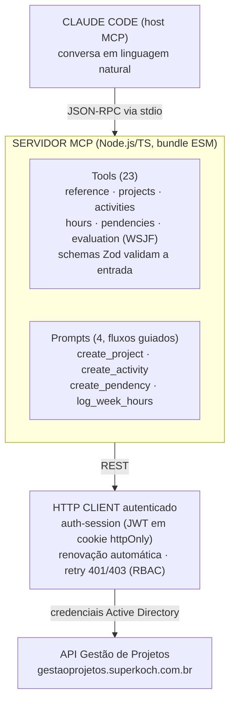
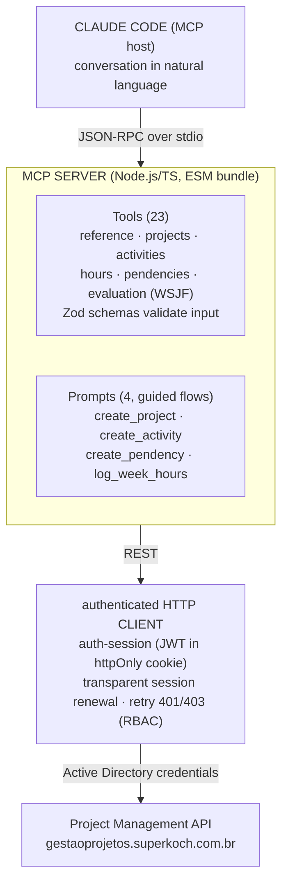
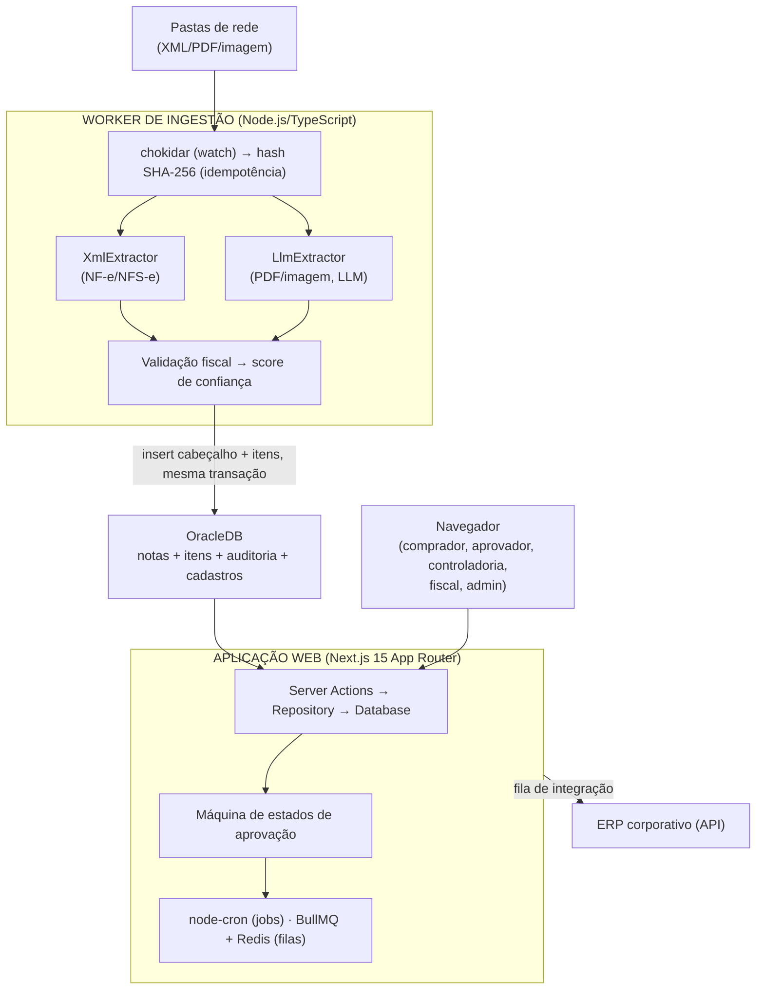
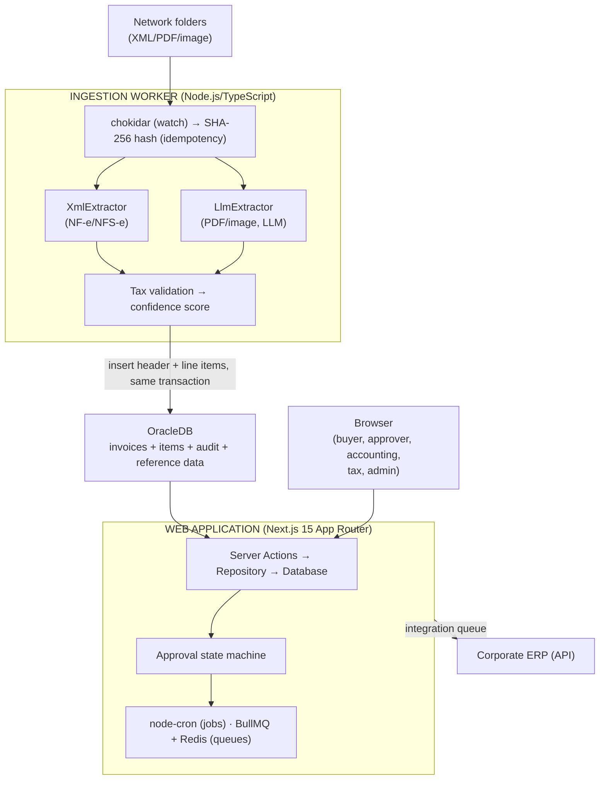
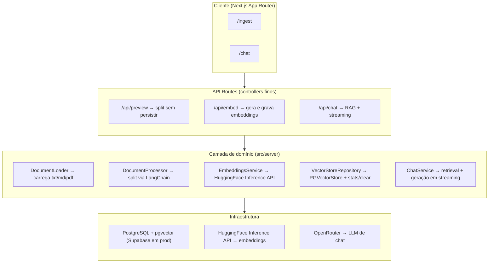
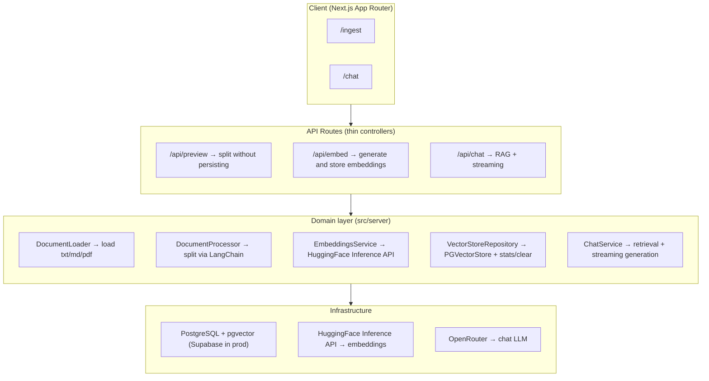
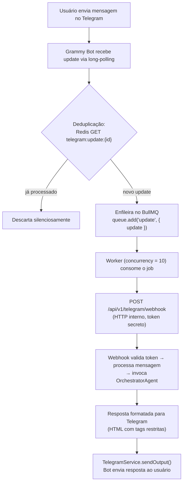
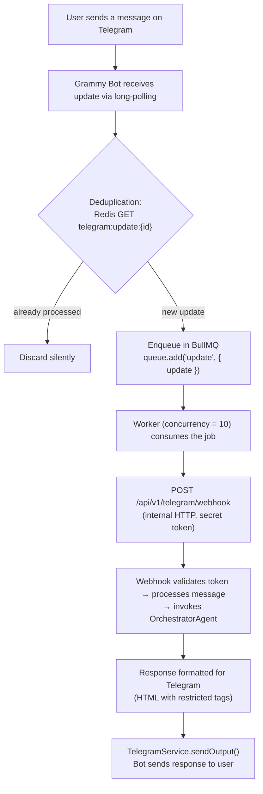

# Post Layout Mobile-First + Mermaid Diagrams Implementation Plan

> **For agentic workers:** REQUIRED SUB-SKILL: Use superpowers:subagent-driven-development (recommended) or superpowers:executing-plans to implement this plan task-by-task. Steps use checkbox (`- [ ]`) syntax for tracking.

**Goal:** Fix blog posts breaking on mobile by replacing the fixed-width ASCII architecture diagrams with real, responsive Mermaid.js SVG diagrams, and tighten the post's reading column/typography for small screens.

**Architecture:** `markdown-content.tsx` (a React Server Component using `react-markdown`) gets a new `'use client'` leaf component, `MermaidDiagram`, that it renders whenever a fenced code block is tagged ` ```mermaid `. `MermaidDiagram` lazy-loads the `mermaid` npm package inside a `useEffect` (so the ~1MB library is never in the initial bundle and only downloads on pages that actually render a diagram), renders to SVG client-side, and falls back to a plain `<pre>` if parsing fails. The 8 markdown files (4 posts × PT/EN) that contain ASCII architecture diagrams get their diagram fence rewritten to `mermaid` syntax; `vinyl-store`/`voting-lists` (directory trees, not diagrams) are untouched. Separately, `markdown-content.tsx` and `post-header.tsx` get small responsive-typography tweaks (heading scale, code font size, reading column width, table overflow fade).

**Tech Stack:** Next.js 16 (App Router, React Server Components), React 19, Tailwind CSS v4, `react-markdown` + `remark-gfm`, new dependency: `mermaid` (v11).

## Global Constraints

- Site is dark-only (no light/dark toggle exists) — theme colors are fixed values from `src/app/globals.css`, no `dark:`/media-query variants needed anywhere in this plan.
- No `@tailwindcss/typography` plugin is installed — all post typography is hand-rolled in `markdownComponents` (`src/app/_components/pages/post/markdown-content.tsx`); do not add the typography plugin as part of this work.
- No unit/component test runner exists in this repo (no jest/vitest/RTL configured — confirmed via `package.json`). Verification for this plan is: `pnpm build` (typecheck + build correctness) and manual/browser-driven visual checks (dev server + Playwright MCP browser tools), not automated unit tests. Do not invent a test framework as part of this work.
- Package manager is `pnpm` (`pnpm-lock.yaml` present) — always use `pnpm`, not `npm`/`yarn`.
- Every markdown content edit must preserve the technical meaning of the original diagram 1:1 (labels, arrows/order, branches) — this is portfolio content describing real systems Cristian built; don't paraphrase or drop details.
- Keep commits scoped per task, in Portuguese commit style consistent with repo history (see `git log`), and never add `Co-Authored-By: Claude` or the `🤖 Generated with Claude Code` footer (user's global instruction).

---

### Task 1: Add the `mermaid` dependency

**Files:**

- Modify: `package.json`
- Modify: `pnpm-lock.yaml` (regenerated by `pnpm install`)

**Interfaces:**

- Produces: `mermaid` v11 available as an import (`import mermaid from 'mermaid'`) for Task 2.

- [ ] **Step 1: Install the package**

Run:

```bash
pnpm add mermaid
```

Expected: `package.json` gains a `"mermaid": "^11.x.x"` entry (latest v11 release at install time, e.g. `^11.17.2`) under `"dependencies"`, and `pnpm-lock.yaml` updates.

- [ ] **Step 2: Verify the install**

Run: `pnpm list mermaid`
Expected: prints a line showing `mermaid 11.x.x` with no error.

- [ ] **Step 3: Commit**

```bash
git add package.json pnpm-lock.yaml
git commit -m "chore(web): add mermaid dependency for architecture diagrams"
```

---

### Task 2: `MermaidDiagram` client component

**Files:**

- Create: `src/app/_components/pages/post/code-block-classes.ts`
- Create: `src/app/_components/pages/post/mermaid-diagram.tsx`

**Interfaces:**

- Consumes: `mermaid` package (Task 1).
- Produces: `export function MermaidDiagram({ chart }: { chart: string }): JSX.Element` — a client component that Task 3 imports and renders from `markdown-content.tsx`'s `code` renderer. Also produces `export const CODE_BLOCK_PRE_CLASSES: string` and `export const CODE_BLOCK_CODE_CLASSES: string` from `code-block-classes.ts` — the single source of truth for "plain code block" styling, consumed by both this component's error fallback and, in Task 3, `markdown-content.tsx`'s own `pre`/`code` renderers (avoids duplicating the same Tailwind class strings in two files).

- [ ] **Step 1: Write the shared class constants**

```ts
export const CODE_BLOCK_PRE_CLASSES =
  'bg-muted/80 border-border mb-5 overflow-x-auto rounded-lg border p-4'

export const CODE_BLOCK_CODE_CLASSES =
  'text-foreground/90 block font-mono text-xs leading-6 sm:text-sm'
```

Save as `src/app/_components/pages/post/code-block-classes.ts`.

- [ ] **Step 2: Write the component**

```tsx
'use client'

import { useEffect, useId, useRef, useState } from 'react'

import {
  CODE_BLOCK_CODE_CLASSES,
  CODE_BLOCK_PRE_CLASSES,
} from './code-block-classes'

interface MermaidDiagramProps {
  chart: string
}

const MERMAID_THEME_VARIABLES = {
  darkMode: true,
  background: '#0a0a0a',
  primaryColor: '#141413',
  primaryTextColor: '#fafaf7',
  primaryBorderColor: '#3a3a34',
  lineColor: '#c4f000',
  secondaryColor: '#171716',
  tertiaryColor: '#1e1e1b',
  nodeBorder: '#3a3a34',
  nodeTextColor: '#fafaf7',
  clusterBkg: '#171716',
  clusterBorder: '#3a3a34',
  edgeLabelBackground: '#0a0a0a',
  fontFamily: 'JetBrains Mono, ui-monospace, monospace',
  fontSize: '14px',
}

let mermaidInitialized = false

export function MermaidDiagram({ chart }: MermaidDiagramProps) {
  const rawId = useId()
  const diagramId = `mermaid-${rawId.replace(/[^a-zA-Z0-9]/g, '')}`
  const containerRef = useRef<HTMLDivElement>(null)
  const [failed, setFailed] = useState(false)

  useEffect(() => {
    let cancelled = false

    async function renderDiagram() {
      try {
        const { default: mermaid } = await import('mermaid')

        if (!mermaidInitialized) {
          mermaid.initialize({
            startOnLoad: false,
            theme: 'base',
            themeVariables: MERMAID_THEME_VARIABLES,
            securityLevel: 'strict',
            flowchart: { curve: 'basis' },
          })
          mermaidInitialized = true
        }

        const { svg } = await mermaid.render(diagramId, chart)
        if (!cancelled && containerRef.current) {
          containerRef.current.innerHTML = svg
        }
      } catch (error) {
        if (!cancelled) {
          console.error('Mermaid diagram failed to render:', error)
          setFailed(true)
        }
      }
    }

    renderDiagram()

    return () => {
      cancelled = true
    }
  }, [chart, diagramId])

  if (failed) {
    return (
      <pre className={CODE_BLOCK_PRE_CLASSES}>
        <code className={CODE_BLOCK_CODE_CLASSES}>{chart}</code>
      </pre>
    )
  }

  return (
    <div
      ref={containerRef}
      className='mb-5 overflow-x-auto rounded-lg [&_svg]:mx-auto [&_svg]:max-w-full'
    />
  )
}
```

- [ ] **Step 3: Typecheck/build**

Run: `pnpm build`
Expected: build succeeds with no TypeScript errors referencing `mermaid-diagram.tsx` or `code-block-classes.ts` (the component isn't wired up yet, so it won't affect any page output, but this confirms both files compile and the `mermaid` types resolve).

- [ ] **Step 4: Commit**

```bash
git add src/app/_components/pages/post/mermaid-diagram.tsx src/app/_components/pages/post/code-block-classes.ts
git commit -m "feat(web): add MermaidDiagram client component with brutalist-mono theme"
```

---

### Task 3: Wire `language-mermaid` detection into `markdown-content.tsx`

**Files:**

- Modify: `src/app/_components/pages/post/markdown-content.tsx:65-84`

**Interfaces:**

- Consumes: `MermaidDiagram` from `./mermaid-diagram`, and `CODE_BLOCK_PRE_CLASSES`/`CODE_BLOCK_CODE_CLASSES` from `./code-block-classes` (both Task 2).
- Produces: any post markdown with a ` ```mermaid ` fence renders as an SVG diagram instead of a text code block; all other code blocks (with or without a language tag) render exactly as before.

- [ ] **Step 1: Add the imports**

In `src/app/_components/pages/post/markdown-content.tsx`, add near the top (after the existing imports):

```tsx
import type { ReactElement } from 'react'

import {
  CODE_BLOCK_CODE_CLASSES,
  CODE_BLOCK_PRE_CLASSES,
} from './code-block-classes'
import { MermaidDiagram } from './mermaid-diagram'
```

- [ ] **Step 2: Update the `code` renderer**

Replace:

```tsx
  code: ({ className, children }) => {
    const isBlock = className?.includes('language-')
    if (isBlock) {
      return (
        <code className='text-foreground/90 block font-mono text-sm leading-6'>
          {children}
        </code>
      )
    }
    return (
      <code className='bg-muted text-primary rounded-md px-1.5 py-0.5 font-mono text-sm'>
        {children}
      </code>
    )
  },
```

with:

```tsx
  code: ({ className, children }) => {
    if (className === 'language-mermaid') {
      return <MermaidDiagram chart={String(children).replace(/\n$/, '')} />
    }
    const isBlock = className?.includes('language-')
    if (isBlock) {
      return <code className={CODE_BLOCK_CODE_CLASSES}>{children}</code>
    }
    return (
      <code className='bg-muted text-primary rounded-md px-1.5 py-0.5 font-mono text-sm'>
        {children}
      </code>
    )
  },
```

(Note: this step also folds in the Task 4 code-block font-size tweak — `text-sm` → `text-xs sm:text-sm`, carried by `CODE_BLOCK_CODE_CLASSES` — since it's the same line; Task 4 will not touch this line again.)

- [ ] **Step 3: Update the `pre` renderer**

Replace:

```tsx
  pre: ({ children }) => (
    <pre className='bg-muted/80 border-border mb-5 overflow-x-auto rounded-lg border p-4'>
      {children}
    </pre>
  ),
```

with:

```tsx
  pre: ({ children }) => {
    const child = children as ReactElement
    if (child?.type === MermaidDiagram) {
      return <>{children}</>
    }
    return <pre className={CODE_BLOCK_PRE_CLASSES}>{children}</pre>
  },
```

- [ ] **Step 4: Build**

Run: `pnpm build`
Expected: build succeeds with no TypeScript errors.

- [ ] **Step 5: Manual verification — mermaid renders and non-mermaid code is untouched**

Run `pnpm dev` in the background, then:

1. Use the Playwright MCP browser tool to navigate to `http://localhost:3000/post/gestao-de-projetos-mcp` (the post markdown still has the old ASCII fence at this point — that's expected, it'll look unchanged until Task 6). Confirm the page loads with no console errors.
2. Use `mcp__playwright__browser_navigate` to `http://localhost:3000/post/vinyl-store` and confirm the existing ```bash code blocks still render as normal text code blocks (not broken), confirming the `pre`/`code` change didn't regress ordinary code fences.

Expected: no console errors in either page; `vinyl-store` code blocks look identical to before this task.

- [ ] **Step 6: Commit**

```bash
git add src/app/_components/pages/post/markdown-content.tsx
git commit -m "feat(web): render mermaid fences as diagrams in post markdown"
```

---

### Task 4: Typography and layout polish in `markdown-content.tsx`

**Files:**

- Modify: `src/app/_components/pages/post/markdown-content.tsx`

**Interfaces:**

- Consumes: nothing new.
- Produces: narrower reading column, responsive heading scale, and a scroll-fade affordance on tables — visible on every post page without further wiring.

- [ ] **Step 1: Narrow the reading column**

Replace:

```tsx
export function MarkdownContent({ content }: MarkdownContentProps) {
  return (
    <article className='prose-blog max-w-none'>
```

with:

```tsx
export function MarkdownContent({ content }: MarkdownContentProps) {
  return (
    <article className='mx-auto max-w-3xl'>
```

(Drops the dead `prose-blog` class — it matched no CSS rule and no typography plugin is installed — and replaces `max-w-none` with a `~65-75ch` reading measure, centered via `mx-auto` inside the wider `MainContainer`.)

- [ ] **Step 2: Responsive heading scale**

Replace:

```tsx
  h1: ({ children }) => (
    <h1 className='text-foreground border-border mt-10 mb-6 border-b pb-3 text-3xl font-bold tracking-tight'>
      {children}
    </h1>
  ),
  h2: ({ children }) => (
    <h2 className='text-foreground border-border/50 mt-10 mb-4 border-b pb-2 text-2xl font-semibold tracking-tight'>
      {children}
    </h2>
  ),
```

with:

```tsx
  h1: ({ children }) => (
    <h1 className='text-foreground border-border mt-10 mb-6 border-b pb-3 text-2xl font-bold tracking-tight sm:text-3xl'>
      {children}
    </h1>
  ),
  h2: ({ children }) => (
    <h2 className='text-foreground border-border/50 mt-10 mb-4 border-b pb-2 text-xl font-semibold tracking-tight sm:text-2xl'>
      {children}
    </h2>
  ),
```

(`h3`/`h4` stay as-is — they're already `text-xl`/`text-lg`, small enough that a further mobile step-down isn't worth the extra rule.)

- [ ] **Step 3: Table scroll-fade affordance**

Replace:

```tsx
  table: ({ children }) => (
    <div className='mb-5 overflow-x-auto'>
      <table className='w-full border-collapse text-sm'>{children}</table>
    </div>
  ),
```

with:

```tsx
  table: ({ children }) => (
    <div className='relative mb-5'>
      <div className='overflow-x-auto'>
        <table className='w-full border-collapse text-sm'>{children}</table>
      </div>
      <div className='from-background pointer-events-none absolute inset-y-0 right-0 w-8 bg-gradient-to-l to-transparent' />
    </div>
  ),
```

- [ ] **Step 4: Build**

Run: `pnpm build`
Expected: build succeeds with no errors.

- [ ] **Step 5: Manual verification**

Use `pnpm dev` + Playwright MCP:

1. `mcp__playwright__browser_navigate` to `http://localhost:3000/post/langchain-rag-lab` (has a real table — check via `grep -n '|' public/posts/langchain-rag-lab.md` if unsure which post has one; if none do, use any post page).
2. `mcp__playwright__browser_resize` to `375x812` (mobile) and take a screenshot (`mcp__playwright__browser_take_screenshot`). Confirm: body text no longer stretches edge-to-edge on a wide viewport (resize to `1440x900` and screenshot again — text column should now be visibly narrower than the full container), headings look proportionate on the 375px screenshot, and any table has a subtle right-edge fade.

Expected: both screenshots look correct; no layout breakage.

- [ ] **Step 6: Commit**

```bash
git add src/app/_components/pages/post/markdown-content.tsx
git commit -m "style(web): narrow post reading column and add responsive heading scale"
```

---

### Task 5: Responsive description in `post-header.tsx`

**Files:**

- Modify: `src/app/_components/pages/post/post-header.tsx:71-73`

**Interfaces:**

- Consumes: nothing new.
- Produces: post description text scales down on mobile instead of staying fixed at `text-lg`.

- [ ] **Step 1: Update the description**

Replace:

```tsx
{
  /* Description */
}
;<p className='text-muted-foreground mb-6 text-lg leading-relaxed'>
  {description}
</p>
```

with:

```tsx
{
  /* Description */
}
;<p className='text-muted-foreground mb-6 text-base leading-relaxed sm:text-lg'>
  {description}
</p>
```

- [ ] **Step 2: Build**

Run: `pnpm build`
Expected: build succeeds with no errors.

- [ ] **Step 3: Manual verification**

Use `pnpm dev` + Playwright MCP: navigate to any post (e.g. `http://localhost:3000/post/gestao-de-projetos-mcp`), resize to `375x812`, screenshot, confirm the description under the title reads at a smaller, comfortable size relative to the title.

- [ ] **Step 4: Commit**

```bash
git add src/app/_components/pages/post/post-header.tsx
git commit -m "style(web): scale post description text down on mobile"
```

---

### Task 6: Convert the `gestao-de-projetos-mcp` diagram (PT + EN)

**Files:**

- Modify: `public/posts/gestao-de-projetos-mcp.md:33-60`
- Modify: `public/posts/gestao-de-projetos-mcp.en.md:33-60`

**Interfaces:**

- Consumes: Task 3's `language-mermaid` detection.
- Produces: n/a (leaf content change).

- [ ] **Step 1: Replace the PT diagram**

In `public/posts/gestao-de-projetos-mcp.md`, replace the fenced block from line 33 (` ``` `) to line 60 (` ``` `):

```
   ┌──────────────────────────────────────────────────────────┐
   │  CLAUDE CODE (host MCP)                                   │
   │     │  conversa em linguagem natural                     │
   └─────┼────────────────────────────────────────────────────┘
         │  JSON-RPC sobre stdio
         ▼
   ┌──────────────────────────────────────────────────────────┐
   │  SERVIDOR MCP  (Node.js / TypeScript, bundle ESM)        │
   │                                                          │
   │  Tools (23)                Prompts (4, fluxos guiados)   │
   │   ├─ reference             ├─ create_project            │
   │   ├─ projects              ├─ create_activity           │
   │   ├─ activities            ├─ create_pendency           │
   │   ├─ hours                 └─ log_week_hours            │
   │   ├─ pendencies                                          │
   │   └─ evaluation (WSJF)     schemas Zod validam a entrada │
   │        │                                                 │
   │        ▼                                                 │
   │  HTTP CLIENT autenticado                                 │
   │   ├─ auth-session (JWT em cookie httpOnly)               │
   │   ├─ renovação automática de sessão expirada            │
   │   └─ retry + tratamento de 401/403 (RBAC-aware)         │
   └─────┼────────────────────────────────────────────────────┘
         │  REST + credenciais do Active Directory
         ▼
   API do Gestão de Projetos (gestaoprojetos.superkoch.com.br)
```

with:

````

````

(i.e. change the fence's opening line from ` ``` ` to ` ```mermaid `, and replace the ASCII body with the `flowchart TD` above; closing ` ``` ` stays.)

- [ ] **Step 2: Replace the EN diagram**

In `public/posts/gestao-de-projetos-mcp.en.md`, replace the equivalent fenced block (lines 33-60) with:

````

````

- [ ] **Step 3: Visual verification**

`pnpm dev` + Playwright MCP: navigate to `http://localhost:3000/post/gestao-de-projetos-mcp` (pt-BR is the default locale, no prefix — confirmed in `src/i18n/routing.ts`, `localePrefix: 'as-needed'`) and `http://localhost:3000/en-US/post/gestao-de-projetos-mcp`. Resize to `375x812` and screenshot both. Confirm: diagram renders as boxes/arrows (not raw text), no horizontal scrollbar/cut-off content, colors match the site's dark/acid-lime palette, both "Tools" and "Prompts" groups are legible.

- [ ] **Step 4: Commit**

```bash
git add public/posts/gestao-de-projetos-mcp.md public/posts/gestao-de-projetos-mcp.en.md
git commit -m "docs(web): convert gestao-de-projetos-mcp diagram to mermaid"
```

---

### Task 7: Convert the `gestao-de-despesas` diagram (PT + EN)

**Files:**

- Modify: `public/posts/gestao-de-despesas.md:27-63`
- Modify: `public/posts/gestao-de-despesas.en.md:27-63`

**Interfaces:**

- Consumes: Task 3's `language-mermaid` detection.
- Produces: n/a (leaf content change).

- [ ] **Step 1: Replace the PT diagram**

In `public/posts/gestao-de-despesas.md`, replace the fenced block spanning lines 27-63 (opening ` ``` ` through closing ` ``` `, containing the "Pastas de rede → WORKER DE INGESTÃO → OracleDB → APLICAÇÃO WEB → ERP corporativo" ASCII diagram) with:

````

````

- [ ] **Step 2: Replace the EN diagram**

In `public/posts/gestao-de-despesas.en.md`, replace the equivalent fenced block (lines 27-63) with:

````

````

- [ ] **Step 3: Visual verification**

`pnpm dev` + Playwright MCP: navigate to the `gestao-de-despesas` post (PT and EN), resize to `375x812`, screenshot. Confirm: worker subgraph shows both extractors side by side (or stacked, still legible) feeding into the validation step, web-app subgraph shows the 3 steps in order, no overflow.

- [ ] **Step 4: Commit**

```bash
git add public/posts/gestao-de-despesas.md public/posts/gestao-de-despesas.en.md
git commit -m "docs(web): convert gestao-de-despesas diagram to mermaid"
```

---

### Task 8: Convert the `langchain-rag-lab` diagram (PT + EN)

**Files:**

- Modify: `public/posts/langchain-rag-lab.md:20-41`
- Modify: `public/posts/langchain-rag-lab.en.md:20-41`

**Interfaces:**

- Consumes: Task 3's `language-mermaid` detection.
- Produces: n/a (leaf content change).

- [ ] **Step 1: Replace the PT diagram**

In `public/posts/langchain-rag-lab.md`, replace the fenced block spanning lines 20-41 with:

````

````

- [ ] **Step 2: Replace the EN diagram**

In `public/posts/langchain-rag-lab.en.md`, replace the equivalent fenced block (lines 20-41) with:

````

````

- [ ] **Step 3: Visual verification**

`pnpm dev` + Playwright MCP: navigate to the `langchain-rag-lab` post (PT and EN), resize to `375x812`, screenshot. Confirm: the 4 layers (Client, API Routes, Domain, Infrastructure) stack top-to-bottom and each is readable without horizontal scrolling.

- [ ] **Step 4: Commit**

```bash
git add public/posts/langchain-rag-lab.md public/posts/langchain-rag-lab.en.md
git commit -m "docs(web): convert langchain-rag-lab diagram to mermaid"
```

---

### Task 9: Convert the `orchestrator-agent` diagram (PT + EN)

**Files:**

- Modify: `public/posts/orchestrator-agent.md:146-172`
- Modify: `public/posts/orchestrator-agent.en.md:146-172`

**Interfaces:**

- Consumes: Task 3's `language-mermaid` detection.
- Produces: n/a (leaf content change).

- [ ] **Step 1: Replace the PT diagram**

In `public/posts/orchestrator-agent.md`, replace the fenced block spanning lines 146-172 with:

````

````

- [ ] **Step 2: Replace the EN diagram**

In `public/posts/orchestrator-agent.en.md`, replace the equivalent fenced block (lines 146-172) with:

````

````

- [ ] **Step 3: Visual verification**

`pnpm dev` + Playwright MCP: navigate to the `orchestrator-agent` post (PT and EN), resize to `375x812`, screenshot. Confirm: the linear pipeline renders top-to-bottom with the dedup decision diamond branching to "discard silently" on one side and continuing the main flow on the other.

- [ ] **Step 4: Commit**

```bash
git add public/posts/orchestrator-agent.md public/posts/orchestrator-agent.en.md
git commit -m "docs(web): convert orchestrator-agent diagram to mermaid"
```

---

### Task 10: Full-suite verification

**Files:** none (verification-only task).

**Interfaces:** none.

- [ ] **Step 1: Full build**

Run: `pnpm build`
Expected: succeeds with no TypeScript/ESLint errors.

- [ ] **Step 2: Lint**

Run: `pnpm lint`
Expected: no errors.

- [ ] **Step 3: Browser sweep — all 4 converted posts, mobile + desktop**

`pnpm dev`, then for each of `gestao-de-despesas`, `gestao-de-projetos-mcp`, `langchain-rag-lab`, `orchestrator-agent` (PT and EN, 8 page loads total): use Playwright MCP to navigate, resize to `375x812`, screenshot; then resize to `1440x900`, screenshot. For each mobile screenshot, use `mcp__playwright__browser_evaluate` to confirm `document.documentElement.scrollWidth <= document.documentElement.clientWidth` (no forced horizontal scroll from the diagram or anything else on the page).

Expected: no horizontal overflow on any of the 8 pages at 375px; diagrams and reading column both look correct at 1440px.

- [ ] **Step 4: Browser sweep — unaffected posts**

Navigate to `vinyl-store` and `voting-lists` (PT and EN) at `375x812`. Confirm the directory-tree code blocks still render as plain monospace text (unchanged), and headings/description reflect the Task 4/5 responsive scale.

- [ ] **Step 5: Commit (if any fixes were needed)**

If steps 1-4 required any code fixes, commit them now with a message describing the fix. If everything passed as-is, no commit is needed for this task.
