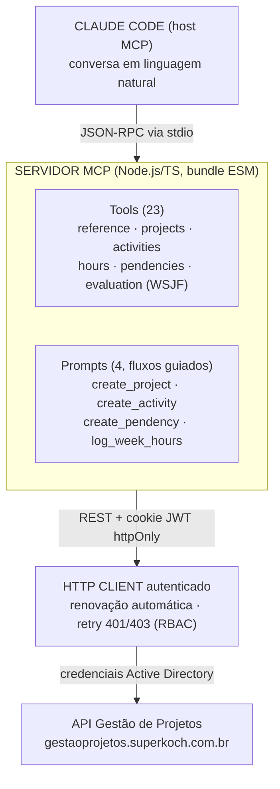

# Design — Layout mobile-first dos posts + diagramas Mermaid

**Data:** 2026-08-29

## Objetivo

Os posts do blog quebram em telas pequenas: o diagrama ASCII de arquitetura
(box-drawing, ~60-63 colunas monoespaçadas) força scroll horizontal e perde a
formatação em mobile. Aproveitando a revisão, também ajustar a leitura geral
do post (largura de coluna, escala tipográfica) para telas pequenas.

## Decisões (fechadas com o usuário)

- Diagrama de fluxo: substituir a ASCII art por **Mermaid.js** (SVG real,
  reflui sozinho, empilha verticalmente no mobile), em vez de só deixar o
  ASCII responsivo ou criar um componente de cards customizado.
- Escopo: revisão completa do layout do post (não só o diagrama) —
  tipografia, largura de coluna de leitura, e polimentos menores.
- Todos os 4 blocos abaixo aprovados como descritos, incluindo os
  polimentos menores (item 4).

## Arquitetura

### 1. Componente `MermaidDiagram` (novo, client-only)

Novo arquivo `src/app/_components/pages/post/mermaid-diagram.tsx`:

- `'use client'`, carregado a partir de `markdown-content.tsx` via
  `next/dynamic(() => import('./mermaid-diagram'), { ssr: false })` — o
  bundle do `mermaid` só baixa nas páginas que de fato renderizam um
  diagrama (code-split por instância).
- Recebe `chart: string` (o conteúdo do fence `mermaid`).
- Usa `mermaid.initialize` (uma vez) + `mermaid.render(id, chart)` num
  `useEffect`, injeta o SVG resultante via `dangerouslySetInnerHTML`. `id`
  único por instância (ex.: `useId()`).
- **Fallback de erro:** se `mermaid.render` rejeitar (sintaxe inválida),
  renderizar o `chart` cru num `<pre>` monoespaçado igual ao code block
  atual — nunca deixar a página quebrar por causa de um diagrama malformado.
- Wrapper do SVG: `overflow-x-auto` + `flex justify-center` (SVGs muito
  largos ainda podem precisar de scroll em telas muito estreitas, mas deixam
  de ser o caso comum).

### 2. Tema do Mermaid (paleta "Brutalist Mono")

`mermaid.initialize({ theme: 'base', themeVariables: {...} })` mapeando para
os tokens já existentes em `globals.css`:

- `background`: `#0a0a0a` (--background)
- `primaryColor` (fill dos nós): `#141413` (--card)
- `primaryTextColor` / `textColor`: `#fafaf7` (--foreground)
- `primaryBorderColor` / `nodeBorder`: `#3a3a34` (--border)
- `lineColor` (arestas/setas): `#c4f000` (--primary, acid-lime)
- `clusterBkg`/`clusterBorder` (subgraphs): `#171716`/`#3a3a34` (--muted/--border)
- `fontFamily`: `'JetBrains Mono', monospace` (mesma `--font-mono`)

Site é dark-only (confirmado: sem toggle, `.dark` idêntico a `:root`) —
não precisa de variante de tema clara.

### 3. Detecção no `markdown-content.tsx`

- `code`: quando `className === 'language-mermaid'`, retorna
  `<MermaidDiagram chart={String(children)} />` em vez do `<code>` genérico.
- `pre`: hoje sempre envolve o filho no wrapper
  `bg-muted/80 border-border rounded-lg border p-4`. Passa a inspecionar
  `children.props.className` — se for `language-mermaid`, renderiza o filho
  direto (sem a caixa de "bloco de código"), já que o resultado é um SVG,
  não texto.
- Direção do fluxo: sempre `flowchart TD` (topo→baixo) — já é o sentido que
  as ASCII arts originais seguem (setas `▼` descendo), e é naturalmente
  mobile-first (empilha vertical em vez de crescer para os lados).

### 4. Conversão dos diagramas existentes (12 arquivos)

6 posts × PT/EN, cada um com exatamente 1 diagrama ASCII (confirmado via
grep por caracteres de box-drawing): `gestao-de-despesas`,
`gestao-de-projetos-mcp`, `langchain-rag-lab`, `orchestrator-agent`,
`vinyl-store`, `voting-lists`.

Para cada arquivo: localizar o fence ` ` ``sem language tag que contém
os caracteres `─│┌└▼├`, e substituir por um fence``mermaid```com um`flowchart TD`equivalente, preservando os rótulos e o sentido do fluxo.
Listas agrupadas (ex.: "Tools" / "Prompts" no diagrama do MCP) viram`subgraph`com nós filhos, para preservar a estrutura visual de lista.
Exemplo de referência (post`gestao-de-projetos-mcp`, já validado nesta
conversa):



Os outros 5 diagramas (PT+EN) seguem o mesmo tratamento na implementação,
lendo cada markdown e traduzindo a ASCII art existente 1:1 para
`flowchart TD`, sem alterar o conteúdo/sentido técnico.

### 5. Coluna de leitura mais estreita

`article` em `markdown-content.tsx` usa `prose-blog max-w-none` — `prose-blog`
não existe em lugar nenhum (não há `@tailwindcss/typography` instalado), então
só `max-w-none` tem efeito real, e o container pai (`MainContainer`,
`max-w-7xl` = 1280px) deixa o texto esticar até ~1280px em telas grandes, o
que prejudica a leitura (linhas longas demais). Trocar `max-w-none` por uma
medida de leitura confortável, ex. `max-w-3xl` (~65-75 caracteres por linha),
mantendo full-width no mobile (que já é naturalmente estreito). Como os
diagramas passam a ser SVGs que escalam para caber no container (em vez de
texto de largura fixa), essa coluna mais estreita deixa de ser um problema
para eles.

### 6. Escala tipográfica responsiva

`post-header.tsx`: título já escala (`text-3xl sm:text-4xl lg:text-5xl`);
descrição fica fixa em `text-lg` — trocar para `text-base sm:text-lg`.

`markdown-content.tsx`, headings do corpo do post (hoje tamanho fixo único):

- `h1`: `text-3xl` → `text-2xl sm:text-3xl`
- `h2`: `text-2xl` → `text-xl sm:text-2xl`
- `h3`/`h4`: mantêm (já são menores, `text-xl`/`text-lg`, impacto baixo).

### 7. Polimentos menores

- Code blocks reais (não-mermaid): `text-sm` fixo → `text-xs sm:text-sm`,
  tanto no `code` (`isBlock`) quanto no `pre`.
- Tabelas: `overflow-x-auto` já existe mas sem nenhuma pista visual de que
  há conteúdo cortado. Adicionar um fade sutil na borda direita do wrapper
  (`mask-image` em gradiente linear, ou uma sombra interna `shadow-[inset_...]`
  condicionada — usar a solução mais simples via CSS puro, sem JS de scroll
  tracking).

## Componentes afetados (mapa de arquivos)

- **Novo:** `src/app/_components/pages/post/mermaid-diagram.tsx`
- **Modificar:** `src/app/_components/pages/post/markdown-content.tsx`
  (detecção `language-mermaid` em `code`/`pre`, larguras/tamanhos de
  heading e code block, `max-w-3xl` no `article`, fade de scroll na tabela)
- **Modificar:** `src/app/_components/pages/post/post-header.tsx` (descrição
  responsiva)
- **Modificar (conteúdo):** os 12 arquivos em `public/posts/` listados no
  item 4 — apenas o fence do diagrama, resto do markdown inalterado.
- **Modificar:** `package.json` (nova dependência `mermaid`)

## Estratégia de teste / verificação

- `pnpm build` passa (novo import client-only não quebra SSR das páginas de
  post, que continuam Server Components).
- Visitar cada um dos 6 posts (PT e EN) e confirmar visualmente: diagrama
  renderiza como SVG, sem scroll horizontal forçado em viewport de ~375px
  (mobile), cores batendo com a paleta do site.
- Confirmar fallback: forçar um erro de sintaxe mermaid temporariamente e
  ver que cai no `<pre>` de texto em vez de quebrar a página (teste manual,
  revertido antes de finalizar).
- Conferir em viewport mobile (375px) e desktop (1440px) que a coluna de
  leitura (`max-w-3xl`) e a escala de heading ficam confortáveis nos dois.
- Sem regressão nos outros code blocks (com linguagem, ex. `typescript`)
  nem nas tabelas existentes.

## Fora de escopo

- Toggle de tema claro/escuro (site é dark-only, fora desta revisão).
- Syntax highlighting em code blocks reais (não pedido; só ajuste de
  tamanho de fonte responsivo).
- Redesenho do `post-header`/`post-footer` além da descrição responsiva.
- Novos diagramas além dos 6 já existentes.
