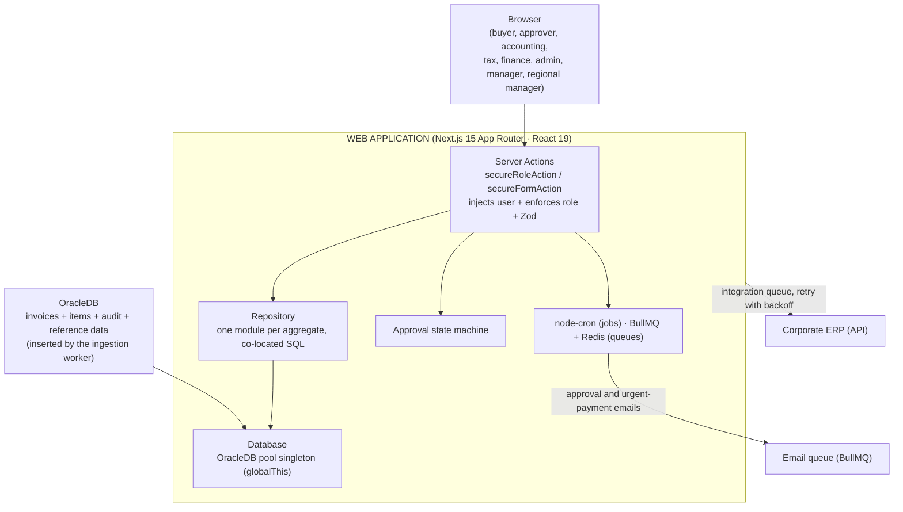

## About the Project

**Gestão de Despesas** is the internal web application of a retail company for managing **non-resale purchase expenses** — everything the company buys to operate (services, materials, maintenance, marketing, IT…) that **doesn't** go on the shelf. Built on **Next.js 15 (App Router)** with **React 19**, it receives invoices already extracted and persisted by a dedicated ingestion worker (see the [Gestão de Despesas — Ingestor](/en-US/post/gestao-despesas-ingestor) post), routes each one through an **eight-role approval workflow**, applies tax and authority-level rules, and integrates the result back into the **corporate ERP**.

> ⚠️ **Internal project — no public link.** Because this is a corporate system handling real tax and financial data, **there is no public URL or GitHub repository available**. This post describes the **architecture, business rules, and key challenges** of the web application in an anonymized way — without exposing sensitive data, internal addresses, proprietary system names, or credentials.

## The Problem

Before the system existed, non-resale purchase expenses arrived in a **fragmented** way — invoices sent by email or dropped into shared folders by each cost center (accounting, marketing, HR, IT, maintenance, procurement). From there, the approval process was manual and brittle:

- **No traceability:** there was no record of who approved what, when, or for how much.
- **No consistent approval authority:** approvals outside a manager's responsibility limit went unnoticed.
- **Manual ERP entry:** someone would re-read the invoice and retype the data into the ERP — slow and error-prone.
- **Tax complexity:** calculations like **DIFAL** (the ICMS interstate tax differential) required manual lookup and separate calculation.

The application's goal is to close the half of the cycle that starts **after** the invoice is already in the database: route it through an auditable approval workflow with authority levels, apply the tax rules that require human judgment, and **integrate it into the ERP without rekeying**.

## Architecture

A typical mutation flows as **Server Action → Repository → Database (OracleDB)**, with Server Components as the default and `'use client'` reserved for what genuinely needs browser state.



### Layers

- **Actions (`src/actions/`)** — Server Actions grouped by domain (invoices, buyers, approvers, suppliers, users…). Every sensitive action is wrapped by a handler (`secureRoleAction`/`secureAction`) that injects the authenticated user and **enforces the allowed roles**; form-based actions go through `secureFormAction`/`validatedAction` with a **Zod** schema. Errors are funneled through a single handler that returns a uniform action response, and every mutation calls `revalidatePath` at the end.
- **Repository (`src/repository/`)** — one module per aggregate (invoice, line item, supplier, buyer, approver, cost center, expense type…), each receiving a `Database` instance in its constructor. SQL lives in its own co-located files per aggregate, keeping queries close to the code that uses them.
- **Database (`src/database/`)** — a class wrapping the **OracleDB connection pool**, exposed as a singleton stored on `globalThis` to survive hot reload in development. An existing connection can be passed in to run multiple statements within a **single transaction**.
- **Role-based routes (`src/app/(dashboard)/`)** — the dashboard is grouped by profile (admin, buyer, approver, accounting, tax, finance, manager, regional manager); route middleware matches the first path segment against the allowed roles, redirecting unauthenticated users to login and unauthorized users to an access-denied page.

## Business Rules

The heart of the application is the **state machine** that governs the lifecycle of each invoice — richer than a simple "pending → approved": besides the triage states (`unknown supplier`, `unknown expense type`, `invalid details`) and the buyer → approver → tax → integrated cycle, there is an **extended tax track** for cases requiring extra review before integration (fiscal desk → check → asset registration → completed) — used when the expense type involves asset control. Terminal and integration states **do not re-enter** the approval workflow, an important invariant to prevent unintended reprocessing.

### Approval workflow

A newly ingested invoice arrives from the database already with an automatic linking attempt (supplier, expense type, approver). From there:

- If the data is incomplete or invalid, the invoice goes to **accounting** for correction (e.g., unknown supplier, unknown expense type, invalid details).
- If the data is complete, it optionally moves on to **buyer validation** and then to the **approver**, who can approve, reject, or transfer the invoice to another approver.
- Once approved, it goes to the **tax officer** — directly to integration, or through the extended tax track if the expense type requires it — responsible for syncing with the ERP.
- Successfully synced, it reaches the terminal state.

### Approval authority by amount and escalation

Each approver has a **maximum amount** they can approve. If an invoice's amount **exceeds** that limit, the approval action itself blocks the operation as a business rule before it reaches the database — the correct approver is resolved through the hierarchy, ensuring large expenses always pass through an appropriate authority level, without relying on manual discipline. A system administrator can approve on behalf of any approver as an exception path.

### Vacation and substitute approver

If an approver is **on vacation** (with a configured period), resolving the "effective approver" at approval time automatically points to the registered **substitute** — the workflow never ends up without an active responsible party, even with the primary approver away.

### Urgent payments

When approving an invoice, besides advancing its status, the application **queues urgent-payment emails** for the tax and finance teams whenever the expense meets the urgency criteria — each team gets an email with a direct link to their own screen, already filtered to urgent invoices. A failure to queue that email is logged but **never reverts** an approval that has already been confirmed.

### DIFAL calculation

For **interstate purchases**, the **ICMS interstate tax differential (DIFAL)** applies — the difference between the interstate rate (as shown by the supplier) and the destination state's internal rate for that **NCM** code. The application separates three data groups per line item:

- **Extracted** by the ingestion worker (values, interstate rate…).
- **Enriched** by the tax officer (the **internal** rate for the destination state, which varies by NCM/state decree and is not reliable to extract automatically).
- **Calculated** by the application when the internal rate is filled in:

```
DIFAL_AMOUNT = TOTAL_VALUE × (internal_rate − interstate_rate) / (100 − internal_rate)
```

The calculation is **"tax-inclusive"** (inclusive base), per LC 190/2022. Sample effective rates: `12→17% ≈ 6.03%`, `4→17% ≈ 15.66%`, `4→12% ≈ 9.09%`.

### Audit trail

Every significant action on an invoice (approve, reject, transfer, comment, update) is recorded with author and timestamp in a per-invoice history, making it possible to reconstruct the full timeline of any expense.

## Integrations

- **Corporate ERP authentication** — login does not use a local user database: a custom Next-Auth v5 authentication provider (JWT session) validates credentials against the **corporate ERP**. User roles come from this integration and determine what each user can see and do.
- **Outbound integration (queue)** — when an invoice is approved, it enters an **integration queue** (BullMQ + Redis, up to 3 attempts with exponential backoff) that sends it to the **ERP API** through an authenticated HTTP client (an in-memory cached access token, refreshed on demand). Queue producers (Server Actions, jobs) use a Redis connection separate from the worker's: it fails fast instead of blocking the user's action if Redis is unavailable, rather than piling up commands waiting to reconnect. Tracking statuses (`pending`, `integrating`, `integrated`, `failed`) are visible in the UI.
- **NF-e XML → PDF conversion** — a **PHP sidecar service**, in its own container, converts the NF-e XML to PDF for viewing, keeping this specific dependency out of the main process.

## Background Processes

Running only in the Node runtime (never on the edge), initialized once at process bootstrap:

- **node-cron** — four scheduled jobs: reprocess pending invoices every 5 minutes (attempting to link supplier/expense type/approver), promote future-dated entries that have matured daily at 3am, notify approvers with a daily pending-items digest on weekdays at 8am, and — hourly during business hours on weekdays — chase whoever is holding up an **urgent invoice** at its current stage (approver, fiscal, or finance), with a minimum cooldown between reminders and a daily cap stored in Redis to avoid turning into spam.
- **BullMQ workers** — the ERP integration queue and a separate email queue (approvals, urgent payments), both shut down gracefully on `SIGTERM`/`SIGINT`.

## Key Challenges

- **Approval authority and escalation without manual bottlenecks.** Blocking approval when the amount exceeds the approver's limit — and automatically resolving the correct approver through the hierarchy — avoids both excess autonomy and dependence on someone remembering to escalate manually.
- **Extended tax track as the exception, not the rule.** Not every approved invoice needs extra asset-registration review; designing that track as an optional detour from the main state machine, rather than a parallel workflow, kept the core approval logic simple.
- **Queue resilience under infrastructure failure.** Separating the Redis connection used by producers (Server Actions, jobs) from the one used by the consumer (worker) — with aggressive timeouts and no offline queue on the producer side — prevents Redis instability from blocking a user's action in the browser.
- **The tax nuance of DIFAL.** The internal rate varies by NCM and by state decree — something that **cannot be automated safely**. The solution was a hybrid design: the ingestion worker extracts what's safe, the application calculates the result, and the tax officer explicitly fills in the one point that requires a specialist (internal rate).
- **Role enforcement at the action boundary.** Rather than scattering permission checks throughout the UI, each Server Action is wrapped by a handler that validates the role and injects the authenticated user — authorization lives in one place, and parameterized SQL in the repositories mitigates injection.

## Technologies Used

- **Next.js 15** (App Router) + **React 19** + **TypeScript** — Server Components and Server Actions.
- **Tailwind CSS** + accessible components (Radix/shadcn) — responsive UI.
- **Next-Auth v5** — authentication integrated with the corporate ERP (JWT session).
- **Zod** — schema validation on all inputs.
- **OracleDB** — transactional and reference database (connection pool, parameterized binds).
- **Redis + BullMQ** — async queues (ERP integration and email).
- **node-cron** — scheduled tasks.
- **Docker** — packaging for the application and the PHP PDF-conversion sidecar.

## Technical Notes

- **Clean separation from the ingestion worker.** The web application never reads files or calls LLMs to extract invoice data — it receives records that are already validated and persisted, and focuses entirely on approval, the tax rules that require human judgment, and outbound integration. Extraction and ingestion details live in the [dedicated worker post](/en-US/post/gestao-despesas-ingestor).
- **Role enforcement at the action boundary.** Rather than scattering permission checks throughout the UI, each Server Action is wrapped by a handler that validates the role and injects the authenticated user.
- **Co-located, parameterized SQL.** Queries live in their own files per aggregate and always use binds, mitigating SQL injection.
- **Anonymization.** Company names, proprietary system names, network addresses, database schema, and internal URLs have been deliberately omitted from this post — the focus is the engineering, not the corporate data.
