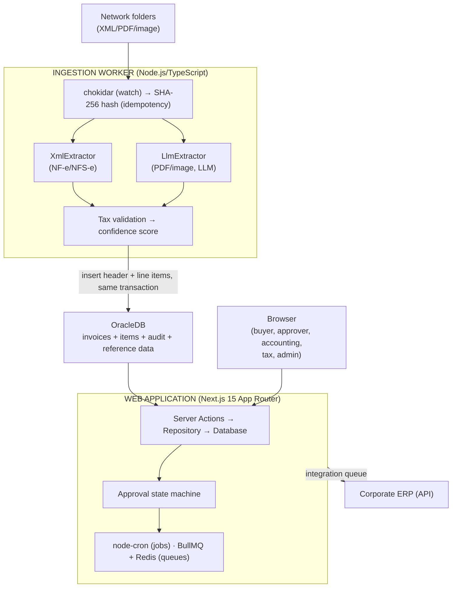

## About the Project

**Gestão de Despesas** is an **internal** system for a retail company, built to manage **non-resale purchase expenses** — everything the company buys to operate (services, materials, maintenance, marketing, IT…) that **doesn't** go on the shelf. Each invoice goes through a role-based approval workflow and, at the end, is integrated back into the **corporate ERP**.

> ⚠️ **Internal project — no public link.** Because this is a corporate system handling real tax and financial data, **there is no public URL or GitHub repository available**. This post describes the **architecture, business rules, integrations, and key challenges** in an anonymized way — without exposing sensitive data, internal addresses, proprietary system names, or credentials.

The system is, in practice, **two components** that form a single pipeline:

- An **ingestion worker** (Node.js/TypeScript) that watches network folders, extracts invoice data, and inserts it into the database.
- A **web application** (Next.js 15) where invoices are validated, approved through multiple levels, and integrated into the ERP.

## The Problem

Before the system existed, non-resale purchase expenses arrived in a **fragmented** way — invoices in XML, PDF, or even images, sent by email or dropped into shared folders by each cost center (accounting, marketing, HR, IT, maintenance, procurement). From there, the process was manual and brittle:

- **No traceability:** there was no record of who approved what, when, or for how much.
- **No consistent approval authority:** approvals outside a manager's responsibility limit went unnoticed.
- **Manual ERP entry:** someone would re-read the invoice and retype the data into the ERP — slow and error-prone.
- **Tax complexity:** calculations like **DIFAL** (the ICMS interstate tax differential) required manual lookup and separate calculation.

The system's goal is to **close this cycle end-to-end**: capture the invoice automatically, extract and validate its data, run it through an auditable approval workflow with authority levels, and **integrate it into the ERP without rekeying**.

## Architecture

The system cleanly separates **ingestion** (producing structured data from documents) from **operations** (approval and integration), with OracleDB as the shared contract between both worlds.



### Web application

Built on **Next.js 15 (App Router)** with **React 19**, leaning heavily on **Server Components + Server Actions** — a typical mutation flows as **Server Action → Repository → Database (OracleDB)**. The layers are well isolated:

- **Actions** — Server Actions grouped by domain (invoices, buyers, approvers, suppliers, users). Every sensitive action goes through a security wrapper that injects the authenticated user and **enforces required roles**; forms are validated with **Zod**.
- **Repository** — data access, one module per aggregate. SQL lives in co-located `.sql.ts` files, and each repository receives a `Database` instance in its constructor.
- **Database** — a class that wraps the **OracleDB connection pool**. An existing connection can be passed in to run multiple statements within a **single transaction**.
- **Role-based routes** — the dashboard is grouped by profile (admin, approver, buyer, accounting, finance, tax, manager); middleware protects each route based on the allowed roles.

### Ingestion worker

A separate Node.js/TypeScript service with **hexagonal architecture** (domain, application, infrastructure, ports). It watches the input folders in real time and transforms raw documents into structured, validated records in the database — detailed in the next section.

## Ingestion Pipeline

Each cost center has a monitored input folder. When a file appears, the worker runs:

1. **Detection** — `chokidar` detects the new file in the input folder.
2. **Idempotency** — computes the **SHA-256** hash of the file and checks the database to see if it has already been processed; duplicates are discarded without reprocessing.
3. **Extraction** — two paths depending on the file type:
   - **XML** → direct structured parsing (NF-e model 55 and NFS-e ABRASF).
   - **PDF / image** → **LLM with structured output** (Zod schema), covering NF-e, NFS-e, communication invoices, bank slips, bills, debit notes, and receipts. Critical header fields receive automatic double-checking, and LLM call concurrency is capped.
   - **Line items/products** are extracted in the same step (code, description, NCM, CFOP, quantity, values, ICMS, IPI…).
4. **Tax validation** — a validation engine checks **CNPJ (mod-11)**, **NF-e access key**, value consistency, and dates. Each failure applies a penalty and reduces the document's **confidence score**.
5. **Enrichment** — resolves the supplier, type, and store in the database; detects and corrects CNPJ inversion (issuer vs. recipient).
6. **Persistence** — inserts **header + line items in the same transaction** (atomic rollback if any part fails) and writes the audit record.
7. **File routing** — depending on the result, the file is moved to `Files Read`, `Review` (score below the threshold), or `Failures`, always organized by `year/month`.

The auto-insert threshold without human review is **0.70**. Below that, the invoice goes to a review queue instead of entering the workflow directly.

## Business Rules

The heart of the system is the **state machine** that governs the lifecycle of each invoice.

### Approval workflow

A newly ingested invoice enters as **unprocessed**. A job attempts to **automatically link** it to the supplier, expense type, and responsible approver using the configured associations. From there:

- If the data is incomplete or invalid, the invoice goes to **accounting** for correction (e.g., unknown supplier, unknown expense type, invalid details).
- If the data is complete, it moves on to **buyer validation** and then to the **approver**.
- Once approved, it goes to the **tax officer**, who is responsible for syncing with the ERP.
- Successfully synced, it reaches the terminal state.

Terminal and integration states **do not re-enter** the approval workflow — an important invariant to prevent unintended reprocessing.

### Approval authority by amount and escalation

Each approver has a **maximum amount** they can approve. If an invoice's amount **exceeds** that limit, it is **automatically transferred** to the next approver in the hierarchy. This ensures that large expenses always pass through an appropriate authority level, without relying on manual discipline.

### Vacation and substitute approver

If an approver is **on vacation** (with a configured period), invoices assigned to them are **automatically redirected** to the substitute approver. The "effective approver" is resolved at routing time, so the workflow always has an active responsible party.

### DIFAL calculation

For **interstate purchases**, the **ICMS interstate tax differential (DIFAL)** applies — the difference between the interstate rate (as shown by the supplier) and the destination state's internal rate for that **NCM** code. The system separates three data groups per line item:

- **Extracted** by the LLM/XML (values, interstate rate…).
- **Enriched** by the tax officer (the **internal** rate for the destination state, which varies by NCM/state decree and is not reliable to extract automatically).
- **Calculated** by the application when the internal rate is filled in:

```
DIFAL_AMOUNT = TOTAL_VALUE × (internal_rate − interstate_rate) / (100 − internal_rate)
```

The calculation is **"tax-inclusive"** (inclusive base), per LC 190/2022. Sample effective rates: `12→17% ≈ 6.03%`, `4→17% ≈ 15.66%`, `4→12% ≈ 9.09%`.

### Audit trail

Every significant action on an invoice (approve, reject, transfer, comment, update) is recorded in an **audit trail** with author and timestamp, making it possible to reconstruct the full history of any expense.

## Integrations

- **Corporate ERP authentication** — login does not use a local user database: a custom authentication provider (Next-Auth v5, JWT session) validates credentials against the **corporate ERP**. User roles come from this integration and determine what each user can see and do.
- **Outbound integration (queue)** — when an invoice is approved, it enters an **integration queue** (BullMQ + Redis) that sends it to the **ERP API**, with retries and status tracking (`pending`, `integrating`, `integrated`, `failed`). Isolating the integration in a queue prevents the UI from blocking and absorbs ERP instability.
- **NF-e XML → PDF conversion** — a **PHP sidecar service**, in its own container, converts the NF-e XML to PDF for viewing, keeping this specific dependency out of the main process.

## Key Challenges

- **Reliable extraction from heterogeneous documents.** XML is structured, but PDFs and images are not. Using an LLM with **structured output + confidence score + review threshold** was what made automation possible without sacrificing control: what the model isn't confident about goes to human review instead of entering the database incorrectly.
- **Distinguishing between `null` and `"0.00"`.** A field **not printed** on the invoice (`null`) is semantically different from a value **explicitly stated as zero** (exempt/not applicable). Preserving that difference is essential for correct tax treatment.
- **Atomic header + line item transaction.** An invoice without its line items (or vice versa) is an invalid state. Inserting both in the **same transaction**, with automatic rollback, ensures consistency even under partial failure.
- **The tax nuance of DIFAL.** The internal rate varies by NCM and by state decree — something that **cannot be automated safely**. The solution was a hybrid design: automate what's safe (extraction, calculation) and make the point requiring a tax expert explicit (internal rate), including an index of "items awaiting tax review."
- **Idempotency.** The same file can reappear in the folder. The **SHA-256 hash** with a pre-check guarantees that reprocessing never creates duplicates.
- **Background processes.** Scheduled jobs (**node-cron**) process pending invoices every few minutes, promote future-dated entries that have matured, and notify approvers; **BullMQ/Redis** workers handle integration and email delivery. All of them need graceful shutdown and must run only in the Node runtime — not on the edge.

## Technologies Used

### Web application

- **Next.js 15** (App Router) + **React 19** + **TypeScript** — Server Components and Server Actions.
- **Tailwind CSS** + accessible components (Radix/shadcn) — responsive UI.
- **Next-Auth v5** — authentication integrated with the corporate ERP (JWT session).
- **Zod** — schema validation on all inputs.

### Ingestion worker

- **Node.js / TypeScript** — hexagonal architecture (domain, application, infrastructure).
- **LLM with structured output** — PDF and image extraction; **fast-xml-parser** for XML.
- **chokidar** — real-time file watching on input folders.

### Data, queues, and infrastructure

- **OracleDB** — transactional and reference database (connection pool, parameterized binds).
- **Redis + BullMQ** — async queues (integration and email).
- **node-cron** — scheduled tasks.
- **Docker** — packaging for all services (web, worker, and the PHP sidecar).

## Technical Notes

- **Ingestion vs. operations separation.** Keeping the ingestion worker as its own service allows it to be scaled and deployed independently of the web app; OracleDB is the contract between the two.
- **Role enforcement at the action boundary.** Rather than scattering permission checks throughout the UI, each Server Action is wrapped by a handler that validates the role and injects the authenticated user — authorization lives in one place.
- **Co-located, parameterized SQL.** Queries live in their own files per aggregate and always use binds, mitigating SQL injection.
- **Anonymization.** Company names, proprietary system names, network addresses, database schema, and internal URLs have been deliberately omitted from this post — the focus is the engineering, not the corporate data.
