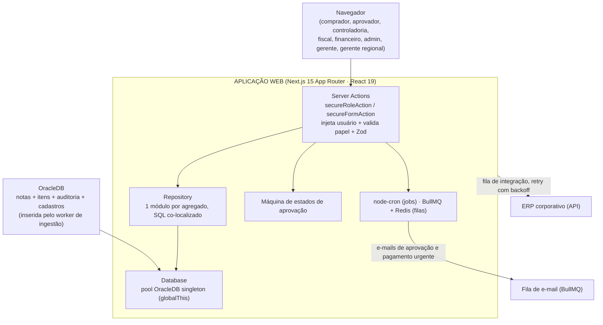

## Sobre o Projeto

**Gestão de Despesas** é a aplicação web interna de uma empresa do setor varejista para controlar as **despesas de compras não revenda** — tudo o que a empresa compra para operar (serviços, materiais, manutenção, marketing, TI…) e que **não** vai para a prateleira. Construída em **Next.js 15 (App Router)** com **React 19**, ela recebe as notas fiscais já extraídas e persistidas por um worker de ingestão dedicado (ver post [Gestão de Despesas — Ingestor](/post/gestao-despesas-ingestor)), conduz cada uma por um **fluxo de aprovação com oito papéis**, aplica as regras fiscais e de alçada, e integra o resultado de volta ao **ERP corporativo**.

> ⚠️ **Projeto interno, sem link público.** Por se tratar de um sistema corporativo que lida com dados fiscais e financeiros reais da empresa, **não há URL pública nem repositório no GitHub disponível**. Este post descreve a **arquitetura, as regras de negócio e as principais dificuldades** da aplicação web de forma anonimizada — sem expor dados sensíveis, endereços internos, nomes de sistemas proprietários ou credenciais.

## O Problema

Antes do sistema, as despesas de compras não revenda chegavam de forma **dispersa** — notas fiscais enviadas por e-mail ou depositadas em pastas compartilhadas por cada área de custo (controladoria, marketing, RH, TI, manutenção, suprimentos). A partir daí, o processo de aprovação era manual e frágil:

- **Sem rastreabilidade:** não havia registro de quem aprovou o quê, quando e por qual valor.
- **Sem alçada consistente:** aprovações fora do limite de responsabilidade de cada gestor passavam despercebidas.
- **Digitação manual no ERP:** alguém relia a nota e redigitava os dados no ERP — lento e sujeito a erro.
- **Complexidade fiscal:** cálculos como o **DIFAL** (diferencial de alíquota de ICMS em compras interestaduais) dependiam de consulta manual e cálculo à parte.

O objetivo da aplicação é fechar a metade do ciclo que começa **depois** da nota já estar na base: conduzi-la por um fluxo de aprovação auditável com alçadas, aplicar as regras fiscais que dependem de julgamento humano, e **integrá-la ao ERP sem redigitação**.

## Arquitetura

O caminho típico de uma mutação é **Server Action → Repository → Database (OracleDB)**, com Server Components como padrão e `'use client'` reservado para o que realmente precisa de estado no navegador.



### Camadas

- **Actions (`src/actions/`)** — Server Actions agrupadas por domínio (notas, compradores, aprovadores, fornecedores, usuários…). Toda ação sensível é embrulhada por um wrapper (`secureRoleAction`/`secureAction`) que injeta o usuário autenticado e **exige os papéis permitidos**; ações baseadas em formulário passam por `secureFormAction`/`validatedAction` com um schema **Zod**. Erros são funilados por um handler único que devolve uma resposta de ação uniforme, e toda mutação chama `revalidatePath` ao final.
- **Repository (`src/repository/`)** — um módulo por agregado (nota, item, fornecedor, comprador, aprovador, centro de custo, natureza de despesa…), cada um recebendo uma instância de `Database` no construtor. O SQL fica em arquivos próprios co-localizados por agregado, mantendo a query perto do código que a usa.
- **Database (`src/database/`)** — uma classe que encapsula o **pool de conexões OracleDB**, exposta como singleton guardado em `globalThis` para sobreviver a hot-reload em desenvolvimento. É possível passar uma conexão já aberta para rodar várias instruções em uma **única transação**.
- **Rotas por papel (`src/app/(dashboard)/`)** — o dashboard é agrupado por perfil (admin, comprador, aprovador, controladoria, fiscal, financeiro, gerente, gerente regional); um middleware de rota casa o primeiro segmento do caminho contra a lista de papéis permitidos, redireciona não-autenticados para o login e usuários sem permissão para uma página de acesso negado.

## Regras de Negócio

O coração da aplicação é a **máquina de estados** que rege a vida de cada nota fiscal — mais rica do que um simples "aguardando → aprovada": além dos estados de triagem (`sem fornecedor`, `sem natureza`, `detalhes inválidos`) e do ciclo comprador → aprovador → fiscal → integrada, existe uma **trilha fiscal estendida** para casos que exigem conferência adicional antes da integração (CPD fiscal → conferência → patrimônio → concluída) — usada quando a natureza da despesa envolve controle patrimonial. Estados terminais e de integração **não reentram** no fluxo de aprovação, uma invariante importante para evitar reprocessamento indevido.

### Fluxo de aprovação

Uma nota recém-ingerida chega da base já com uma tentativa automática de vínculo (fornecedor, natureza de despesa, aprovador). A partir daí:

- Se os dados estão incompletos ou inválidos, a nota vai para a **controladoria** corrigir (ex.: fornecedor desconhecido, natureza desconhecida, detalhes inválidos).
- Se estão completos, segue opcionalmente para **validação do comprador** e depois para o **aprovador**, que pode aprovar, reprovar ou transferir a nota para outro aprovador.
- Aprovada, vai para o **fiscal** — direto para integração ou, se a natureza exigir, pela trilha fiscal estendida — responsável por sincronizar os dados com o ERP.
- Sincronizada com sucesso, atinge o estado terminal.

### Alçada por valor e escalonamento

Cada aprovador tem um **valor máximo** que pode aprovar. Se o valor da nota **excede** esse limite, a ação de aprovação já bloqueia a operação por regra de negócio antes de chegar ao banco — o aprovador correto é resolvido pela hierarquia, garantindo que gastos altos sempre passem por um nível de alçada compatível, sem depender de disciplina manual. Um administrador do sistema pode aprovar em nome de qualquer aprovador, como via de exceção.

### Férias e aprovador substituto

Se um aprovador está **de férias** (com período configurado), a resolução do "aprovador efetivo" no momento da aprovação aponta automaticamente para o **substituto** cadastrado — o fluxo nunca fica sem um responsável ativo, mesmo com o titular ausente.

### Pagamentos urgentes

Ao aprovar uma nota, além de avançar o status, a aplicação **enfileira e-mails de pagamento urgente** para fiscal e financeiro sempre que a despesa se enquadra nos critérios de urgência — cada área recebe um e-mail com link direto para sua própria tela, já filtrada pelas notas urgentes. A falha ao enfileirar esse e-mail é logada mas **nunca reverte a aprovação** já confirmada.

### Cálculo de DIFAL

Em compras **interestaduais**, incide o **diferencial de alíquota de ICMS (DIFAL)** — a diferença entre a alíquota interestadual (destacada pelo fornecedor) e a alíquota interna do estado de destino para aquele **NCM**. A aplicação separa três grupos de dados por item:

- **Extraídos** pelo worker de ingestão (valores, alíquota interestadual…).
- **Enriquecidos** pelo fiscal (a alíquota **interna** do estado de destino, que varia por NCM/decreto e não é confiável extrair automaticamente).
- **Calculados** pela aplicação, no momento em que a alíquota interna é preenchida:

```
VALOR_DIFAL = VALOR_TOTAL × (aliq_interna − aliq_interestadual) / (100 − aliq_interna)
```

O cálculo é **"por dentro"** (base incluída), conforme a LC 190/2022. Exemplos de percentuais efetivos: `12→17% ≈ 6,03%`, `4→17% ≈ 15,66%`, `4→12% ≈ 9,09%`.

### Auditoria

Toda ação relevante sobre uma nota (aprovar, reprovar, transferir, comentar, atualizar) é registrada com autor e timestamp em um histórico por nota, permitindo reconstruir a linha do tempo completa de cada despesa.

## Integrações

- **Autenticação no ERP corporativo** — o login não usa base de usuários local: um provedor de autenticação customizado do Next-Auth v5 (sessão JWT) valida as credenciais contra o **ERP corporativo**. Os papéis do usuário vêm dessa integração e determinam o que ele enxerga e pode fazer.
- **Integração de saída (fila)** — quando uma nota é aprovada, ela entra em uma **fila de integração** (BullMQ + Redis, com até 3 tentativas e backoff exponencial) que a envia para a **API do ERP** por meio de um cliente HTTP autenticado (token de acesso cacheado em memória, renovado sob demanda). Os produtores da fila (Server Actions, jobs) usam uma conexão Redis separada da do worker: falha rápido em vez de travar a ação do usuário se o Redis estiver indisponível, em vez de acumular comandos esperando reconectar. Status de acompanhamento (`aguardando`, `integrando`, `integrada`, `falha`) ficam visíveis na UI.
- **Conversão NFe → PDF** — um **serviço lateral (sidecar) em PHP**, em container próprio, converte o XML da NF-e em PDF para visualização, mantendo essa dependência específica fora do processo principal.

## Processos em Background

Rodando apenas no runtime Node (nunca na edge), inicializados uma vez no bootstrap do processo:

- **node-cron** — quatro jobs agendados: reprocessa notas pendentes a cada 5 minutos (tentando vincular fornecedor/natureza/aprovador), promove diariamente às 3h os lançamentos futuros que venceram, notifica aprovadores em dias úteis às 8h com um resumo diário de pendências, e — de hora em hora, em horário comercial nos dias úteis — cobra especificamente quem está com uma **despesa urgente** parada na etapa atual (aprovador, fiscal ou financeiro), com cooldown mínimo entre lembretes e um teto de notificações por dia guardados no Redis para não virar spam.
- **BullMQ workers** — a fila de integração com o ERP e uma fila separada de e-mail (aprovações, pagamentos urgentes), ambas fechadas de forma graciosa em `SIGTERM`/`SIGINT`.

## Principais Dificuldades

- **Alçada e escalonamento sem gargalo manual.** Bloquear a aprovação quando o valor excede o limite do aprovador — e resolver automaticamente quem é o aprovador correto pela hierarquia — evita tanto o excesso de autonomia quanto a dependência de alguém lembrar de escalar manualmente.
- **Trilha fiscal estendida como exceção, não regra.** Nem toda nota aprovada precisa de conferência patrimonial extra; desenhar essa trilha como um desvio opcional da máquina de estados principal, e não como um novo fluxo paralelo, manteve a lógica de aprovação central simples.
- **Resiliência de fila sob falha de infraestrutura.** Separar a conexão Redis de quem produz (Server Actions, jobs) da de quem consome (worker) — com timeouts agressivos e sem fila offline do lado do produtor — evita que uma instabilidade no Redis trave a ação de um usuário no navegador.
- **A nuance fiscal do DIFAL.** A alíquota interna varia por NCM e por decreto estadual — algo que **não dá para automatizar com segurança**. A solução foi um desenho híbrido: o worker de ingestão extrai o que é seguro, a aplicação calcula o resultado, e o fiscal preenche explicitamente o único ponto que exige o especialista (alíquota interna).
- **Segurança por papel na borda da ação.** Em vez de espalhar checagens de permissão pela UI, cada Server Action é embrulhada por um wrapper que valida papel e injeta o usuário autenticado — a autorização mora em um único lugar, e SQL sempre parametrizado nos repositórios mitiga injeção.

## Tecnologias Utilizadas

- **Next.js 15** (App Router) + **React 19** + **TypeScript** — Server Components e Server Actions.
- **Tailwind CSS** + componentes acessíveis (Radix/shadcn) — interface responsiva.
- **Next-Auth v5** — autenticação integrada ao ERP corporativo (sessão JWT).
- **Zod** — validação de schemas em todas as entradas.
- **OracleDB** — base transacional e cadastral (pool de conexões, binds parametrizados).
- **Redis + BullMQ** — filas assíncronas (integração com o ERP e e-mail).
- **node-cron** — tarefas agendadas.
- **Docker** — empacotamento da aplicação e do sidecar PHP de conversão de PDF.

## Notas Técnicas

- **Divisão clara de responsabilidade com o worker de ingestão.** A aplicação web nunca lê arquivos nem chama LLMs para extrair dados de nota fiscal — ela recebe registros já validados e persistidos, e se concentra inteiramente na aprovação, nas regras fiscais que dependem de julgamento humano e na integração de saída. Os detalhes de extração e ingestão estão no [post dedicado ao worker](/post/gestao-despesas-ingestor).
- **Segurança por papel na borda da ação.** Em vez de espalhar checagens de permissão pela UI, cada Server Action é embrulhada por um wrapper que valida papel e injeta o usuário autenticado.
- **SQL co-localizado e parametrizado.** As queries ficam em arquivos próprios por agregado e sempre usam binds, mitigando injeção de SQL.
- **Anonimização.** Nomes de empresa, sistemas proprietários, endereços de rede, schema do banco e URLs internas foram deliberadamente omitidos deste post — o foco é a engenharia, não os dados corporativos.
