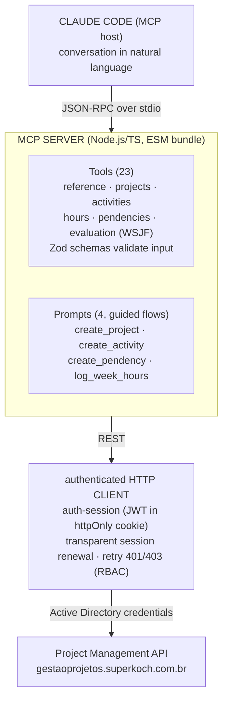

## About the Project

**Gestão de Projetos MCP** is a **Claude Code plugin** that connects the AI assistant to Grupo Koch's internal **Project Management system**. Instead of opening the web interface for every task, the user has a conversation with Claude and it performs the actions in the system — creating projects, opening activities, logging hours, recording blockers, advancing the workflow — through an **MCP (Model Context Protocol) server** written in TypeScript.

> ⚠️ **Internal integration — no public link.** Because this connects to a real corporate system (authenticated with network credentials and containing company project data), **there is no public URL or open repository available**. This post describes the **architecture, protocol, guided flows, and design decisions** in an anonymized way — without exposing internal endpoints, credentials, or sensitive data.

The plugin packages three things into a single installable artifact:

- An **MCP server** (Node.js/TypeScript) that exposes **23 tools** and **4 guided flows**.
- An **authenticated HTTP client** for the Project Management REST API, with session management and automatic renewal.
- A **skill** in Portuguese containing business rules, lifecycle definitions, and usage best practices.

## The Problem

Internal project management systems hold a lot of value, but they extract a price in **friction**: every simple action — logging the week's hours, opening a blocker, moving a stage — requires navigating screens, filling out forms, and remembering mandatory fields. The typical result is something every manager knows:

- **Late time tracking**, done from memory on Friday afternoon.
- **Unlogged blockers**, which only become a problem once they're already blocking.
- **Lost context** between the actual work (the commits, what was delivered) and what ends up in the system.

The plugin's premise is to **bring the system into the conversation**. Since the developer already works in the terminal with Claude Code, it makes sense to be able to say _"log my hours for this week based on my commits"_ and have the assistant handle the rest — querying the API, mapping the work, creating whatever's missing, and confirming before saving.

## What MCP Is

The **Model Context Protocol** is an open standard that lets an AI assistant discover and call external tools in a structured way. Each tool declares its **input schema** (validated here with **Zod**), and the model decides which one to call and with what arguments. Beyond tools, MCP supports **prompts** — guided, reusable flows that orchestrate multiple calls in a sequence with confirmation steps.

In this project the server speaks **MCP over stdio** (the process's stdin/stdout): Claude Code starts the plugin's Node process and exchanges JSON-RPC messages with it. Nothing is exposed over the network.

## Architecture

The plugin cleanly separates **the protocol** (the MCP tools the model sees) from **the transport** (the authenticated HTTP client that talks to the corporate API).

### Tool layer

The 23 tools are organized by domain, one "family" per file:

- **reference** — support queries: current user and permissions (`auth_me`), people search in AD (`directory_search`), current accounting week (`config_current_week`), areas (`area_list`), strategic objectives (`objective_list`), and workflow templates (`workflow_template_list`/`get`).
- **projects** — project lifecycle: `project_create`, `project_list`, `project_get`, status transitions (`project_status_set`, `project_status_history`), members (`project_members_add`/`list`), sponsors (`project_sponsors_add`), and workflow (`project_workflow_get`, `project_workflow_stage_complete`).
- **activities** — project activities: create, list, get, **start**, **complete**, and **reopen** (`project_activities_*`).
- **hours** — time tracking: log hours (`project_hours_register`), query by project (`project_hours_list`, `project_hours_actual`), and the **weekly summary** per user (`hours_weekly_summary`).
- **pendencies** — issues/blockers: create, list, update, and transition (`project_pendencies_start`/`resolve`/`cancel`).
- **evaluation** — **WSJF** (Weighted Shortest Job First) prioritization: set and query project scoring (`project_evaluation_set`/`get`) and list available models (`evaluation_model_list`).

### HTTP layer

The `api-client` is an authenticated REST client that abstracts the API session. The `auth-session` logs in with **Active Directory** credentials, stores the **JWT in an httpOnly cookie**, and when a call returns an expired session, **transparently renews it** and retries the request. Permission errors (`403`) are surfaced as clear messages — the server **respects the user's RBAC** and never tries to work around a denied authorization.

## Guided Flows (Prompts)

What sets this apart from "just an API wrapper" are the **prompts** — scripts that coordinate multiple calls with validations and human confirmation in between. There are four:

- **create_project** — guides the full creation process: infers name and description, has the user choose an **active leaf area** (`area_list` with `onlyLeaf=true`, rejecting grouping areas), offers a strategic objective and manager, allows adding a sponsor via AD search and filling in the **WSJF evaluation** — always showing the exact payload and asking for confirmation before saving.
- **create_activity** — creates an activity in a project, with title, description, due date (must be in the future), complexity, and estimated hours.
- **create_pendency** — opens a blocker (type: scope, deadline, cost, quality, technical, external dependency; severity from low to critical).
- **log_week_hours** — the most sophisticated flow, detailed below.

### Highlight: `log_week_hours`

This prompt closes the gap between **work done** and **work recorded**. Instead of the developer trying to remember what they did, they start from the source of truth: the **git history**.

1. Defines the **window** (current accounting week, Friday to Thursday, or a custom range).
2. Runs `git log` locally and groups **commits by day**.
3. Asks the user **how many hours** they have available for project work on each day.
4. **Maps** each work group to an existing project/activity — and if there's no match, proposes **creating the project** (following the `create_project` rules) and/or the activity, always with confirmation.
5. **Distributes** the hours in a balanced way across activities and days, respecting the daily cap.
6. **Logs** the hours (`project_hours_register`) with a day description derived from the commits.
7. **Completes** activities that represent finished work and **reports** everything: projects created, activities created, and hours per day.

Time tracking stops being a tedious manual task and becomes **a confirmation of something the assistant has already assembled** from real evidence.

## Prioritization with WSJF

The system uses **WSJF (Weighted Shortest Job First)** to prioritize initiatives. The plugin exposes this during project creation and editing through four dimensions (scale of 1 to 10):

- **Value** — business value of the delivery.
- **Urgency** — time criticality (cost of delay).
- **Risk** — risk reduction or opportunity enablement.
- **Effort** — size of the work (the higher the effort, the **lower** the final score).

The **score calculation and derived priority are done on the backend**, according to the active model (with its weights and thresholds) — the plugin only collects the four scores and queries `evaluation_model_list` to explain the model in use. Keeping the formula on the server ensures everyone prioritizes by the same criteria.

## Configuration and Distribution

As a Claude Code plugin, configuration is declarative. The `plugin.json` defines the `userConfig` that Claude Code presents to the user during installation:

- **`gp_username`** / **`gp_password`** — network credentials (AD). The password is marked as `sensitive`, so it **doesn't appear in chat** or in logs.
- **`gp_api_base_url`** — API endpoint (production by default; staging for testing).

These variables are injected into the MCP server process via `.mcp.json`, which starts `dist/index.js` with `type: "stdio"`. The build is done with **esbuild** (single ESM bundle), keeping the installation lightweight and requiring no `npm install` on the client.

## Key Challenges

- **Designing tools at the right granularity.** Each tool needs to be specific enough for the model to choose confidently, but general enough not to explode into dozens of variations. Splitting by domain (project, activity, hour, blocker) and by verb (create, start, complete, reopen) was the right balance — 23 tools that cover the lifecycle without ambiguity.
- **Transparent session renewal.** The API uses sessions with expiry. Letting the model deal with "your session expired" would be a terrible experience; automatic renewal in `auth-session` hides this entirely — the tool simply works, even after an idle period.
- **Respecting RBAC without frustrating the user.** Not every user can do everything. Rather than attempting actions that will fail, the server surfaces the `403` as a clear message and the assistant **informs** the user that this action requires a permission they don't have — it never insists or tries to work around it.
- **Orchestrating `log_week_hours` with confirmation.** Automating time tracking is useful, but logging wrong hours is worse than not logging at all. The flow always **shows the plan** (commit mapping, hour distribution, projects/activities to create) and **waits for confirmation** before any write.
- **Strong validation at the boundary.** Every argument entering a tool passes through a **Zod schema**, which turns ambiguous model inputs into explicit, early errors rather than malformed requests to the API.

## Technologies Used

- **TypeScript / Node.js** — MCP server and HTTP client.
- **@modelcontextprotocol/sdk** — protocol implementation (tools, prompts, stdio transport).
- **Zod** — schema validation on all tool inputs.
- **esbuild** — single ESM bundle for lightweight plugin distribution.
- **ESLint + Prettier** — code style and quality.
- **Active Directory + JWT (httpOnly cookie)** — authentication and session against the corporate API.

## Technical Notes

- **Protocol separated from transport.** The MCP tools know nothing about HTTP; the `api-client` knows nothing about MCP. This separation keeps both layers independently testable and replaceable.
- **Prompts as "product."** Tools are the mechanics; prompts (`create_project`, `log_week_hours`) are the experience. The business rules live in them — which fields to ask for, in what order, what to confirm — and that's what turns loose API calls into a flow that actually makes sense to the user.
- **Security by design.** Credentials via `userConfig` (marked as `sensitive`), session in an httpOnly cookie, server-side RBAC respected, and no network exposure (stdio). The assistant operates with exactly the user's permissions — no more, no less.
- **Anonymization.** Internal endpoints, API schema, system names, and infrastructure details have been deliberately omitted from this post — the focus is the integration engineering, not the corporate data.
