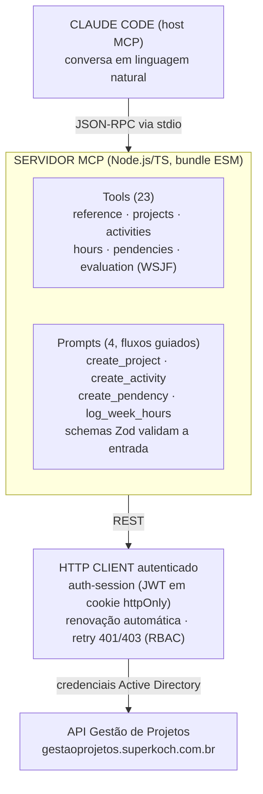

## Sobre o Projeto

**Gestão de Projetos MCP** é um **plugin do Claude Code** que conecta o assistente de IA ao sistema corporativo de **Gestão de Projetos do Grupo Koch**. Em vez de abrir a interface web para cada tarefa, o colaborador conversa com o Claude e ele executa as ações no sistema — criar projetos, abrir atividades, apontar horas, registrar pendências, avançar o workflow — através de um **servidor MCP (Model Context Protocol)** escrito em TypeScript.

> ⚠️ **Integração interna, sem link público.** Por conectar-se a um sistema corporativo real (autenticado com credenciais de rede e com dados de projetos da empresa), **não há URL pública nem repositório aberto disponível**. Este post descreve a **arquitetura, o protocolo, os fluxos guiados e as decisões de design** de forma anonimizada — sem expor endpoints internos, credenciais ou dados sensíveis.

O plugin empacota três coisas em um único artefato instalável:

- Um **servidor MCP** (Node.js/TypeScript) que expõe **23 ferramentas** e **4 fluxos guiados**.
- Um **cliente HTTP autenticado** para a API REST do Gestão de Projetos, com sessão e renovação automática.
- Uma **skill** em português com as regras de negócio, ciclos de vida e boas práticas de uso.

## O Problema

Sistemas internos de gestão de projetos concentram muito valor, mas cobram um preço em **fricção**: cada ação simples — apontar as horas da semana, abrir uma pendência, mover uma etapa — exige navegar por telas, preencher formulários e lembrar de campos obrigatórios. O resultado típico é o que todo gestor conhece:

- **Apontamento de horas atrasado**, feito de memória na sexta-feira à tarde.
- **Pendências não registradas**, que só viram problema quando já são bloqueio.
- **Contexto perdido** entre o trabalho real (os commits, o que foi entregue) e o que fica registrado no sistema.

A proposta do plugin é **trazer o sistema para dentro da conversa**. Como o desenvolvedor já trabalha no terminal com o Claude Code, faz sentido que ele possa dizer _"aponta minhas horas dessa semana a partir dos meus commits"_ e o assistente resolva o resto — consultando a API, mapeando o trabalho, criando o que faltar e confirmando antes de gravar.

## O que é MCP

O **Model Context Protocol** é um padrão aberto que permite a um assistente de IA descobrir e chamar ferramentas externas de forma estruturada. Cada ferramenta declara seu **schema de entrada** (aqui, validado com **Zod**), e o modelo escolhe qual chamar e com quais argumentos. Além de ferramentas, o MCP suporta **prompts** — fluxos guiados, reutilizáveis, que orquestram várias chamadas em uma sequência com passos de confirmação.

Neste projeto o servidor fala **MCP sobre stdio** (stdin/stdout do processo): o Claude Code inicia o processo Node do plugin e troca mensagens JSON-RPC com ele. Nada é exposto na rede.

## Arquitetura

O plugin separa claramente **o protocolo** (as ferramentas MCP que o modelo enxerga) do **transporte** (o cliente HTTP autenticado que fala com a API corporativa).

### Camada de ferramentas

As 23 ferramentas são organizadas por domínio, uma "família" por arquivo:

- **reference** — consultas de apoio: usuário atual e permissões (`auth_me`), busca de pessoas no AD (`directory_search`), semana contábil corrente (`config_current_week`), áreas (`area_list`), objetivos estratégicos (`objective_list`) e templates de workflow (`workflow_template_list`/`get`).
- **projects** — ciclo de vida do projeto: `project_create`, `project_list`, `project_get`, transições de status (`project_status_set`, `project_status_history`), membros (`project_members_add`/`list`), patrocinadores (`project_sponsors_add`) e workflow (`project_workflow_get`, `project_workflow_stage_complete`).
- **activities** — atividades do projeto: criar, listar, obter, **iniciar**, **concluir** e **reabrir** (`project_activities_*`).
- **hours** — apontamento: registrar horas (`project_hours_register`), consultar por projeto (`project_hours_list`, `project_hours_actual`) e o **resumo semanal** por usuário (`hours_weekly_summary`).
- **pendencies** — issues/blockers: criar, listar, atualizar e transicionar (`project_pendencies_start`/`resolve`/`cancel`).
- **evaluation** — priorização **WSJF** (Weighted Shortest Job First): definir e consultar o scoring do projeto (`project_evaluation_set`/`get`) e listar os modelos disponíveis (`evaluation_model_list`).

### Camada HTTP

O `api-client` é um cliente REST autenticado que abstrai a sessão da API. O `auth-session` faz login com as credenciais do **Active Directory**, guarda o **JWT em cookie httpOnly** e, quando uma chamada retorna sessão expirada, **renova de forma transparente** e repete a requisição. Erros de permissão (`403`) são propagados como mensagens claras — o servidor **respeita o RBAC** do usuário e nunca tenta contornar uma autorização negada.

## Fluxos Guiados (Prompts)

O diferencial em relação a "só um wrapper de API" são os **prompts** — roteiros que coordenam várias chamadas com validações e confirmação humana no meio. São quatro:

- **create_project** — conduz a criação completa: infere nome e descrição, faz o usuário escolher uma **área dona ativa** (`area_list` com `onlyLeaf=true`, rejeitando áreas agrupadoras), oferece objetivo estratégico e gerente, permite adicionar patrocinador via busca no AD e preencher a **avaliação WSJF** — sempre mostrando o payload exato e pedindo confirmação antes de gravar.
- **create_activity** — cria uma atividade em um projeto, com título, descrição, prazo (futuro), complexidade e horas estimadas.
- **create_pendency** — abre uma pendência (tipo: escopo, prazo, custo, qualidade, técnica, dependência externa; severidade de baixa a crítica).
- **log_week_hours** — o fluxo mais sofisticado, detalhado a seguir.

### Destaque: `log_week_hours`

Este prompt fecha a lacuna entre **o trabalho feito** e **o trabalho registrado**. Em vez de o desenvolvedor lembrar o que fez, ele parte da fonte da verdade: o **histórico do git**.

1. Define a **janela** (semana contábil corrente, sexta a quinta, ou um intervalo customizado).
2. Roda `git log` localmente e agrupa os **commits por dia**.
3. Pergunta ao usuário **quantas horas** ele tem disponíveis para projeto em cada dia.
4. **Mapeia** cada grupo de trabalho para um projeto/atividade existente — e, se não houver correspondência, propõe **criar o projeto** (seguindo as regras do `create_project`) e/ou a atividade, sempre com confirmação.
5. **Distribui** as horas de forma balanceada entre atividades e dias, respeitando o teto diário.
6. **Registra** as horas (`project_hours_register`) com uma descrição do dia derivada dos commits.
7. **Conclui** as atividades que representam trabalho terminado e **relata** tudo: projetos criados, atividades criadas e horas por dia.

O apontamento deixa de ser uma tarefa manual chata e passa a ser uma **confirmação de algo que o assistente já montou** a partir de evidências reais.

## Priorização com WSJF

O sistema usa **WSJF (Weighted Shortest Job First)** para priorizar iniciativas. O plugin expõe isso na criação e na edição do projeto através de quatro dimensões (escala de 1 a 10):

- **Value** — valor de negócio da entrega.
- **Urgency** — criticidade temporal (custo do atraso).
- **Risk** — redução de risco ou habilitação de oportunidade.
- **Effort** — tamanho do trabalho (quanto maior o esforço, **menor** o score final).

O **cálculo do score e da prioridade derivada é feito no backend**, conforme o modelo ativo (com seus pesos e limiares) — o plugin apenas coleta as quatro notas e consulta `evaluation_model_list` para explicar o modelo em uso. Manter a fórmula no servidor garante que todos priorizem pelo mesmo critério.

## Configuração e Distribuição

Como plugin do Claude Code, a configuração é declarativa. O `plugin.json` define o `userConfig` que o Claude Code apresenta ao usuário na instalação:

- **`gp_username`** / **`gp_password`** — credenciais de rede (AD). A senha é marcada como `sensitive`, então **não aparece no chat** nem em logs.
- **`gp_api_base_url`** — endpoint da API (produção por padrão; HML para testes).

Essas variáveis são injetadas no processo do servidor MCP via `.mcp.json`, que sobe o `dist/index.js` com `type: "stdio"`. O build é feito com **esbuild** (bundle ESM único), o que mantém a instalação leve e sem passo de `npm install` no cliente.

## Principais Dificuldades

- **Desenhar ferramentas na granularidade certa.** Cada tool precisa ser específica o bastante para o modelo escolher com segurança, mas genérica o bastante para não explodir em dezenas de variações. A divisão por domínio (projeto, atividade, hora, pendência) e por verbo (criar, iniciar, concluir, reabrir) foi o equilíbrio encontrado — 23 tools que cobrem o ciclo de vida sem ambiguidade.
- **Sessão e renovação transparentes.** A API usa sessão com expiração. Deixar o modelo lidar com "sua sessão expirou" seria péssimo; a renovação automática no `auth-session` esconde isso por completo — a ferramenta simplesmente funciona, mesmo após um período ocioso.
- **Respeitar o RBAC sem frustrar.** Nem todo usuário pode tudo. Em vez de tentar ações que vão falhar, o servidor propaga o `403` como mensagem clara e o assistente **avisa** que aquilo exige uma permissão que o usuário não tem — nunca insiste nem tenta contornar.
- **Orquestrar `log_week_hours` com confirmação.** Automatizar o apontamento é útil, mas gravar horas erradas é pior do que não gravar. O fluxo sempre **mostra o plano** (mapeamento de commits, distribuição de horas, projetos/atividades a criar) e **espera confirmação** antes de qualquer escrita.
- **Validação forte na fronteira.** Todo argumento que entra em uma tool passa por um **schema Zod**, o que transforma entradas ambíguas do modelo em erros explícitos e cedo, em vez de requisições malformadas para a API.

## Tecnologias Utilizadas

- **TypeScript / Node.js** — servidor MCP e cliente HTTP.
- **@modelcontextprotocol/sdk** — implementação do protocolo (tools, prompts, transporte stdio).
- **Zod** — validação de schemas em todas as entradas de ferramentas.
- **esbuild** — bundle ESM único para distribuição leve do plugin.
- **ESLint + Prettier** — padronização e qualidade de código.
- **Active Directory + JWT (cookie httpOnly)** — autenticação e sessão contra a API corporativa.

## Notas Técnicas

- **Protocolo separado do transporte.** As ferramentas MCP não sabem nada de HTTP; o `api-client` não sabe nada de MCP. Essa separação deixa as duas camadas testáveis e substituíveis de forma independente.
- **Prompts como "produto".** As tools são a mecânica; os prompts (`create_project`, `log_week_hours`) são a experiência. É neles que mora a regra de negócio — quais campos pedir, em que ordem, o que confirmar — e é o que transforma chamadas soltas de API em um fluxo que faz sentido para o usuário.
- **Segurança por design.** Credenciais via `userConfig` (marcadas como `sensitive`), sessão em cookie httpOnly, respeito ao RBAC do servidor e nenhuma exposição de rede (stdio). O assistente opera exatamente com as permissões do usuário — nem mais, nem menos.
- **Anonimização.** Endpoints internos, schema da API, nomes de sistemas e detalhes de infraestrutura foram deliberadamente omitidos deste post — o foco é a engenharia da integração, não os dados corporativos.
