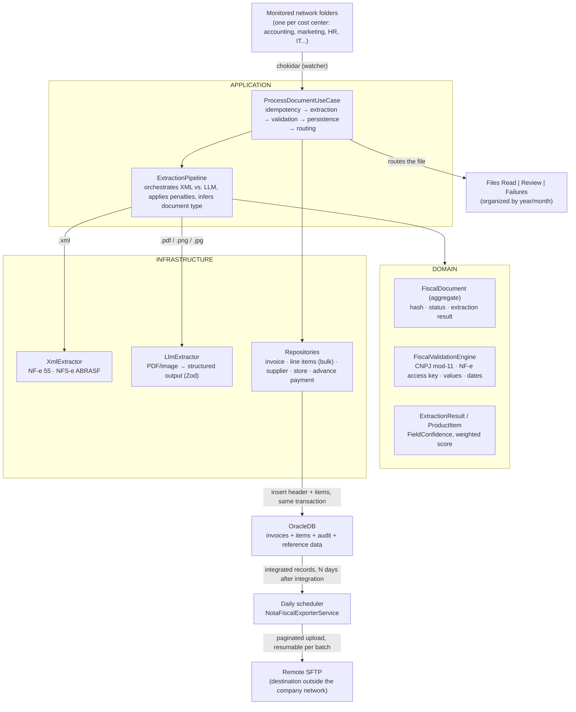

## About the Project

**Gestão de Despesas — Ingestor** is the fiscal-document ingestion worker that feeds the **Gestão de Despesas** expense management system of a retail company (see the [Gestão de Despesas](/en-US/post/gestao-de-despesas) post for the web application that consumes this data). It's an independent **Node.js/TypeScript** service with **hexagonal architecture** (domain, application, infrastructure, interfaces) that watches network folders in real time, extracts invoice data from XML, PDF, and image files — header **and line items** — validates the fields, and persists everything to OracleDB. The worker is the successor to an earlier extraction pipeline, rewritten as a dedicated Node.js service.

> ⚠️ **Internal integration — no public link.** Because it processes real fiscal documents for the company and connects to network folders and a corporate database, **there is no public URL or open repository available**. This post describes the **architecture, extraction pipeline, and key challenges** in an anonymized way — without exposing internal endpoints, credentials, hostnames, or database schema.

## The Problem

Each cost center (accounting, marketing, HR, IT, maintenance, procurement) receives its own invoices — in XML, PDF, or even image form — dropped into a monitored network folder. Turning that raw stream of heterogeneous files into structured, reliable database records without manual typing requires solving three problems at once:

- **Incompatible formats.** XML is structured and straightforward to parse; PDF and image files have no structure at all — they require some form of "intelligent" document reading.
- **Reliability without reviewing everything by hand.** Not every automatic extraction is reliable enough to go straight into the database; but requiring manual review of **every** invoice would cancel out the point of automating.
- **Tax consistency.** Fields like CNPJ, the NF-e access key, and amounts need validation before becoming data — an extraction error that slips through becomes a financial problem downstream.

The worker's goal is to solve ingestion end-to-end: **detect** the file as soon as it arrives, **extract** its data with the right method per type, **validate** it with a tax-rules engine, and **decide on its own** what can go straight into the database and what needs human eyes.

## Architecture

The project follows **hexagonal architecture** (ports & adapters): the domain knows nothing about Oracle, LLMs, or the filesystem — those dependencies enter through ports (`domain/ports/`) implemented in the infrastructure layer.

### Layers

- **`domain/`** — the pure core: the `FiscalDocument` entity (hash, status, extraction result), the extraction value objects (`ExtractionResult`, `ProductItem`, per-field confidence, and weighted score), the `FiscalValidationEngine`, and the **ports** (`ports/repositories.ts`, `ports/services.ts`) that define the contracts infrastructure must implement. Nothing here knows what Oracle, chokidar, or OpenAI are.
- **`application/`** — the main use case (`ProcessDocumentUseCase`) orchestrates the end-to-end flow: idempotency → extraction → validation → persistence → file routing. The `ExtractionPipeline` chooses between the XML and LLM extractor, applies confidence penalties, and infers the document type when it isn't obvious from the extension.
- **`infrastructure/`** — the concrete adapters: the extractors (XML and LLM), the Oracle repositories (invoice, line items via bulk `executeMany`, supplier, store, advance payment), and the Oracle connection pool in thick mode.
- **`interfaces/`** — the process entry points: the `file-watcher` (chokidar watching the input folders) and a **daily scheduler** that exports invoices already integrated with the ERP to an external destination over **SFTP** — independent of the main watcher and of ingestion itself.

## Extraction Pipeline

Each cost center has a monitored input folder, organized by group. When a file appears, `ProcessDocumentUseCase` runs:

1. **Detection** — `chokidar` detects the new file in the input folder.
2. **Idempotency** — computes the file's **SHA-256** hash and checks the database for a prior match; duplicates are discarded without reprocessing.
3. **Extraction** — two paths depending on the type:
   - **XML** → `XmlExtractor`, direct structured parsing (NF-e model 55 and NFS-e ABRASF).
   - **PDF / image** → `LlmExtractor`, an LLM with structured output (Zod schema), covering NF-e, NFS-e, communication invoices, bank slips, bills, debit notes, and receipts. Critical header fields (CNPJs, amounts) get automatic double-checking, and LLM call concurrency is capped at **2 simultaneous requests**.
   - **Line items/products** are extracted in the same pass (code, description, NCM, CFOP, quantity, values, ICMS, IPI…); the most tax-sensitive per-item fields get top-priority instructions in the prompt.
4. **Tax validation** — the `FiscalValidationEngine` checks **CNPJ (mod-11)**, **NF-e access key**, value consistency, and dates. Each failure applies a penalty and lowers the document's **confidence score**.
5. **Enrichment** — resolves supplier, type, and store in the database; detects and corrects CNPJ inversion (issuer vs. recipient); checks the supplier's open balances to flag advance payments.
6. **Persistence** — inserts **header + line items in the same transaction** (atomic rollback if any part fails), with line items written in bulk (`executeMany`), and records the audit entry.
7. **File routing** — depending on the outcome, the file is moved to `Files Read`, `Review` (score below threshold), or `Failures`, always organized by `year/month`.

The auto-insert threshold without human review is **0.70**. Below that, the invoice goes to a review queue instead of entering the flow directly. The document's lifecycle follows `PENDING → PROCESSING → INSERTED | REVIEW | ERROR`, with `APPROVED`/`INTEGRATED` managed later by the web application.

## Normalizing Amounts and Due Dates

Beyond extracting and validating, the pipeline applies two business rules that correct common distortions in the source documents before persisting:

- **Derived gross amount.** Some documents only report the net total (with a discount already baked in), which forced the accounting team to manually fix the gross-amount field on every invoice with a discount. The pipeline now derives `valor_nota` (gross) from the net amount plus the discount whenever the gross doesn't match that sum — except for one document type (services) where the amount field already represents the gross by definition, and adding the discount back would incorrectly inflate it.
- **Due-date inference and adjustment.** When a document doesn't carry a due date, the worker looks up the supplier's registered payment term in the ERP and infers the date from the issue date; with no registered term, it falls back to a default. Either way — inferred or extracted — a due date landing on a weekend is pushed to the next business day, since that's the day the payment is actually processed.

## A Second Extraction Flow

Beyond the main invoice pipeline, the worker maintains a second LLM extractor dedicated to a distinct kind of free text — service descriptions from outsourced-labor suppliers, who informally mention which internal requisitions that work refers to. This extractor only fires when the text suggests that kind of content (to avoid costing on every invoice) and tries to match what it read against the requisition records — as an accessory step: any failure here is logged and ignored, never blocking ingestion of the invoice itself. A diagnostic script rounds out the worker's operational toolkit for support when something falls outside the automatic flow.

## Key Challenges

- **Reliable extraction from heterogeneous documents.** XML is structured, but PDFs and images are not. Using an LLM with **structured output + confidence score + review threshold** was what made automation possible without sacrificing control: what the model isn't confident about goes to human review instead of entering the database incorrectly.
- **Distinguishing between `null` and `"0.00"`.** A field **not printed** on the invoice (`null`) is semantically different from a value **explicitly stated as zero** (exempt/not applicable). Preserving that distinction in the extraction schema is essential for correct tax handling downstream, in the web application.
- **Atomic header + line item transaction.** An invoice without its line items (or vice versa) is an invalid state. Inserting both in the **same transaction**, with items in bulk and automatic rollback, ensures consistency even under partial failure.
- **Domain isolated from infrastructure.** Defining the ports (`ports/repositories.ts`, `ports/services.ts`) before implementing the adapters forced the domain's contract to be designed first — the `FiscalValidationEngine` and entities don't need to know Oracle, an LLM, or a filesystem exist behind them.
- **Idempotency.** The same file can reappear in the folder. The **SHA-256 hash** with a pre-check guarantees that reprocessing never creates duplicates.
- **Controlled LLM call concurrency.** Capping calls at 2 simultaneous requests avoids exhausting rate limits and cost spikes when several invoices arrive at once, without fully serializing processing.
- **Export resilient to partial failures.** The daily SFTP export job paginates pending records and isolates failures per record: if one upload fails, that record is flagged and skipped, but pagination continues for the rest — one isolated failure doesn't stall the batch or force reprocessing everything from scratch.

## Technologies Used

- **Node.js / TypeScript** — hexagonal architecture (domain, application, infrastructure, interfaces).
- **LLM with structured output (OpenAI)** — extraction of PDFs and images, validated against a Zod schema.
- **fast-xml-parser** — structured XML parsing (NF-e/NFS-e).
- **chokidar** — real-time watching of input folders.
- **OracleDB** — connection pool in thick mode, parameterized binds, `executeMany` for bulk inserts.
- **SFTP** — scheduled daily export of already-integrated invoices to a destination outside the company network.
- **Docker** — worker packaging, with Docker secrets for credentials in production.

## Technical Notes

- **Domain with no external dependencies.** The golden rule of hexagonal architecture holds: everything that touches OracleDB, an LLM, or the filesystem enters through a port defined in the domain — swapping an adapter (say, a different LLM provider) shouldn't require touching `domain/` or `application/`.
- **Separation of ingestion and operations.** The worker never decides whether an expense is approved — that responsibility belongs entirely to the web application. The worker's only concern is turning a raw document into a structured, reliable record.
- **Anonymization.** Internal endpoints, hostnames, credentials, database schema, and proprietary system names have been deliberately omitted from this post — the focus is the engineering of the ingestion pipeline, not the corporate data.
