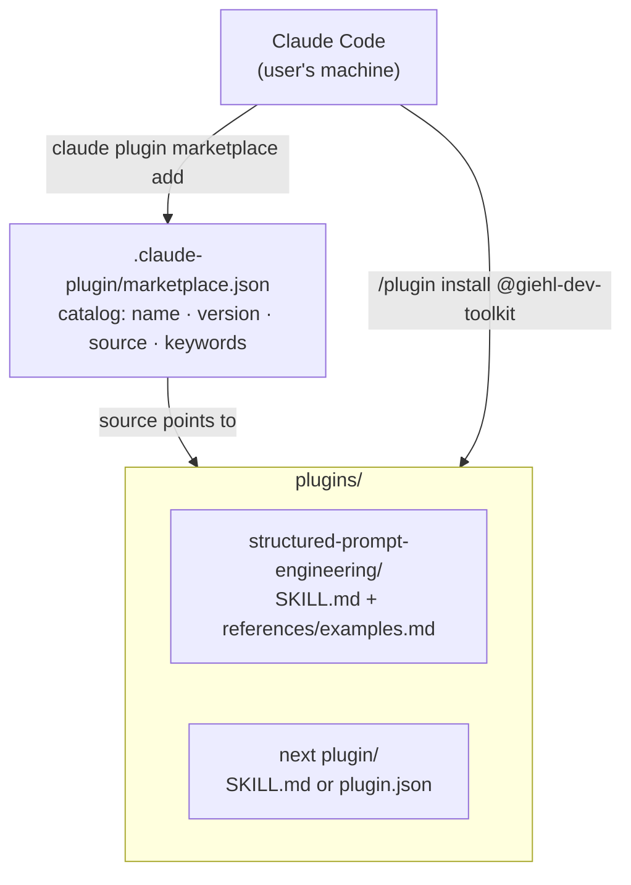

## About the Project

**Giehl Dev Toolkit** is a **personal plugin marketplace for [Claude Code](https://code.claude.com)**. Instead of manually copying skill files, MCP configurations, and commands between machines and projects, the repository centralizes everything into a single installable catalog with one command: `claude plugin marketplace add` + `/plugin install`.

The repository is public and available at [github.com/cristiangiehl1/giehl-dev-toolkit](https://github.com/cristiangiehl1/giehl-dev-toolkit).

## The Problem

Working with Claude Code every day eventually produces a set of patterns worth reusing: how to structure a `system prompt`, commit conventions, a code review flow. Without a central place for this, the usual path is one of two bad options:

- **Copy-pasting** skill files from one project to another, losing track of which version lives where.
- **Rewriting from scratch** the same pattern on another machine or a new project, because finding the original file takes more effort than retyping it.

A **plugin marketplace** solves this at the root: each pattern becomes a versioned plugin, cataloged once, installable in any project or machine with a single command.

## Architecture

The repository follows the standard Claude Code marketplace structure: a catalog at the root and one directory per plugin.

- **`.claude-plugin/marketplace.json`** — the catalog. Each entry registers `name`, `displayName`, `description`, `version` (SemVer), `author`, `license`, `source` (path to the plugin directory), and `keywords` for discovery.
- **`plugins/<plugin-name>/`** — one directory per plugin, containing its manifest (`SKILL.md` with frontmatter, or `plugin.json`) and the implementation of the skill, command, subagent, or hook.

## Published plugin: `structured-prompt-engineering`

The marketplace's first plugin documents a pattern for writing LLM prompts as **serialized objects** (`JSON.stringify`) instead of plain text — a technique that is framework-agnostic (works with LangChain, the Vercel AI SDK, or a direct call to an LLM API).

The skill covers:

- The anatomy of `getSystemPrompt` (receives only what changes per session/config — never the current turn's message) and `getUserPromptTemplate` (receives the current turn's input and repeats the relevant instruction, reducing drift in long conversations).
- Recurring sections that work well inside the object: `role`, `tarefas`/`task`, `regras`/`rules`, `extraction_instructions`, `examples`/`exemplos`.
- The parametrization rule: if a value changes between calls (catalog data, user context, current message), it's a **function parameter** — never a literal hardcoded inside the object.
- A set of **do's and don'ts** derived from real production prompts, highlighting the most common and most silent error: the model confusing "what the user said" with "what the AI itself recommended" during preference extraction.
- `references/examples.md` with 4 complete, annotated examples of `getSystemPrompt`/`getUserPromptTemplate` + schema, covering preference extraction, intent classification, message generation, and conversation summarization.

## Conventions and Contribution Flow

The `README.md` documents the process for adding a new plugin to the marketplace:

1. Create a directory under `plugins/<plugin-name>/`.
2. Add the manifest (`SKILL.md` with frontmatter, or `plugin.json`) describing name, description, and usage.
3. Register the plugin in `.claude-plugin/marketplace.json`, including `name`, `version`, and `source`.
4. Test locally with `claude plugin marketplace add /local/path` before publishing.

Conventions fixed in the README: plugin names in `kebab-case`, versioning by [SemVer](https://semver.org/), and an objective description plus a usage example for each plugin. Relevant releases are tagged with Git tags (`git tag vX.Y.Z`).

## Key Challenges

- **Deciding what belongs in the skill body versus `references/`.** A skill needs to fit in a context the model loads entirely; extensive supporting content (like the 4 complete few-shot examples) was split into `references/examples.md`, referenced from `SKILL.md` instead of inflating the skill's main body.
- **Writing the frontmatter `description` as a trigger, not a summary.** The `description` field in `SKILL.md` is what Claude uses to decide _when_ to load the skill — it needs to explicitly list the phrases and situations that should trigger its use, not just describe the content.
- **Keeping the catalog and directories in sync.** As the marketplace grows, the risk is registering a plugin in `marketplace.json` with a `source` that doesn't match the actual directory, or forgetting to bump the `version` after a relevant change — hence the convention of always testing with a local `claude plugin marketplace add` before publishing.

## Technologies Used

- **Claude Code** — the marketplace's and plugins' target platform.
- **Markdown + YAML frontmatter** — the format for skill manifests (`SKILL.md`).
- **JSON** — the marketplace catalog (`marketplace.json`).
- **Git + SemVer** — versioning and distribution via tags.

## Technical Notes

- **Marketplace as personal infrastructure, not a product.** The README's stated goal is to have "a single installation point" for the author's own development patterns — the initial target audience is the author himself, across different machines and projects.
- **Minimal surface by design.** No build step, no runtime dependencies: each plugin is static markdown and/or JSON, which keeps installation instant and the repository auditable line by line.
