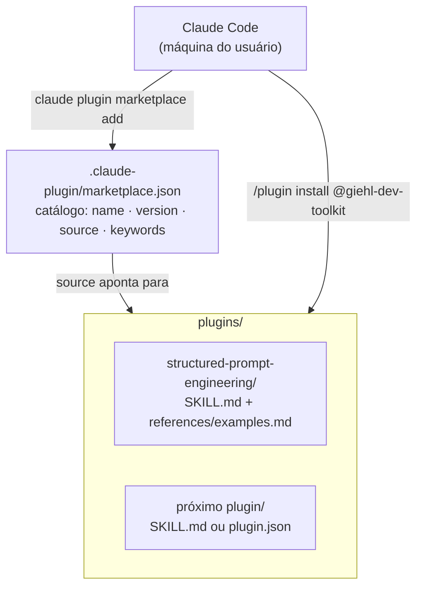

## Sobre o Projeto

**Giehl Dev Toolkit** é um **marketplace pessoal de plugins para o [Claude Code](https://code.claude.com)**. Em vez de copiar arquivos de skill, configurações de MCP e comandos manualmente entre máquinas e projetos, o repositório centraliza tudo num único catálogo instalável com um comando: `claude plugin marketplace add` + `/plugin install`.

O repositório é público e está disponível em [github.com/cristiangiehl1/giehl-dev-toolkit](https://github.com/cristiangiehl1/giehl-dev-toolkit).

## O Problema

Trabalhar com o Claude Code todos os dias gera, com o tempo, um conjunto de padrões que valem a pena repetir: a forma de estruturar um `system prompt`, convenções de commit, um fluxo de revisão de código. Sem um lugar central para isso, o caminho mais comum é um de dois ruins:

- **Copiar e colar** arquivos de skill de um projeto para outro, perdendo o rastro de qual versão está em cada lugar.
- **Reescrever do zero** o mesmo padrão numa outra máquina ou num projeto novo, porque encontrar o arquivo original dá mais trabalho do que digitar de novo.

Um **marketplace de plugins** resolve isso na raiz: cada padrão vira um plugin versionado, catalogado uma única vez, instalável em qualquer projeto ou máquina com um comando.

## Arquitetura

O repositório segue a estrutura padrão de um marketplace do Claude Code: um catálogo na raiz e um diretório por plugin.

- **`.claude-plugin/marketplace.json`** — o catálogo. Cada entrada registra `name`, `displayName`, `description`, `version` (SemVer), `author`, `license`, `source` (caminho para o diretório do plugin) e `keywords` para descoberta.
- **`plugins/<nome-do-plugin>/`** — um diretório por plugin, contendo seu manifesto (`SKILL.md` com frontmatter, ou `plugin.json`) e a implementação da skill, comando, subagent ou hook.

## Plugin publicado: `structured-prompt-engineering`

O primeiro plugin do marketplace documenta um padrão para escrever prompts de LLM como **objetos serializados** (`JSON.stringify`) em vez de texto corrido — técnica que independe de framework (funciona com LangChain, Vercel AI SDK ou chamada direta a uma API de LLM).

A skill cobre:

- A anatomia de `getSystemPrompt` (recebe apenas o que muda por sessão/config — nunca a mensagem do turno atual) e `getUserPromptTemplate` (recebe a entrada do turno atual e repete a instrução relevante, reduzindo _drift_ em conversas longas).
- Seções recorrentes que funcionam bem dentro do objeto: `role`, `tarefas`/`task`, `regras`/`rules`, `extraction_instructions`, `examples`/`exemplos`.
- A regra de parametrização: se o valor muda entre chamadas (catálogo, contexto do usuário, mensagem atual), é **parâmetro da função** — nunca um literal hardcoded no objeto.
- Um conjunto de **do's and don'ts** derivado de prompts reais em produção, com destaque para o erro mais comum e mais silencioso: o modelo confundir "o que o usuário disse" com "o que a própria IA recomendou" durante a extração de preferências.
- `references/examples.md` com 4 exemplos completos e comentados de `getSystemPrompt`/`getUserPromptTemplate` + schema, cobrindo extração de preferências, classificação de intenção, geração de mensagem e sumarização de conversa.

## Convenções e Fluxo de Contribuição

O `README.md` documenta o processo para adicionar um novo plugin ao marketplace:

1. Criar um diretório em `plugins/<nome-do-plugin>/`.
2. Adicionar o manifesto (`SKILL.md` com frontmatter, ou `plugin.json`) descrevendo nome, descrição e uso.
3. Registrar o plugin em `.claude-plugin/marketplace.json`, incluindo `name`, `version` e `source`.
4. Testar localmente com `claude plugin marketplace add /caminho/local` antes de publicar.

Convenções fixadas no README: nomes de plugin em `kebab-case`, versionamento por [SemVer](https://semver.org/lang/pt-BR/) e uma descrição objetiva + exemplo de uso em cada plugin. Releases relevantes são marcadas com tags Git (`git tag vX.Y.Z`).

## Principais Dificuldades

- **Decidir o que vira plugin.md e o que vira `references/`.** Uma skill precisa caber num contexto que o modelo carrega inteiro; conteúdo de apoio extenso (como os 4 exemplos completos de few-shot) foi separado em `references/examples.md`, citado no `SKILL.md` em vez de inflar o corpo principal da skill.
- **Escrever a `description` do frontmatter como gatilho, não como resumo.** O campo `description` do `SKILL.md` é o que o Claude usa para decidir _quando_ carregar a skill — precisa listar explicitamente as frases e situações que devem disparar o uso, não apenas descrever o conteúdo.
- **Manter o catálogo e os diretórios sincronizados.** Com o marketplace crescendo, o risco é registrar um plugin em `marketplace.json` com um `source` que não bate com o diretório real, ou esquecer de subir a `version` depois de uma mudança relevante — daí a convenção de sempre testar com `claude plugin marketplace add` local antes de publicar.

## Tecnologias Utilizadas

- **Claude Code** — plataforma de destino do marketplace e dos plugins.
- **Markdown + frontmatter YAML** — formato dos manifestos de skill (`SKILL.md`).
- **JSON** — catálogo do marketplace (`marketplace.json`).
- **Git + SemVer** — versionamento e distribuição via tags.

## Notas Técnicas

- **Marketplace como infraestrutura pessoal, não produto.** O objetivo declarado no README é ter "um único ponto de instalação" para os próprios padrões de desenvolvimento — o público-alvo inicial é o próprio autor, entre máquinas e projetos diferentes.
- **Superfície mínima por design.** Sem build step, sem dependências de runtime: cada plugin é markdown e/ou JSON estático, o que mantém a instalação instantânea e o repositório auditável linha a linha.
