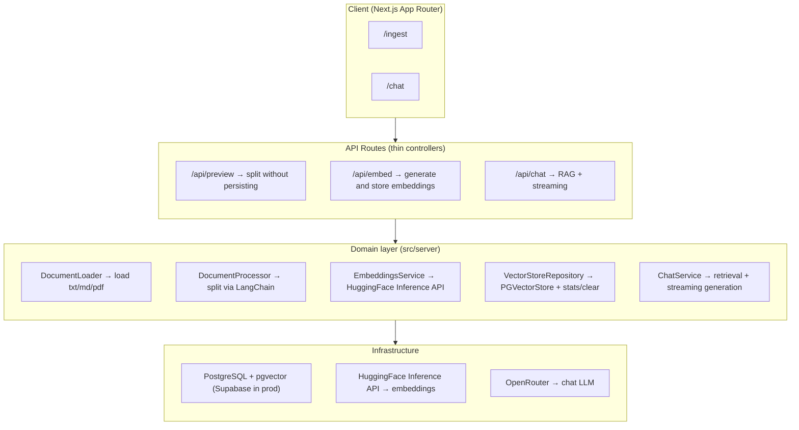

## About the Project

The **LangChain RAG Lab** is a **case study** on _Retrieval-Augmented Generation_ (RAG): an interactive lab where **every step of the pipeline is explicit, previewable, and configurable**. It lets you load documents (`.txt`, `.md`, `.pdf`), inspect how they are split into _chunks_, generate embeddings via the **HuggingFace Inference API**, persist vectors in **PostgreSQL + pgvector**, and ultimately chat with the content through an LLM with **streaming responses** and **citation of retrieved sources**.

More than a finished product, the focus is on **understanding the trade-offs** of a RAG system built entirely on free resources: free-tier models, low-dimensionality embeddings, and quantized LLMs. The interface deliberately exposes the parameters of each step (split, embedding, retrieval, generation) to make visible **how each decision affects response quality and accuracy**.

**Highlights**

- **Chunk preview** before any write — nothing is embedded or persisted until confirmed.
- **Remote embeddings** via HuggingFace Inference API (multilingual model, 384 dimensions) — no local model, ready for _serverless_.
- **Similarity search** (cosine distance) over an **HNSW** index in pgvector.
- **RAG chat with streaming** and source display including their similarity scores.
- **Fine-grained generation control**: `temperature`, `top_p`, `top_k`, `max_tokens`, `frequency/presence penalty`, and `system prompt` — disabled parameters are not sent to the API.
- **Zod-validated environment** on boot and an **OOP domain layer** (services + repository) with a central frozen `CONFIG`.

## Architecture

The project separates the interface (Next.js App Router), thin controllers (Route Handlers), and an object-oriented domain layer that concentrates all RAG logic.



**Summarized flow:** the document is loaded (`DocumentLoader`), split (`DocumentProcessor`), embedded by the HuggingFace Inference API (`EmbeddingsService`), and persisted (`VectorStoreRepository`). At chat time, the `ChatService` embeds the question, retrieves the most similar _chunks_, and builds the context for the LLM.

`EmbeddingsService` and `VectorStoreRepository` are **lazy singletons** (`getInstance()`): the HuggingFace client and the `PGVectorStore` connection pool are created once and reused across requests — avoiding a fresh connection on every call in a serverless environment, at the cost of an explicitly logged "cold start" on first creation.

## Ingestion Pipeline


The `/ingest` page exposes each step of document preparation:

1. **Document** — paste text or attach a `.txt` / `.md` / `.pdf` file (PDF via LangChain's `PDFLoader`, with `splitPages: false` — all pages are combined into a single text before splitting; an unsupported file type throws an explicit error).
2. **Split configuration** — using `RecursiveCharacterTextSplitter`, adjust `chunkSize`, `chunkOverlap`, and optional separators.
3. **Preview chunks** — shows all chunks numbered and with their sizes. **Nothing is sent to the model or the database at this step.**
4. **Confirm and generate embeddings** — each chunk is embedded via the HuggingFace Inference API and saved to pgvector with metadata (`source`, `chunkIndex`, `totalChunks`, `chunkSize`, `chunkOverlap`, `splitter`, `ingestedAt`). Changing the text or configuration invalidates the preview and requires previewing again.

### Vector store inspector

The same `/ingest` page exposes a **pgvector stats panel**, extending the "nothing stays opaque" philosophy beyond the chunk preview:

- **Total vectors** stored, plus a badge per document (`source · chunk count`).
- A **paginated listing** (20 per page, with "load more") of each individual vector, filterable by document, showing: the **first 8 raw embedding values** (`vector_dims` + the `vector::real[][1:8]` slice), the full stored chunk text, and the entire `metadata` jsonb.
- A **clear all** button (`DELETE FROM embeddings`, with confirmation) to wipe the vector store and restart an experiment from scratch.

## RAG Chat


On the `/chat` page, the app embeds the question, retrieves the `topK` most similar chunks from pgvector, builds the context, and calls the LLM via OpenRouter **with streaming**.

- Each response displays the **retrieved sources** with their **similarity score** (cosine), the model used, and the **applied parameters**.
- The **side panel** is fully configurable and persisted in `localStorage`:
  - **Retrieval:** `topK` and minimum score threshold — `minScore` is applied **in application code, after the search** (filtering results pgvector already returned), not as part of the SQL query.
  - **Generation:** `temperature`, `top_p`, `top_k` (sampling — distinct from the retrieval `topK`), `max_tokens`, `frequency_penalty`, `presence_penalty`, and `system prompt`. Since `top_k` isn't a native OpenAI parameter, it's sent via `modelKwargs` and forwarded verbatim by OpenRouter to the underlying model provider.
- The **prompt is structured** (`promptConfig` + templates) and assembled into `SystemMessage` (persona/rules) + `HumanMessage` (context/question), with an optional free-form system prompt override.

## Structured Prompt

Instead of writing a _system prompt_ as a loose block of text, the project treats the prompt as **structured, versionable data**. The configuration lives in `src/lib/prompt/prompt.config.json` and is **validated with Zod** (`promptConfigSchema`) on boot — if anything is malformed, the application fails at startup rather than sending a broken prompt to the LLM.

The config separates **what the model should do** from **how the text is assembled**:

```jsonc
{
  "task": "Answer user questions based exclusively on the retrieved documents",
  "role": "specialized assistant for querying and extracting information via RAG",
  "instructions": [
    "Use ONLY the information from the retrieved context to answer",
    "If the context is insufficient, clearly state that no answer was found",
    "Never invent facts that are not in the context",
    "When quoting a passage, reference the source number in the format [#]",
  ],
  "constraints": {
    "language": "pt-BR",
    "tone": "objective and helpful",
    "format": "natural text with source citation [#]",
  },
  "context_rules": {
    "use_only_provided_context": true,
    "indicate_if_insufficient_context": true,
  },
}
```

This config is injected into two _templates_ with _placeholders_ (`{role}`, `{instructions}`, `{context}`, `{question}`…): `system.txt` receives **persona and rules**, and `human.txt` receives **the retrieved context and the question**. `buildChatPrompt` renders both and returns `{ system, human }`, which become `SystemMessage` + `HumanMessage`.

**Why this matters more than a plain system prompt:**

- **Separation of concerns** — persona/rules (stable) live in the `SystemMessage`; context/question (volatile) live in the `HumanMessage`. Keeping instructions in the system role gives them **higher priority** and **greater resistance to prompt injection** from the user turn or from the documents themselves.
- **Validatable and versionable** — the prompt has a _schema_, `metadata` (version, author, tags), and a git history. Adjusting tone, language, or rules means editing a field, not rewriting a paragraph.
- **Consistency** — every response starts from exactly the same structure (language, citation format `[#]`, "don't make things up" policy), rather than depending on how the prompt happened to be written that day.
- **Deliberate override** — the chat panel still allows replacing everything with a free-form _system prompt_ for experimentation, but the **default path is the structured one**.

## Case Study: Choices and Trade-offs

Since the goal is learning, the project was built **entirely on free resources**. That's great for zero cost and for keeping the pipeline reproducible by anyone, but it comes at a price in quality — and seeing that price clearly is precisely the point of the lab.

### 1. Free-tier models

The chat LLM uses a `:free` model from OpenRouter (default: `google/gemma-4-26b-a4b-it:free`). Free models are generally **smaller and/or more aggressively optimized** than paid ones, which translates to:

- **Less reasoning capacity** and a higher tendency to hallucinate when the retrieved context is weak or ambiguous.
- **Rate limits and queues** — availability fluctuates and latency spikes during peak hours; `:free` model IDs can even go offline (which is why the model is configurable via env).
- **Limited context window and throughput**, restricting how many chunks can be injected into the prompt.

In a RAG system, generation quality depends **equally** on the model **and** on retrieval quality. With a weaker model, retrieval needs to be even more precise — which brings us to the second trade-off.

### 2. Embedding dimensionality

The embeddings use `sentence-transformers/paraphrase-multilingual-MiniLM-L12-v2`, a **multilingual model with only 384 dimensions** (versus 768, 1024, or 1536+ for larger models). The vector dimension is, in practice, the "budget" the model has for describing the meaning of a passage:

- **Fewer dimensions = less semantic representational power.** Nuances of meaning "collide" in the same space, and similarity search becomes **less accurate** — relevant passages may fall outside the `topK`, and superficially similar passages may sneak in.
- On the other hand, 384d is **cheaper and faster**: smaller vectors take up less space in pgvector, the HNSW index is lighter, and search latency drops.
- The dimension is **coupled to the schema** (`vector(384)`): switching the embedding model to one with a different dimension requires recreating the column and **re-ingesting all documents**.

Choosing 384d multilingual was a conscious trade-off: good enough for Portuguese, cheap, and serverless-friendly, at the cost of retrieval precision.

### 3. Quantization

Reducing a model's size by changing how its weights are represented. For example, going from 16-bit to 8-bit — or even 4-bit — **shrinks the model size and speeds up inference**, but can **impact response quality**.

The idea is to reduce the numerical precision used to **store** (and sometimes **compute**) the weights, so the model occupies less memory and runs faster — at the cost of some quality loss.

**Suffixes in model names** indicate how many bits are used. Taking `Llama-3-8B-Instruct-`**`q4f32_1`**`-MLC` as an example:

- **`q4`** → the model's _weights_ were stored in **4 bits**.
- **`f32`** → the _activations_ (tensors/intermediate calculations during inference) stay in **float32** (32 bits), while the original is typically float16.
- **`_1`** → an internal identifier for the quantization variant/recipe used by MLC (differences in algorithm, calibration, packing scheme, etc.).

The model becomes smaller **primarily because of the 4-bit weights**, while keeping activations in float32 helps **preserve numerical stability and inference quality**. In short, quantization is the dial that trades **precision** for **memory and speed** — and understanding it is essential for choosing, comparing, or running models locally (for example, MLC/WebLLM builds in the browser).

### Trade-off summary

| Choice                      | Benefit                          | Cost                                             |
| --------------------------- | -------------------------------- | ------------------------------------------------ |
| LLM `:free` (OpenRouter)    | Zero cost, no infrastructure     | Less capability, rate limits, more hallucination |
| 384d multilingual embedding | Fast, cheap, serverless-friendly | Less precise retrieval                           |
| Quantization (e.g., q4)     | Less memory, faster inference    | Numerical precision loss                         |

**How to mitigate** (natural evolution paths for the study): upgrade to higher-dimension embeddings, increase `topK` with a stricter score threshold, improve chunking (size/overlap by document type), add re-ranking, and when the budget allows, replace the `:free` LLM with a paid model or a less quantized local one.

## Technologies Used

### Framework

- **Next.js 15** — React framework with App Router
- **React 19** — UI library
- **TypeScript** — static typing throughout the project

### RAG Orchestration

- **LangChain** (`@langchain/core`, `@langchain/community`, `@langchain/textsplitters`, `@langchain/openai`) — splitters, loaders, and vector store integration
- **HuggingFace Inference API** — embeddings using the `sentence-transformers/paraphrase-multilingual-MiniLM-L12-v2` model (384 dimensions)
- **OpenRouter** — chat LLM (configurable `:free` model) with streaming responses

### Database

- **PostgreSQL 16** — primary persistence
- **pgvector** — vector storage with HNSW index and cosine distance
- **Supabase** — vector database in production (Transaction pooler)

### Frontend

- **Tailwind CSS** — utility-first styling
- **shadcn/ui** — Radix UI-based components
- **React Hook Form** — form management
- **React Markdown** (`react-markdown` + `remark-gfm`) — response rendering
- **Zod** — schema validation (routes + environment variables)

### Infrastructure

- **Docker** — PostgreSQL + pgvector locally in development
- **Vercel + Supabase** — application and vector database deployment in production

## Technical Notes

- **Displayed similarity** = `1 - cosine_distance` from pgvector (0..1, higher = more similar).
- `serverExternalPackages` in `next.config.mjs` prevents `pdf-parse` and `pg` from being bundled into the server bundle; `outputFileTracingIncludes` ensures prompt files (read via `fs`) are included in the Vercel function.
- The vector dimension (`384`) is coupled to the embedding model; switching models requires re-ingesting all documents.
- Every environment variable is validated with Zod on boot (`src/lib/env.ts`) — if anything is missing or invalid, the application fails at startup with a clear message.
- **pgvector indexes.** The `embeddings` table keeps an `hnsw (vector vector_cosine_ops)` index for similarity search plus a separate index on `metadata->>'source'`, used when chat or the inspector filter by a specific document.
- **Streaming protocol.** The `/api/chat` response body is `<metadata JSON><delimiter>__ANSWER__<answer tokens...>`; if generation fails mid-stream, a second delimiter (`__ERROR__`) is appended with the error message — the client can always tell metadata, answer text, and a late failure apart within the same response body.
