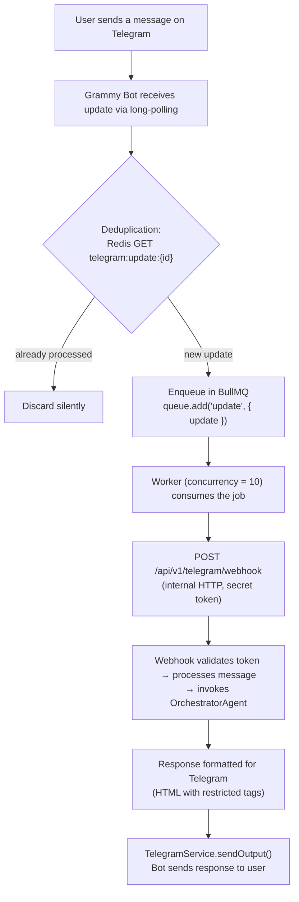

## About the Project

A corporate intelligent assistant platform that centralizes all internal company interactions in a single conversational interface. Users interact with the system through a natural-language chat to perform operational, analytical, and institutional queries — eliminating the need to navigate across multiple systems.

**Architecture and Approach**

The system uses a multi-agent architecture with central orchestration via the OpenAI Responses API. An orchestrator agent interprets the user's intent and delegates to domain-specialized agents, which in turn query corporate databases, internal services, and document knowledge bases to compose consolidated responses.

**Key Differentiators**

- **Semantic Search with RAG:** Document base indexed with embeddings for contextual retrieval and augmented generation
- **Corporate Authentication:** LDAP/Active Directory integration — no local user database
- **Async Processing:** Job queues with Redis and BullMQ for operations that require background processing
- **Multiple Channels:** Web interface plus Telegram integration as an additional communication channel

## Agent Architecture

The system is composed of **5 specialized AI agents**, each scoped to a domain, orchestrated by a central agent that interprets user intent and decides which sub-agent or tool should handle each request.

### Orchestrator

The central agent responsible for interpreting user messages and routing them to the correct domain. It exposes cross-cutting capabilities such as semantic search over the knowledge base, authenticated user profile lookup, and delegation to specialized sub-agents.

### Store Operations

An agent specialized in retail operational data. It answers questions about inventory, operational tasks, quality checklists, product information, sales, and slow-moving product analysis. It automatically applies store-level access restrictions based on the user's profile.

### Expense Management

An agent specialized in financial data and invoices. It performs queries with advanced filters (period, status, supplier, store, approver), daily and multi-dimension aggregated summaries, rankings, and comparative analyses.

### Helpdesk

An agent specialized in automated ticket creation in the corporate helpdesk system. It automatically resolves all required fields (requester, area, service, type, priority, category, solution group) by querying the system's reference tables — the user simply describes the problem in natural language.

### Document Indexer

The agent responsible for processing institutional documents (PDFs, text files) and extracting structured question-answer pairs via structured outputs. It feeds the knowledge base used by the Orchestrator's semantic search.

## Tools Ecosystem

Each agent registers a set of **tools** (functions) that the AI model can invoke to query corporate systems and compose responses. The project has **36 registered tools** distributed across agents.

### Cross-cutting Tools _(3 tools)_

| Tool                 | Description                                                                                                                 |
| -------------------- | --------------------------------------------------------------------------------------------------------------------------- |
| `buildReportPayload` | Builds a structured payload for PDF report generation (title, sections with charts, tables, text, and metrics)              |
| `formatAsChart`      | Converts query results into interactive charts (bar, line, pie, area, radar, treemap, scatter)                              |
| `showOptions`        | Presents multiple-choice buttons for the user to decide between options (e.g., "Which category would you like to explore?") |

### Orchestrator Tools _(9 tools)_

| Tool                     | Description                                                                                                               |
| ------------------------ | ------------------------------------------------------------------------------------------------------------------------- |
| `getAuthenticatedUser`   | Returns the public profile of the authenticated user from the corporate directory (name, email, department, role, branch) |
| `sendResetPasswordEmail` | Sends a password-reset email for corporate systems (requires explicit user confirmation)                                  |
| `getCategories`          | Lists categories and subcategories available in the institutional knowledge base                                          |
| `getCreatorInfo`         | Returns information about the assistant's creator                                                                         |
| `getQuestions`           | Lists questions and answers from the knowledge base with pagination and category filters                                  |
| `searchDocuments`        | Semantic search (embeddings) over the document base with access control and category filters                              |
| `openTicket`             | Delegates ticket creation to the Helpdesk agent (requires explicit confirmation)                                          |
| `askExpenseAgent`        | Delegates expense and invoice queries to the Expense Management agent                                                     |
| `askStoreOpsAgent`       | Delegates operational queries to the Store Operations agent                                                               |

### Store Operations Tools _(11 tools)_

| Tool                         | Description                                                                                                                                                |
| ---------------------------- | ---------------------------------------------------------------------------------------------------------------------------------------------------------- |
| `consultChecklistStatistics` | Execution statistics for operational checklists (score, responsible party, frequency)                                                                      |
| `consultTasks`               | Lists operational tasks from multiple modules (inventory, gondola audit, price check, replenishment) with dynamic filters                                  |
| `consultInventoryTaskItems`  | Products in an inventory count with counted quantities vs. ERP stock and divergence analysis                                                               |
| `consultTaskItems`           | Products within an operational task with detailed information (description, image, category, stock at creation time)                                       |
| `searchProductCategory`      | Retrieves the full category hierarchy (4 levels) for a product by code, barcode, or name                                                                   |
| `searchProductInfo`          | Detailed product information at a store: stock (store/warehouse), sales averages, prices, purchase status, shelf exposure, gondola capacity, coverage days |
| `queryProductSales`          | Product sales with flexible grouping (by product, category, store, region, segment, date) and optional ranking                                             |
| `queryNoSaleProducts`        | Products with available stock but no actual sales for more than N days, with filters by category, supplier, and brand                                      |
| `queryNoSaleSummary`         | Aggregation by category of slow-moving products, with totals for products and available stock                                                              |
| `getAvailableFilters`        | Reference values for filters: categories, regions, task types, and statuses                                                                                |
| `queryProductTaskStatus`     | Status of a product across different operational tasks (checked, unchecked, excluded)                                                                      |

### Expense Management Tools _(5 tools)_

| Tool                       | Description                                                                                                   |
| -------------------------- | ------------------------------------------------------------------------------------------------------------- |
| `getInvoices`              | Invoice search with advanced filters (period, status, store, supplier, approver, expense type) and pagination |
| `getInvoiceFilters`        | Distinct available values for each invoice filter                                                             |
| `getInvoiceSummary`        | Aggregated invoice summary (totals, averages, min/max values, count of distinct suppliers and stores)         |
| `getInvoiceSummaryByDay`   | Daily summary for time-series analysis (max 31 days per query)                                                |
| `getInvoiceSummaryGrouped` | Grouped summary by one or more dimensions (supplier, store, status, approver) for rankings and comparisons    |

### Helpdesk Tools _(8 tools)_

| Tool                             | Description                                                                            |
| -------------------------------- | -------------------------------------------------------------------------------------- |
| `createTicket`                   | Creates a helpdesk ticket with all required fields automatically resolved              |
| `getRequester`                   | Finds a requester in the helpdesk by corporate login                                   |
| `getAreas`                       | Lists helpdesk areas/departments with their associated services                        |
| `getCategoriesForTicketCreation` | Category tree available for precise ticket classification                              |
| `getServices`                    | Lists all support services available in the helpdesk                                   |
| `getTicketTypes`                 | Lists ticket types (e.g., incident, request)                                           |
| `getPriorities`                  | Lists priority levels with urgency-mapping guidance                                    |
| `getSolutionGroups`              | Lists solution groups (e.g., infrastructure support, application support, development) |

## Technologies Used

### Framework

- **Next.js 16** — React framework with App Router
- **TypeScript** — Static typing throughout the project
- **React 19** — UI library

### Artificial Intelligence

- **OpenAI Responses API** — Agent orchestration and tool calling
- **Embeddings + vector search** — Semantic search and RAG with Supabase/pgvector

### Database

- **Oracle** — Primary corporate database
- **Supabase** — Vector store for semantic search with embeddings
- **Redis** — Cache and async processing queues (BullMQ)

### Frontend

- **Tailwind CSS 4** — Utility-first styling
- **shadcn/ui** — Components based on Radix UI
- **TanStack Query** — Client-side state management and caching
- **Zod** — Schema validation

### Infrastructure

- **Docker** — Containerization with profiles for development, staging, and production
- **Oracle Instant Client** — Connectivity to the corporate database

## Telegram Integration

Telegram operates as an additional communication channel alongside the web interface. The integration was designed with a focus on resilience, scalability, and security, using a two-process decoupled architecture.

### Polling Architecture

The polling service runs as an **independent process in a separate Docker container** from the Next.js server, using **long-polling** (not webhooks). This decision eliminates the need to expose a public endpoint on the internet — the bot consumes updates directly from the Telegram API internally.

The full message flow:

### Queue System with BullMQ + Redis

Every received message is enqueued in BullMQ (`telegram-updates`) with **10 concurrent workers** and an exponential backoff retry policy (3 attempts: 5s → 10s → 20s). If the final attempt fails, the user receives an automatic notification informing them that the message could not be processed.

The worker acts as an **internal HTTP proxy** — it does not process the message directly; it simply calls `fetch()` against the internal Next.js route. This keeps all business logic centralized on the server, with no duplication between the polling process and the web chat.

### Concurrency Control with Distributed Lock

To prevent multiple messages from the same chat from being processed simultaneously, each chat acquires a **distributed lock via Redis** before processing:

- `SET tg:processing:{chatId} '1' PX 60000 NX` — atomic lock with a 60-second TTL
- If the lock already exists → responds "I'm already processing your previous request..."
- In-memory fallback (`Set<string>`) when Redis is unavailable
- The TTL guarantees automatic release in case of process crash

### Rate Limiting

A **fixed-window counter** per chat limits Telegram API calls to **25 messages per second** (1-second window), respecting the platform's official limits. If the limit is exceeded, up to 3 retries are performed with linear backoff (200ms, 400ms, 600ms). If Redis is unavailable, rate limiting is bypassed to avoid blocking the service.

### Update Deduplication

Each `update_id` received from Telegram is checked in Redis (`SET telegram:update:{id} '1' EX 60`). Duplicate updates (common in retry scenarios) are discarded before they even enter the queue.

### Account Linking

Users link their corporate account (Active Directory) to their Telegram chat through **single-use tokens** (`crypto.randomBytes(32)`, expiring in 10 minutes) generated from the web interface. The resulting deep link (`https://t.me/BOT?start=TOKEN`) is sent to the user; clicking it activates the link between their AD login and the Telegram `chatId`. Unlinking removes the record and sends a farewell message to the chat.

### Per-Channel Content Adaptation

The same `OrchestratorAgent` serves both the web chat and Telegram. Differentiation happens via a `source` parameter:

- **Channel-specific formatting prompt**: for Telegram, HTML is restricted to `<b>`, `<i>`, `<u>`, `<s>`, `<code>`, `<pre>`, `<a>`, `<blockquote>` only
- **HTML sanitization**: unsupported tags are stripped while preserving text content; ` ` is converted to a line break; `href` is kept only on `<a>`; if the Telegram API rejects the HTML (400 error), it falls back to plain text
- **Chart blocking**: charts are not supported in Telegram; when the orchestrator generates a chart output for this channel, it falls back to a textual description
- **Voice message support**: audio messages are transcribed via OpenAI Whisper before processing

### Graceful Degradation

The system is designed to keep working even under infrastructure failures: if Redis goes down, rate limiting is bypassed, locks fall back to an in-memory `Set`, and deduplication is disabled. If HTML sanitization fails, plain text is sent. If a job fails after 3 attempts, the user is notified.

## Admin Panel

The admin panel (`/admin`) provides full visibility into platform usage for **cost control, security, and internal auditing**. Access is restricted by session (an `httpOnly`, `sameSite: lax` cookie) and authorization by specific Active Directory groups verified via LDAP.

### Usage Monitoring

Three main dashboards offer visibility at different levels of granularity:

**Per-User Usage:**

- Aggregated KPI cards: total tokens consumed, distinct active users, total questions processed
- Paginated table with filters by user, model, and period, showing: name, branch/department, input/output/total tokens, estimated cost in USD, and question count
- Per-model breakdown: expanding a row shows the consumption split by AI model used
- Drill-down to the user's full conversation history

**Per-Organizational-Unit Usage:**

- KPI cards: total tokens, active units, questions, total cost
- Combined chart (Recharts): bars with question volume per unit + an overlaid line with cost in USD
- Per-unit expansion to list all users in that branch

**Per-Message Execution Tracing:**

- Full history of each conversation with all interactions (user/assistant)
- **Trace Dialog**: clicking any message displays the complete orchestrator execution trail:
  - Each individual LLM call (provider, model, agent, iteration, input/output/reasoning tokens, estimated cost)
  - Each tool call executed (name, arguments formatted as JSON, response)
  - Each assistant output and reasoning block rendered as Markdown
  - Summary cards: total LLM calls, tool calls, reasoning blocks, total tokens, and estimated cost
- Download of documents (PDFs) generated during the conversation

### Cost Tracking

Cost is calculated in two layers:

1. **Database layer**: groups LLM calls by model and sums input/output tokens
2. **Application layer**: applies a per-token price table to each model, returning the estimated cost in USD with 3 decimal places of precision

Each OpenAI API call is recorded individually with: user, chat, model, provider, agent, hyperparameters (temperature, maxTokens, topP), iteration, and timestamp. These records serve as a **natural audit log** of every interaction with the AI models.

### Infrastructure and Health Check

The system status page (`/admin/status`) monitors the health of all services:

| Service                 | Metrics                                                                                                                                         |
| ----------------------- | ----------------------------------------------------------------------------------------------------------------------------------------------- |
| Oracle Database         | Pool (min/max/increment), open/in-use/idle connections, queued requests, average queue time, uptime                                             |
| Supabase                | healthy/unhealthy status with latency                                                                                                           |
| Redis                   | Status, memory used, connected clients, uptime, keyspace hits/misses, **BullMQ queue statistics** (waiting, active, completed, failed, delayed) |
| LDAP / Active Directory | healthy/unhealthy status with latency                                                                                                           |
| Email (Resend)          | healthy/unhealthy status with latency                                                                                                           |
| Helpdesk                | healthy/unhealthy status with latency                                                                                                           |

### Security and Auditing

- **Tracked sessions**: every login records IP, user-agent, timestamp, and a cryptographic token (`crypto.randomBytes(48)`) with a 7-day expiration
- **AD-based authorization**: admin routes require membership in specific groups verified via LDAP; unauthorized access clears the session cookie
- **Activity logging**: while there is no dedicated audit table, the LLM call records, messages, and tool calls themselves form a complete trail of all interactions — who did what, when, with which model, and at what cost

## Confidentiality Notice

> **Disclaimer:** Sensitive details of this project have been intentionally omitted, as this is proprietary intellectual property of the company. Internal system names, database schemas, API endpoints, credentials, and proprietary business logic are not disclosed in this public documentation.
