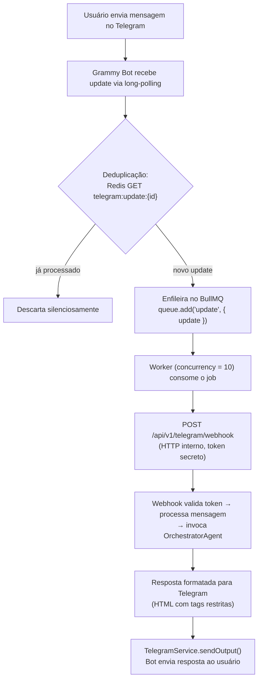

## Sobre o Projeto

Plataforma corporativa de assistente inteligente que centraliza as interações internas da empresa em uma única interface conversacional. Os usuários interagem com o sistema via chat em linguagem natural para realizar consultas operacionais, analíticas e institucionais, eliminando a necessidade de navegar entre múltiplos sistemas.

**Arquitetura e Abordagem**

O sistema utiliza uma arquitetura multi-agente com orquestração central via OpenAI Responses API. Um agente orquestrador interpreta a intenção do usuário e delega a agentes especializados por domínio, que por sua vez consultam bancos de dados corporativos, serviços internos e bases de conhecimento documental para compor respostas consolidadas.

**Diferenciais**

- **Busca Semântica com RAG:** Base documental indexada com embeddings para recuperação contextual e geração aumentada
- **Autenticação Corporativa:** Integração com LDAP/Active Directory — sem banco de dados local de usuários
- **Processamento Assíncrono:** Filas de jobs com Redis e BullMQ para operações que exigem processamento em background
- **Múltiplos Canais:** Interface web e integração com Telegram como canal adicional de comunicação

## Arquitetura de Agentes

O sistema é composto por **5 agentes de IA** especializados por domínio, orquestrados por um agente central que interpreta a intenção do usuário e decide qual sub-agente ou ferramenta deve processar a requisição.

### Orquestrador

Agente central responsável por interpretar a mensagem do usuário e rotear para o domínio correto. Expõe funcionalidades transversais como busca semântica na base de conhecimento, consulta de perfil do usuário autenticado e delegação para os sub-agentes especializados.

### Operações de Loja

Agente especializado em dados operacionais do varejo. Responde perguntas sobre inventário, tarefas operacionais, checklists de qualidade, informações de produtos, vendas e análise de produtos sem giro. Aplica automaticamente restrição de acesso por loja conforme o perfil do usuário.

### Gestão de Despesas

Agente especializado em dados financeiros e notas fiscais. Realiza consultas com filtros avançados (período, status, fornecedor, loja, aprovador), sumarizações diárias e agrupadas por múltiplas dimensões, rankings e análises comparativas.

### Helpdesk

Agente especializado na abertura automatizada de tickets no sistema de helpdesk corporativo. Resolve automaticamente todos os campos obrigatórios (solicitante, área, serviço, tipo, prioridade, categoria, grupo solucionador) consultando as tabelas de referência do sistema, bastando o usuário descrever o problema em linguagem natural.

### Indexador de Documentos

Agente responsável por processar documentos institucionais (PDFs, textos) e extrair pares de pergunta-resposta estruturados via structured outputs. Alimenta a base de conhecimento utilizada pela busca semântica do Orquestrador.

## Ecossistema de Ferramentas

Cada agente registra um conjunto de **tools** (funções) que o modelo de IA pode invocar para consultar sistemas corporativos e compor respostas. O projeto conta com **36 ferramentas** registradas entre os agentes.

### Ferramentas Transversais _(3 tools)_

| Ferramenta           | Descrição                                                                                                              |
| -------------------- | ---------------------------------------------------------------------------------------------------------------------- |
| `buildReportPayload` | Monta um payload estruturado para geração de relatório em PDF (título, seções com gráficos, tabelas, texto e métricas) |
| `formatAsChart`      | Converte resultados de consultas em gráficos interativos (barra, linha, pizza, área, radar, treemap, scatter)          |
| `showOptions`        | Apresenta botões de múltipla escolha para o usuário decidir entre opções (ex: "Qual categoria deseja explorar?")       |

### Ferramentas do Orquestrador _(9 tools)_

| Ferramenta               | Descrição                                                                                                           |
| ------------------------ | ------------------------------------------------------------------------------------------------------------------- |
| `getAuthenticatedUser`   | Retorna o perfil público do usuário autenticado no diretório corporativo (nome, email, departamento, cargo, filial) |
| `sendResetPasswordEmail` | Envia e-mail de redefinição de senha para sistemas corporativos (requer confirmação explícita do usuário)           |
| `getCategories`          | Lista categorias e subcategorias disponíveis na base de conhecimento institucional                                  |
| `getCreatorInfo`         | Retorna informações sobre o criador do assistente                                                                   |
| `getQuestions`           | Lista perguntas e respostas da base de conhecimento com paginação e filtros por categoria                           |
| `searchDocuments`        | Busca semântica (embeddings) na base documental com controle de acesso e filtros por categoria                      |
| `openTicket`             | Delega a criação de ticket ao agente de Helpdesk (requer confirmação explícita)                                     |
| `askExpenseAgent`        | Delegac consultas de despesas e notas fiscais ao agente de Gestão de Despesas                                       |
| `askStoreOpsAgent`       | Delegac consultas operacionais ao agente de Operações de Loja                                                       |

### Ferramentas de Operações de Loja _(11 tools)_

| Ferramenta                   | Descrição                                                                                                                                                                 |
| ---------------------------- | ------------------------------------------------------------------------------------------------------------------------------------------------------------------------- |
| `consultChecklistStatistics` | Estatísticas de execução de checklists operacionais (pontuação, responsável, frequência)                                                                                  |
| `consultTasks`               | Lista tarefas operacionais de múltiplos módulos (inventário, auditoria de gôndola, verificação de preços, reabastecimento) com filtros dinâmicos                          |
| `consultInventoryTaskItems`  | Produtos de uma contagem de inventário com quantidades contadas vs. estoque do ERP e análise de divergência                                                               |
| `consultTaskItems`           | Produtos dentro de uma tarefa operacional com informações detalhadas (descrição, imagem, categoria, estoque no momento da criação)                                        |
| `searchProductCategory`      | Busca a hierarquia completa de categoria (4 níveis) de um produto por código, código de barras ou nome                                                                    |
| `searchProductInfo`          | Informações detalhadas de um produto em uma loja: estoque (loja/depósito), médias de venda, preços, status de compra, exposição, capacidade de gôndola, dias de cobertura |
| `queryProductSales`          | Vendas de produtos com agrupamento flexível (por produto, categoria, loja, região, segmento, data) e ranking opcional                                                     |
| `queryNoSaleProducts`        | Produtos com estoque disponível mas sem venda efetiva há mais de N dias, com filtros por categoria, fornecedor e marca                                                    |
| `queryNoSaleSummary`         | Sumarização por categoria de produtos sem giro, com totais de produtos e estoque disponível                                                                               |
| `getAvailableFilters`        | Valores de referência para filtros: categorias, regiões, tipos de tarefa e status                                                                                         |
| `queryProductTaskStatus`     | Status de um produto em diferentes tarefas operacionais (conferido, não conferido, excluído)                                                                              |

### Ferramentas de Gestão de Despesas _(5 tools)_

| Ferramenta                 | Descrição                                                                                                                    |
| -------------------------- | ---------------------------------------------------------------------------------------------------------------------------- |
| `getInvoices`              | Busca de notas fiscais com filtros avançados (período, status, loja, fornecedor, aprovador, natureza da despesa) e paginação |
| `getInvoiceFilters`        | Valores distintos disponíveis para cada filtro de notas fiscais                                                              |
| `getInvoiceSummary`        | Sumarização agregada de notas fiscais (totais, médias, valores min/max, contagem de fornecedores e lojas distintos)          |
| `getInvoiceSummaryByDay`   | Sumarização diária para análise de série temporal (máx. 31 dias por consulta)                                                |
| `getInvoiceSummaryGrouped` | Sumarização agrupada por uma ou mais dimensões (fornecedor, loja, status, aprovador) para rankings e comparativos            |

### Ferramentas de Helpdesk _(8 tools)_

| Ferramenta                       | Descrição                                                                                     |
| -------------------------------- | --------------------------------------------------------------------------------------------- |
| `createTicket`                   | Cria um ticket no helpdesk com todos os campos obrigatórios resolvidos automaticamente        |
| `getRequester`                   | Busca um solicitante no helpdesk pelo login corporativo                                       |
| `getAreas`                       | Lista áreas/departamentos do helpdesk com seus serviços associados                            |
| `getCategoriesForTicketCreation` | Árvore de categorias disponível para classificação precisa do ticket                          |
| `getServices`                    | Lista todos os serviços de suporte disponíveis no helpdesk                                    |
| `getTicketTypes`                 | Lista os tipos de ticket (ex: incidente, requisição)                                          |
| `getPriorities`                  | Lista níveis de prioridade com orientação de mapeamento por urgência                          |
| `getSolutionGroups`              | Lista grupos solucionadores (ex: suporte infraestrutura, suporte aplicações, desenvolvimento) |

## Tecnologias Utilizadas

### Framework

- **Next.js 16** — Framework React com App Router
- **TypeScript** — Tipagem estática em todo o projeto
- **React 19** — Biblioteca de interface

### Inteligência Artificial

- **OpenAI Responses API** — Orquestração de agentes e tool calling
- **Embeddings + busca vetorial** — Busca semântica e RAG com Supabase/pgvector

### Banco de Dados

- **Oracle** — Banco de dados corporativo principal
- **Supabase** — Base vetorial para busca semântica com embeddings
- **Redis** — Cache e filas de processamento assíncrono (BullMQ)

### Frontend

- **Tailwind CSS 4** — Estilização utility-first
- **shadcn/ui** — Componentes baseados em Radix UI
- **TanStack Query** — Gerenciamento de estado e cache no cliente
- **Zod** — Validação de schemas

### Infraestrutura

- **Docker** — Conteinerização com perfis para desenvolvimento, staging e produção
- **Oracle Instant Client** — Conectividade com banco de dados corporativo

## Integração com Telegram

O Telegram opera como um canal adicional de comunicação além da interface web. A integração foi projetada com foco em resiliência, escalabilidade e segurança, utilizando uma arquitetura de dois processos desacoplados.

### Arquitetura de Polling

O serviço de polling é executado como um **processo independente em container Docker separado** do servidor Next.js, utilizando **long-polling** (não webhooks). Essa decisão elimina a necessidade de expor um endpoint público na internet — o bot consome atualizações diretamente da API do Telegram internamente.

O fluxo completo de uma mensagem:

### Sistema de Filas com BullMQ + Redis

Toda mensagem recebida é enfileirada no BullMQ (`telegram-updates`) com **10 workers simultâneos** e política de retry com backoff exponencial (3 tentativas: 5s → 10s → 20s). Em caso de falha na última tentativa, o usuário recebe uma notificação automática informando que a mensagem não pôde ser processada.

O worker atua como um **proxy HTTP interno** — ele não processa a mensagem diretamente, apenas faz `fetch()` para a rota interna do Next.js. Isso mantém toda a lógica de negócio centralizada no servidor, sem duplicação entre o processo de polling e o chat web.

### Controle de Concorrência com Distributed Lock

Para evitar que múltiplas mensagens do mesmo chat sejam processadas simultaneamente, cada chat adquire um **lock distribuído via Redis** antes do processamento:

- `SET tg:processing:{chatId} '1' PX 60000 NX` — lock atômico com TTL de 60 segundos
- Se o lock já existe → responde "Já estou processando sua solicitação anterior..."
- Fallback em memória (`Set<string>`) quando o Redis está indisponível
- O TTL garante liberação automática em caso de crash do processo

### Rate Limiting

Um **fixed window counter** por chat limita as chamadas à API do Telegram a **25 mensagens por segundo** (window de 1s), respeitando os limites oficiais da plataforma. Em caso de limite excedido, realiza até 3 retries com backoff linear (200ms, 400ms, 600ms). Se o Redis estiver indisponível, o rate limiting é bypassado para não bloquear o serviço.

### Deduplicação de Updates

Cada `update_id` recebido do Telegram é verificado no Redis (`SET telegram:update:{id} '1' EX 60`). Updates duplicados (comuns em cenários de retry) são descartados antes mesmo de entrar na fila.

### Vinculação de Conta

Usuários vinculam sua conta corporativa (Active Directory) ao chat do Telegram através de **tokens de uso único** (`crypto.randomBytes(32)`, expiram em 10 minutos) gerados na interface web. O deep link resultante (`https://t.me/BOT?start=TOKEN`) é enviado ao usuário, que ao clicar ativa o vínculo entre seu login AD e o `chatId` do Telegram. O desvinculamento remove o registro e envia uma mensagem de despedida ao chat.

### Adaptação de Conteúdo por Canal

O mesmo `OrchestratorAgent` atende tanto o chat web quanto o Telegram. A diferenciação ocorre via parâmetro `source`:

- **Prompt de formatação específico**: para Telegram, restringe o HTML a apenas `<b>`, `<i>`, `<u>`, `<s>`, `<code>`, `<pre>`, `<a>`, `<blockquote>`
- **Sanitização de HTML**: tags não suportadas são removidas preservando o conteúdo textual; ` ` é convertido para quebra de linha; `href` é mantido apenas em `<a>`; se a API do Telegram rejeitar o HTML (erro 400), faz fallback para texto puro
- **Bloqueio de gráficos**: gráficos não são suportados no Telegram; quando o orquestrador gera um output de gráfico para este canal, faz fallback para descrição textual
- **Suporte a mensagens de voz**: áudios são transcritos via OpenAI Whisper antes do processamento

### Degradação Graciosa

O sistema foi projetado para continuar funcionando mesmo com falhas de infraestrutura: se o Redis cair, rate limiting é bypassado, locks caem para `Set` em memória e deduplicação é desabilitada. Se a sanitização de HTML falhar, envia texto puro. Se um job falhar após 3 tentativas, o usuário é notificado.

## Painel Administrativo

O painel de administração (`/admin`) fornece visibilidade completa sobre o consumo da plataforma para **controle de custos, segurança e auditoria interna**. O acesso é restrito por sessão (cookie `httpOnly`, `sameSite: lax`) e autorização por grupos específicos do Active Directory verificados via LDAP.

### Monitoramento de Consumo

Três dashboards principais oferecem visibilidade em diferentes níveis de granularidade:

**Uso por Usuário:**

- Cards de KPI agregados: total de tokens consumidos, usuários ativos distintos, total de perguntas processadas
- Tabela paginada com filtros por usuário, modelo e período, exibindo: nome, filial/departamento, tokens de entrada/saída/totais, custo estimado em USD e quantidade de perguntas
- Expansão por modelo: ao expandir uma linha, exibe a quebra de consumo por modelo de IA utilizado
- Drill-down até o histórico completo de conversas do usuário

**Uso por Unidade Organizacional:**

- Cards de KPI: total de tokens, unidades ativas, perguntas, custo total
- Gráfico combinado (Recharts): barras com volume de perguntas por unidade + linha sobreposta com custo em USD
- Expansão por unidade para listar todos os usuários daquela filial

**Rastreamento de Execução por Mensagem:**

- Histórico completo de cada conversa com todas as interações (user/assistant)
- **Trace Dialog**: ao clicar em qualquer mensagem, exibe a trilha completa de execução do orquestrador:
  - Cada chamada LLM individual (provider, modelo, agente, iteração, tokens de entrada/saída/raciocínio, custo estimado)
  - Cada tool call executada (nome, argumentos formatados em JSON, resposta)
  - Cada output do assistente e bloco de raciocínio renderizado como Markdown
  - Cards de sumarização: total de chamadas LLM, tool calls, blocos de raciocínio, tokens totais e custo estimado
- Download de documentos (PDFs) gerados durante a conversa

### Rastreamento de Custos

O custo é calculado em duas camadas:

1. **Camada de banco**: agrupa chamadas LLM por modelo e soma tokens de entrada/saída
2. **Camada de aplicação**: aplica uma tabela de preços por token a cada modelo, retornando o custo estimado em USD com precisão de 3 casas decimais

Cada chamada à API da OpenAI é registrada individualmente com: usuário, chat, modelo, provider, agente, hiperparâmetros (temperature, maxTokens, topP), iteração e timestamp. Esses registros funcionam como **log de auditoria natural** de toda interação com os modelos de IA.

### Infraestrutura e Health Check

A página de status do sistema (`/admin/status`) monitora a saúde de todos os serviços:

| Serviço                 | Métricas                                                                                                                                                    |
| ----------------------- | ----------------------------------------------------------------------------------------------------------------------------------------------------------- |
| Oracle Database         | Pool (min/max/increment), conexões abertas/em uso/ociosas, requests enfileirados, tempo médio de fila, uptime                                               |
| Supabase                | Status healthy/unhealthy com latência                                                                                                                       |
| Redis                   | Status, memória utilizada, clientes conectados, uptime, keyspace hits/misses, **estatísticas de fila BullMQ** (waiting, active, completed, failed, delayed) |
| LDAP / Active Directory | Status healthy/unhealthy com latência                                                                                                                       |
| Email (Resend)          | Status healthy/unhealthy com latência                                                                                                                       |
| Helpdesk                | Status healthy/unhealthy com latência                                                                                                                       |

### Segurança e Auditoria

- **Sessões rastreadas**: cada login registra IP, user-agent, timestamp e token criptográfico (`crypto.randomBytes(48)`) com expiração de 7 dias
- **Autorização por AD**: rotas administrativas exigem pertencimento a grupos específicos verificados via LDAP; acessos não autorizados limpam o cookie de sessão
- **Registro de atividade**: embora não exista uma tabela de auditoria dedicada, os próprios registros de chamadas LLM, mensagens e tool calls compõem uma trilha completa de todas as interações — quem fez o quê, quando, com qual modelo e a que custo

## Nota sobre Confidencialidade

> **Aviso:** Detalhes sensíveis deste projeto foram intencionalmente omitidos por se tratar de propriedade intelectual da empresa. Nomes de sistemas internos, estruturas de banco de dados, endpoints de API, credenciais e lógicas de negócio proprietárias não são divulgados nesta documentação pública.
