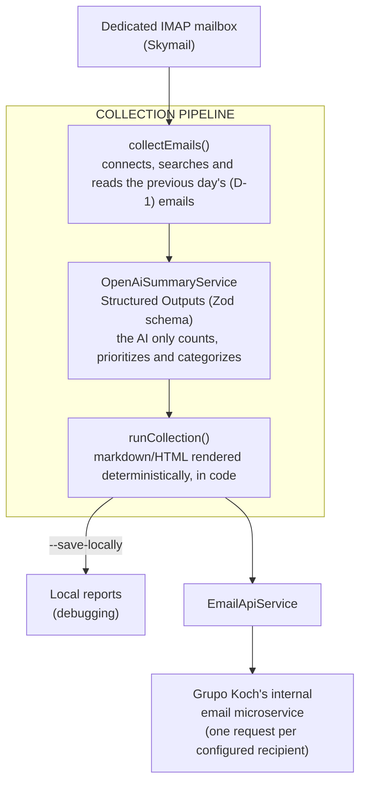

## About the Project

**Daily Fleet Summary** is an internal service at **Grupo Koch** that reads, every day, the vehicle-tracking alerts generated by **Link Monitoramento** — the third-party company responsible for the fleet's tracking — and turns them into a single summary email, with event counts, a risk-ranked vehicle list and the day's key points. It runs as a persistent process in production, with the collection scheduled once a day.

> ⚠️ **Internal project, no public link.** Since it handles corporate email credentials and an internal microservice endpoint, **there is no public URL or open repository**. This post describes the architecture, domain rules and technical decisions in an anonymized way — without exposing credentials, the internal email microservice endpoint, or the real recipients of the report.

## The Problem

Link Monitoramento sends one alert per tracking event — speeding, route-fence exit, off-hours movement, among others — to a corporate mailbox. On a normal operating day, that means **dozens of standalone emails per day**, one per vehicle per event, with no aggregation, no prioritization and no overview. Finding what actually mattered (a vehicle repeatedly over the limit, a route deviation, a cluster of off-hours events) required manually opening and cross-referencing each email.

The service closes that loop on its own: **collect** the previous day's alerts, **analyze** them against explicit business rules, and **deliver** a ready-made summary by email to whoever is responsible for fleet monitoring.

## Architecture

The flow is a single shared pipeline across the production run, the full backfill collection (no date filter), and local debugging:

Architectural decisions behind that flow:

- **Centralized, frozen configuration** — `src/config.ts` exposes a single, `Object.freeze`d `CONFIG` object, the single source of truth for everything at runtime: IMAP credentials validated by Zod (`src/env.ts`), the AI model, the cron expression and the recipient list deliberately pinned in code.
- **Dependency injection via override** — every service (`EmailClient`, `OpenAiSummaryService`, `EmailApiService`) accepts an optional `configOverride` in its constructor, falling back to `CONFIG`. This keeps production configuration separate from the injection used in tests/debugging, without mutable globals.
- **No build step** — the service runs on Node.js 24, which executes `.ts` directly via native type-stripping. There's no `ts-node` and no transpilation; `tsc --noEmit` exists solely for type checking.
- **D-1 date range computed explicitly** — `calculatePreviousDayRange()` converts the current instant to the reference timezone (`America/Sao_Paulo`), computes the start of the previous day and of the current day **in that timezone**, then converts both back to UTC. This guarantees the collection window is always "the previous day in São Paulo," regardless of the host container's own timezone.

## What the AI decides — and what it doesn't

The core idea of the project is separating **judgment** (done by the model) from **presentation** (done in deterministic code). The model receives every email of the day as plain text and returns a structured object (validated by `DailyFleetSummarySchema`, a Zod schema) — never free-form markdown or HTML. From that object, `renderMarkdown` and `renderHtmlEmail` — pure functions, no AI call — assemble the final email.

The output schema covers:

- **`event_counts`** — email counts per event type.
- **`vehicle_ranking`** — every vehicle for the day (not just the highlighted ones), with a per-event-type breakdown and a `risk_level` (`alto`/`medio`/`baixo`).
- **`time_patterns`** — hourly clustering per event type, filled in **only** when there's a genuine pattern — the prompt explicitly instructs the model not to force an artificial one.
- **`speed_stats`** — max and average speed excess per plate.
- **`highlights`** — the day's most critical points, already ordered by priority.
- **`observations`** — an escape hatch for any relevant pattern that doesn't fit the categories above.

The business rules guiding that judgment live entirely in the prompt (`src/prompts/daily-fleet-summary.ts`), not in application logic — a deliberate choice so that threshold or domain-vocabulary adjustments never require a code change:

- **Highlight priority**: severe speeding (15+ km/h over the limit) ranks above recurrence (same plate, same event type, multiple times a day), which ranks above route deviation.
- **Risk classification**: high risk requires severe speeding, a route deviation, or 15+ events of the same type in a day; medium risk covers moderate recurrence (5-14 events) or mild but repeated speeding; everything else is low risk.
- **Abbreviation expansion**: the subject "Movimento FHC" (Link Monitoramento's own abbreviation) is always rewritten in full as "Off-hours movement" in the output — the model must never repeat the raw abbreviation.
- **Missing data never becomes a literal `"null"`**: when a route fence's name comes back empty in the source email (common in "Left the Route Fence" alerts), the prompt forbids repeating the literal `"null"` and requires the spelled-out description ("fence not identified").
- **A handful of few-shot examples in the prompt** cover the three most ambiguous scenarios: an isolated but severe event, several mild events that only stand out because of recurrence, and a high-volume day with a genuine time pattern — each with a note explaining _why_ that outcome is expected, not just what it is.

As a safety net for an occasional Structured Outputs slip (the same plate showing up in two separate `vehicle_ranking` entries), `dedupeVehicleRanking()` merges those entries in code before rendering — summing events, reconciling the `event_breakdown`, and keeping the higher `risk_level` between the two.

## Delivery and scheduling

The final email is delivered via `EmailApiService`, a thin HTTP client over Grupo Koch's internal email microservice — one `POST` per recipient configured in `CONFIG.reportRecipients`. Delivery failures are logged but don't crash the process, since the job runs once a day and a single failure shouldn't take down the scheduler.

In production, `src/index.ts` boots two components side by side:

- **`scheduler.ts`** — a cron job (`node-cron`) firing at 08:00 (`America/Sao_Paulo`), running the day's collection.
- **`server.ts`** — a minimal HTTP server whose only job is to answer `200 ok` for the router (Traefik) used as a _liveness check_ — the process itself exposes no other HTTP route.

Outside the schedule, the service also exposes standalone run modes: a single production collection (`collect`), a full backfill with no date filter (`collect-all`, for reprocessing the entire mailbox), and local debugging (`debug-collect`), which saves reports to disk instead of sending email — useful for validating prompt changes without generating noise for real recipients.

## Main Challenges

- **Separating judgment from presentation.** The initial temptation would be to ask the AI to already return a ready-made HTML email. Fixing the output as a structured schema and moving all formatting to deterministic code eliminated style drift between runs and made the final email testable without depending on the model.
- **The collection window's timezone.** Naively computing "the previous day" using the process's own timezone would break in production, where the host might not be in `America/Sao_Paulo`. Explicitly converting to the reference timezone before computing the day boundaries — and only then converting back to UTC — is what made the calculation indifferent to the runtime environment.
- **Domain vocabulary that isn't obvious from the outside.** Abbreviations like "FHC" and fields that arrive as the literal `"null"` are quirks of Link Monitoramento's own email format. Documenting those rules directly in the prompt, with examples, proved more robust than treating them as special cases scattered across the application.
- **Occasional ranking duplication.** Even with Structured Outputs, the model occasionally returns the same plate in two `vehicle_ranking` entries. Rather than trying to eliminate that purely through prompt engineering, a deterministic deduplication function in code guarantees the final output never has that defect, regardless of what the model returns.

## Technologies Used

- **TypeScript / Node.js 24** — build-free runtime, executing `.ts` natively.
- **OpenAI (Structured Outputs)** — generating the structured summary from the Zod schema.
- **Zod** — validating environment variables and the AI's output schema.
- **IMAP (imapflow)** — collecting emails from the dedicated mailbox; `mailparser` for content parsing.
- **node-cron** — scheduling the daily collection.
- **Docker** — packaging the service; deployed on Docker Swarm, with secrets injected via `entrypoint.sh` and routed through Traefik.

## Technical Notes

- **A frozen `CONFIG` as the single source of truth.** Nothing else in the codebase reads `process.env` directly outside of `env.ts` — all runtime configuration flows through `CONFIG`, making it trivial to trace where any value used by the services comes from.
- **No automated test suite.** The project is small enough that the main validation happens via `debug-collect` (a real run of the collection and the prompt, without sending email) before any change to the flow or the prompt rules.
- **Anonymization.** The report's real recipients, the internal email microservice's endpoint, and the corporate mailbox credentials were omitted from this post — the focus is the engineering of the collection-and-analysis pipeline, not the internal operational data.
