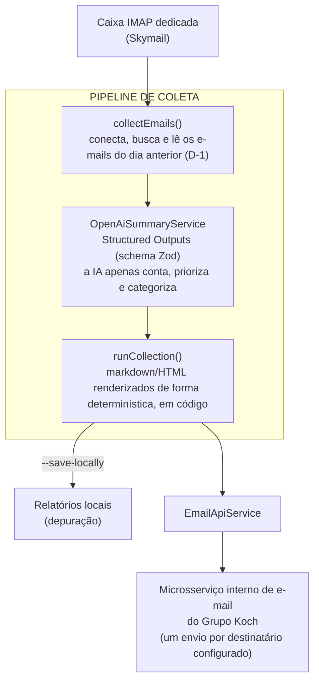

## Sobre o Projeto

**Resumo Diário de Frota** é um serviço interno do **Grupo Koch** que lê, todos os dias, os alertas de rastreamento veicular gerados pela **Link Monitoramento** — a empresa terceirizada responsável pelo monitoramento da frota — e os transforma em um único e-mail de resumo, com contagem de eventos, ranking de veículos por risco e os pontos de atenção do dia. Roda como processo persistente em produção, com uma coleta agendada diariamente às 08:00.

> ⚠️ **Projeto interno, sem link público.** Por lidar com credenciais de e-mail corporativo e com o endpoint de um microsserviço interno, **não há URL pública nem repositório aberto**. Este post descreve a arquitetura, as regras de domínio e as decisões técnicas de forma anonimizada — sem expor credenciais, o endpoint do microsserviço de e-mail ou os destinatários reais do relatório.

## O Problema

A Link Monitoramento envia, para uma caixa de e-mail corporativa, um alerta por evento de rastreamento: excesso de velocidade, saída de cerca de rota, movimentação fora do horário comercial, entre outros. Em dias de operação normal, isso significa **dezenas de e-mails avulsos por dia**, um por veículo por evento — sem agregação, sem priorização e sem visão de conjunto. Encontrar o que realmente importa (um veículo recorrentemente acima do limite, um desvio de rota, uma concentração de eventos fora de horário) exigia abrir e cruzar manualmente cada e-mail.

O objetivo do serviço é fechar esse ciclo sozinho: **coletar** os alertas do dia anterior, **analisá-los** com critérios de negócio explícitos e **entregar** um resumo pronto, por e-mail, aos responsáveis pelo monitoramento da frota.

## Arquitetura

O fluxo é único e compartilhado entre a execução de produção, a coleta completa (sem filtro de data) e a depuração local:

Decisões arquiteturais que sustentam esse fluxo:

- **Configuração centralizada e congelada** — `src/config.ts` expõe um único objeto `CONFIG` (`Object.freeze`), fonte única de verdade para tudo em tempo de execução: credenciais IMAP validadas por Zod (`src/env.ts`), modelo de IA, expressão cron e lista de destinatários fixados deliberadamente no código.
- **Injeção de dependência por override** — cada serviço (`EmailClient`, `OpenAiSummaryService`, `EmailApiService`) aceita um `configOverride` opcional no construtor, com fallback para `CONFIG`. Isso separa a configuração de produção da injeção usada em testes/depuração, sem variáveis globais mutáveis.
- **Sem etapa de build** — o serviço roda em Node.js 24, que executa `.ts` diretamente via type-stripping nativo. Não há `ts-node` nem transpilação; `tsc --noEmit` existe só para checagem de tipos.
- **Data D-1 calculada de forma explícita** — `calculatePreviousDayRange()` converte o instante atual para o timezone de referência (`America/Sao_Paulo`), calcula o início do dia anterior e do dia atual **nesse** timezone, e converte os dois de volta para UTC. Isso garante que a janela de coleta seja sempre "o dia anterior em São Paulo", independentemente do timezone do host onde o container roda.

## O que a IA decide — e o que não decide

O ponto central do projeto é a separação entre **julgamento** (feito pelo modelo) e **apresentação** (feita em código determinístico). O modelo recebe todos os e-mails do dia como texto puro e devolve um objeto estruturado (validado por `DailyFleetSummarySchema`, um schema Zod), nunca markdown ou HTML livre. A partir desse objeto, `renderMarkdown` e `renderHtmlEmail` — funções puras, sem chamada a IA — montam o e-mail final.

O schema de saída cobre:

- **`event_counts`** — contagem de e-mails por tipo de evento.
- **`vehicle_ranking`** — todos os veículos do dia (não só os destacados), com detalhamento por tipo de evento e um `risk_level` (`alto`/`medio`/`baixo`).
- **`time_patterns`** — concentrações horárias por tipo de evento, preenchido **apenas** quando há um padrão real — o prompt instrui explicitamente a IA a não forçar um padrão artificial.
- **`speed_stats`** — excesso de velocidade máximo e médio por placa.
- **`highlights`** — os pontos mais críticos do dia, já ordenados por prioridade.
- **`observations`** — um campo de escape para qualquer padrão relevante que não caiba nas categorias acima.

As regras de negócio que guiam esse julgamento vivem inteiramente no prompt (`src/prompts/daily-fleet-summary.ts`), não na lógica da aplicação — por decisão deliberada, para que ajustes de threshold ou de vocabulário de domínio não exijam alterar código:

- **Prioridade de destaques**: excesso de velocidade grave (15+ Km/h acima do permitido) vem antes de recorrência (mesma placa, mesmo tipo de evento, várias vezes no dia), que vem antes de desvio de rota.
- **Classificação de risco**: risco alto exige excesso de velocidade grave, desvio de rota, ou 15+ eventos do mesmo tipo no dia; risco médio cobre recorrência moderada (5-14 eventos) ou excesso leve mas repetido; o resto é risco baixo.
- **Expansão de siglas**: o assunto "Movimento FHC" (sigla interna da Link Monitoramento) é sempre reescrito por extenso como "Movimento fora do horário comercial" na saída — a IA nunca deve repetir a sigla crua.
- **Dados ausentes não viram `"null"` literal**: quando o nome de uma cerca de rota vem vazio no e-mail de origem (comum em "Saiu da Cerca de Rota"), o prompt proíbe repetir o literal `"null"` e exige a descrição por extenso ("cerca não identificada").
- **Poucos exemplos few-shot no prompt** cobrem os três cenários mais ambíguos: evento isolado mas grave, vários eventos leves que só chamam atenção pela recorrência, e um dia com volume alto e padrão de horário genuíno — cada um com uma nota explicando _por que_ aquele resultado é o esperado, não só qual é.

Como salvaguarda para uma falha ocasional do Structured Outputs (a mesma placa aparecendo em duas entradas separadas de `vehicle_ranking`), `dedupeVehicleRanking()` mescla essas entradas em código antes de renderizar — soma os eventos, reconcilia o `event_breakdown` e mantém o maior `risk_level` entre as duas.

## Envio e agendamento

O e-mail final é entregue via `EmailApiService`, um cliente HTTP fino sobre o microsserviço interno de e-mail do Grupo Koch — um `POST` por destinatário configurado em `CONFIG.reportRecipients`. Falhas de envio são logadas mas não derrubam o processo, já que o job roda uma vez por dia e uma falha isolada não deve interromper o agendador.

Em produção, `src/index.ts` sobe dois componentes lado a lado:

- **`scheduler.ts`** — um cron (`node-cron`) disparando às 08:00 (`America/Sao_Paulo`), que executa a coleta do dia.
- **`server.ts`** — um servidor HTTP mínimo, cuja única função é responder `200 ok` para o roteador (Traefik) usado como _liveness check_ — o processo em si não expõe nenhuma outra rota HTTP.

Fora do agendamento, o serviço também expõe modos de execução avulsos: coleta única de produção (`collect`), coleta sem filtro de data (`collect-all`, para reprocessar a caixa inteira) e depuração local (`debug-collect`), que salva os relatórios em disco em vez de enviar e-mail — útil para validar mudanças no prompt sem gerar ruído nos destinatários reais.

## Principais Dificuldades

- **Separar julgamento de apresentação.** A tentação inicial seria pedir à IA para já devolver o e-mail pronto em HTML. Fixar a saída como um schema estruturado e mover toda a formatação para código determinístico eliminou variação de estilo entre execuções e tornou o e-mail final testável sem depender do modelo.
- **Timezone da janela de coleta.** Calcular "o dia anterior" ingenuamente com o timezone do processo quebraria em produção, onde o host pode não estar em `America/Sao_Paulo`. Converter explicitamente para o timezone de referência antes de calcular os limites do dia — e só então voltar para UTC — foi o que tornou o cálculo indiferente ao ambiente de execução.
- **Vocabulário de domínio que não é óbvio de fora.** Siglas como "FHC" e campos que chegam vazios como o literal `"null"` são particularidades do formato de e-mail da Link Monitoramento. Documentar essas regras diretamente no prompt, com exemplos, foi mais robusto do que tentar tratá-las como casos especiais espalhados pela aplicação.
- **Falha ocasional de duplicidade no ranking.** Mesmo com Structured Outputs, o modelo eventualmente devolve a mesma placa em duas entradas de `vehicle_ranking`. Em vez de tentar eliminar isso só via prompt engineering, uma função de deduplicação determinística em código garante que a saída final nunca tenha esse defeito, independentemente do que o modelo devolver.

## Tecnologias Utilizadas

- **TypeScript / Node.js 24** — runtime sem etapa de build, executando `.ts` nativamente.
- **OpenAI (Structured Outputs)** — geração do resumo estruturado a partir do schema Zod.
- **Zod** — validação de variáveis de ambiente e do schema de saída da IA.
- **IMAP (imapflow)** — coleta dos e-mails na caixa dedicada; `mailparser` para o parsing do conteúdo.
- **node-cron** — agendamento da coleta diária.
- **Docker** — empacotamento do serviço; deploy em Docker Swarm, com secrets injetados via `entrypoint.sh` e roteamento via Traefik.

## Notas Técnicas

- **`CONFIG` congelado como única fonte de verdade.** Nada no restante do código lê `process.env` diretamente fora de `env.ts` — toda configuração de runtime passa por `CONFIG`, o que torna trivial saber de onde vem qualquer valor usado pelos serviços.
- **Sem suíte de testes automatizados.** O projeto é pequeno o suficiente para que a validação principal ocorra via `debug-collect` (execução real da coleta e do prompt, sem envio de e-mail) antes de qualquer mudança no fluxo ou nas regras do prompt.
- **Anonimização.** Os destinatários reais do relatório, o endpoint do microsserviço interno de e-mail e as credenciais de acesso à caixa corporativa foram omitidos deste post — o foco é a engenharia do pipeline de coleta e análise, não os dados internos da operação.
