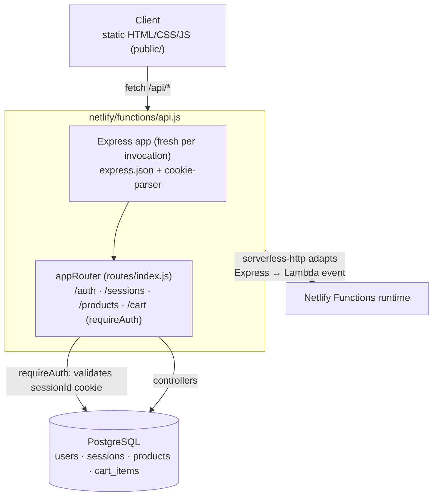

## About the Project

**Vinyl Store** is a vinyl-record e-commerce app: a searchable, genre-filterable catalog, a per-user persistent cart, and session-based authentication — built as a minimalist **Express** API served entirely as a **Netlify serverless function**, with a plain HTML/CSS/JS front end (no framework) on top.

The code is public at [github.com/cristiangiehl1/vinyl-store](https://github.com/cristiangiehl1/vinyl-store), deployed at [vinyl-market.netlify.app](https://vinyl-market.netlify.app/).

## The Problem

The goal was to put together a complete e-commerce flow — catalog, cart, login — without the overhead of a full-stack framework, and host it on a platform with no always-on server. That raises two architectural questions the project answers directly:

- **How do you keep a user session in a stateless API**, where each request can land on a different function instance with no shared memory between invocations?
- **How do you serve a whole Express API (multiple routes, multiple domains) behind a single serverless function**, instead of splitting the logic into one function per endpoint?

## Architecture

The whole API runs as **a single serverless function**: `netlify/functions/api.js` builds an Express app from scratch, registers `express.json()` and `cookie-parser`, mounts the `appRouter` at `/api`, and wraps everything with **`serverless-http`** — the same Express route tree (auth, sessions, products, cart) handles any path under `/api/*` from that one entry point, instead of one function per resource.

- **Controllers** (`controllers/`) — one file per domain (`authController`, `sessionsController`, `cartController`, `productsController`), plus a shared `controller.js` that centralizes reading/writing the session cookie.
- **Routes** (`routes/`) — one router per domain, mounted on the central `appRouter`; the cart is the only route group that requires authentication, applied once at the mount point (`appRouter.use('/cart', requireAuth, cartRouter)`) rather than in every handler.
- **Middleware** (`middleware/requireAuth.js`) — validates the session cookie against the database and injects `req.userId`.
- **Infra** (`infra/database.js`) — Postgres access; migrations versioned with `node-pg-migrate`.

## Session-Based Authentication in the Database

Instead of JWTs or signed cookies, the session is an **opaque token persisted in Postgres**:

1. On register or login, the password is checked with **bcrypt** and a random 48-byte token (`crypto.randomBytes(48)`) is generated.
2. The token is written to the `sessions` table (`user_id`, `token`, `expires_at`, 30-day validity) and returned to the browser as a `sessionId` cookie — **`httpOnly`**, and `secure` whenever `NODE_ENV !== 'development'`.
3. On every protected request, `requireAuth` runs a `JOIN sessions ⋈ users` filtered by `expires_at > NOW()`; if no valid session is found, it clears the cookie and responds `401`.
4. **Logout doesn't delete the row** — instead of a `DELETE`, it subtracts one year from `expires_at` (`expires_at = expires_at - interval '1 year'`), which invalidates the session immediately under the same `requireAuth` check without losing the record of when that session existed.

This moves the session's source of truth entirely into the database — **there's no in-process memory state**, a direct requirement of the serverless environment, where the function can be restarted on any invocation.

## Catalog and Cart

- **Products** (`products`: title, artist, genre, year, price, stock, image) — listing with either an exact `genre` filter **or** a text search with `ILIKE` across title/artist/genre (the two modes are mutually exclusive in the same query); a helper endpoint (`getGenres`) returns the distinct genres already in the catalog, used to populate the UI filter.
- **Cart** (`cart_items`, cascade foreign keys to `users` and `products`) — adding an item that's already in the cart **increments its quantity** instead of duplicating the row; there are separate endpoints for counting items (used by the cart badge), listing with a `JOIN` into `products` (title, artist, price already resolved), and removing a single item or clearing the whole cart.
- The sample catalog (`data.js`, used by the seed script) holds 10 fictional records — the project is an architecture showcase, not a real catalog.

## Key Challenges

- **Session without process state.** Any in-memory cache in the Node process dies with every new function invocation. Persisting the entire session in Postgres — instead of, say, an in-memory `Map` — was the only way for authentication to survive across requests in a serverless environment.
- **One connection per query, not a pool.** `infra/database.js` opens a fresh `pg` `Client` on every `query()` call and closes it in a `finally`. This sidesteps the classic problem of a connection pool left dangling between function invocations (a connection "forgotten" open from a previous one), at the cost of paying the connection handshake on every query — a deliberate trade of throughput for simplicity and safety in a serverless environment.
- **One function for the whole API.** Since Express already handles routing internally, exposing each endpoint as a separate Netlify function would duplicate app setup (parsers, cookie-parser) in every one. Wrapping the entire `appRouter` with `serverless-http` in a single function kept routing where it already made sense — inside Express itself.
- **Revoking a session without losing history.** A `DELETE` on logout would erase the record of when that session existed; expiring the date (`expires_at - interval '1 year'`) invalidates the session under the same `WHERE expires_at > NOW()` already used by `requireAuth`, with no separate revocation logic needed.

## Technologies Used

### Backend

- **Node.js / Express** — API and routing.
- **PostgreSQL (`pg`)** — user, session, product, and cart data; on-demand connections, no persistent pool.
- **node-pg-migrate** — versioned schema migrations.
- **bcryptjs** — password hashing.
- **cookie-parser** — session cookie parsing.
- **validator** — email validation on signup.

### Frontend

- **HTML5 / CSS3 / JavaScript** — static pages (`public/`) consuming the API via `fetch`, no framework or bundler.

### Deploy

- **Netlify Functions** — the entire Express API, adapted via **`serverless-http`**, runs as a single function.
- **ESLint + Prettier** — code standardization.

## Technical Notes

- **Authorization at the router edge, not in every handler.** `requireAuth` is applied once, at `appRouter.use('/cart', requireAuth, cartRouter)` — no cart controller needs to know authentication exists; all of them receive an already-validated `req.userId`.
- **`httpOnly` cookie with environment-conditional `secure`.** In local development (no HTTPS), `secure` is deliberately turned off so the cookie doesn't break; everywhere else (Netlify production), it's always on.
- **Configurable Postgres SSL.** `infra/database.js` accepts a custom certificate via `POSTGRES_CA` and, absent one, requires TLS in production and disables it in development — covering both a local Postgres in Docker and a managed provider with its own certificate.
