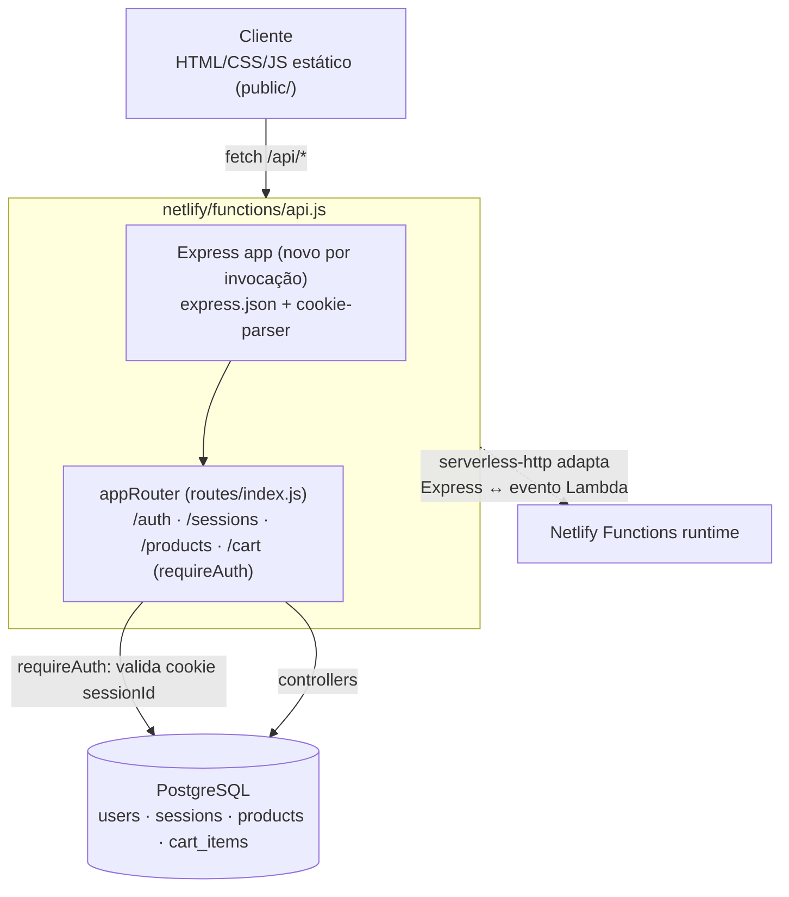

## Sobre o Projeto

**Vinyl Store** é um e-commerce de discos de vinil: catálogo com busca e filtro por gênero, carrinho persistente por usuário e autenticação por sessão — construído como uma API **Express** minimalista servida inteiramente como **função serverless na Netlify**, com um front-end estático em HTML/CSS/JS puro (sem framework) por cima.

O código está público em [github.com/cristiangiehl1/vinyl-store](https://github.com/cristiangiehl1/vinyl-store), com deploy em [vinyl-market.netlify.app](https://vinyl-market.netlify.app/).

## O Problema

O objetivo do projeto era montar um fluxo de e-commerce completo — catálogo, carrinho, login — sem a complexidade de um framework full-stack, e hospedá-lo em uma plataforma sem servidor sempre ligado. Isso levanta duas perguntas de arquitetura que o projeto responde de forma direta:

- **Como manter sessão de usuário em uma API sem estado**, onde cada requisição pode cair numa instância de função diferente e não há memória compartilhada entre invocações?
- **Como servir uma API Express inteira (múltiplas rotas, múltiplos domínios) atrás de uma única função serverless**, em vez de fragmentar a lógica em uma função por endpoint?

## Arquitetura

Toda a API roda como **uma única função serverless**: `netlify/functions/api.js` monta uma app Express do zero, registra `express.json()` e `cookie-parser`, monta o `appRouter` em `/api`, e embrulha tudo com **`serverless-http`** — a mesma árvore de rotas do Express (autenticação, sessões, produtos, carrinho) atende qualquer path sob `/api/*` a partir desse único ponto de entrada, em vez de uma função por recurso.

- **Controllers** (`controllers/`) — um arquivo por domínio (`authController`, `sessionsController`, `cartController`, `productsController`), mais um `controller.js` compartilhado que centraliza a leitura/escrita do cookie de sessão.
- **Routes** (`routes/`) — um router por domínio, montados no `appRouter` central; o carrinho é o único grupo de rotas que exige autenticação, aplicada uma vez no ponto de montagem (`appRouter.use('/cart', requireAuth, cartRouter)`) em vez de em cada handler.
- **Middleware** (`middleware/requireAuth.js`) — valida o cookie de sessão contra o banco e injeta `req.userId`.
- **Infra** (`infra/database.js`) — acesso ao Postgres; migrations versionadas com `node-pg-migrate`.

## Autenticação por sessão em banco

Em vez de JWT ou cookies assinados, a sessão é um **token opaco persistido no Postgres**:

1. No registro ou login, a senha é validada com **bcrypt** e um token aleatório de 48 bytes (`crypto.randomBytes(48)`) é gerado.
2. O token é gravado na tabela `sessions` (`user_id`, `token`, `expires_at`, 30 dias de validade) e devolvido ao navegador como cookie `sessionId` — **`httpOnly`**, e `secure` sempre que `NODE_ENV !== 'development'`.
3. A cada requisição protegida, `requireAuth` faz um `JOIN sessions ⋈ users` filtrando `expires_at > NOW()`; se não achar sessão válida, limpa o cookie e responde `401`.
4. O **logout não apaga a linha** — em vez de `DELETE`, subtrai um ano de `expires_at` (`expires_at = expires_at - interval '1 year'`), o que invalida a sessão imediatamente na checagem de `requireAuth` sem perder o histórico de quando aquela sessão existiu.

Essa abordagem move a fonte da verdade da sessão inteiramente para o banco: **não há estado em memória do processo** — uma exigência direta do ambiente serverless, onde a função pode ser reiniciada a qualquer invocação.

## Catálogo e Carrinho

- **Produtos** (`products`: título, artista, gênero, ano, preço, estoque, imagem) — listagem com filtro exato por `genre` **ou** busca textual com `ILIKE` sobre título/artista/gênero (os dois modos são mutuamente exclusivos na mesma query); um endpoint auxiliar (`getGenres`) devolve os gêneros distintos já cadastrados, usado para popular o filtro na UI.
- **Carrinho** (`cart_items`, com chave estrangeira em cascata para `users` e `products`) — adicionar um item já existente **incrementa a quantidade** em vez de duplicar a linha; há endpoints separados para contar itens (usado no badge do carrinho), listar com `JOIN` em `products` (título, artista, preço já resolvidos) e remover um item ou o carrinho inteiro.
- O catálogo de exemplo (`data.js`, usado pelo script de seed) contém 10 discos fictícios — o projeto é uma vitrine de arquitetura, não um catálogo real.

## Principais Dificuldades

- **Sessão sem estado de processo.** Qualquer cache em memória do processo Node morre a cada nova invocação da função. Persistir a sessão inteira no Postgres — em vez de, por exemplo, um `Map` em memória — foi a única forma de a autenticação sobreviver entre requisições em um ambiente serverless.
- **Uma conexão por query, não um pool.** `infra/database.js` abre um `Client` do `pg` novo a cada chamada de `query()` e o fecha no `finally`. Isso evita o problema clássico de pool de conexões preso entre invocações de função (uma conexão "esquecida" aberta de uma invocação anterior), ao custo de pagar o handshake de conexão em toda query — uma troca deliberada de throughput por simplicidade e segurança em ambiente serverless.
- **Uma função para toda a API.** Como o Express já resolve roteamento internamente, expor cada endpoint como uma função Netlify separada duplicaria a montagem da app (parsers, cookie-parser) em cada uma. Envolver o `appRouter` inteiro com `serverless-http` numa única função manteve o roteamento onde ele já fazia sentido — no próprio Express.
- **Revogar sessão sem perder histórico.** Um `DELETE` no logout apagaria o rastro de quando aquela sessão existiu; expirar a data (`expires_at - interval '1 year'`) invalida a sessão no mesmo `WHERE expires_at > NOW()` já usado por `requireAuth`, sem precisar de uma lógica de revogação separada.

## Tecnologias Utilizadas

### Backend

- **Node.js / Express** — API e roteamento.
- **PostgreSQL (`pg`)** — dados de usuários, sessões, produtos e carrinho; conexão sob demanda, sem pool persistente.
- **node-pg-migrate** — migrations versionadas do schema.
- **bcryptjs** — hash de senha.
- **cookie-parser** — leitura do cookie de sessão.
- **validator** — validação de e-mail no cadastro.

### Frontend

- **HTML5 / CSS3 / JavaScript** — páginas estáticas (`public/`) consumindo a API via `fetch`, sem framework nem bundler.

### Deploy

- **Netlify Functions** — a API Express inteira, adaptada via **`serverless-http`**, roda como uma única função.
- **ESLint + Prettier** — padronização de código.

## Notas Técnicas

- **Autorização na borda do router, não em cada handler.** `requireAuth` é aplicado uma única vez, no `appRouter.use('/cart', requireAuth, cartRouter)` — nenhum controller de carrinho precisa saber que existe autenticação; todos recebem `req.userId` já validado.
- **Cookie `httpOnly` + `secure` condicional ao ambiente.** Em desenvolvimento local (sem HTTPS), `secure` é desligado deliberadamente para não quebrar o cookie; em qualquer outro ambiente (produção Netlify), fica sempre ligado.
- **SSL do Postgres configurável.** `infra/database.js` aceita um certificado customizado via `POSTGRES_CA` e, na ausência dele, exige TLS em produção e desliga em desenvolvimento — cobrindo tanto um Postgres local em Docker quanto um provedor gerenciado com certificado próprio.
