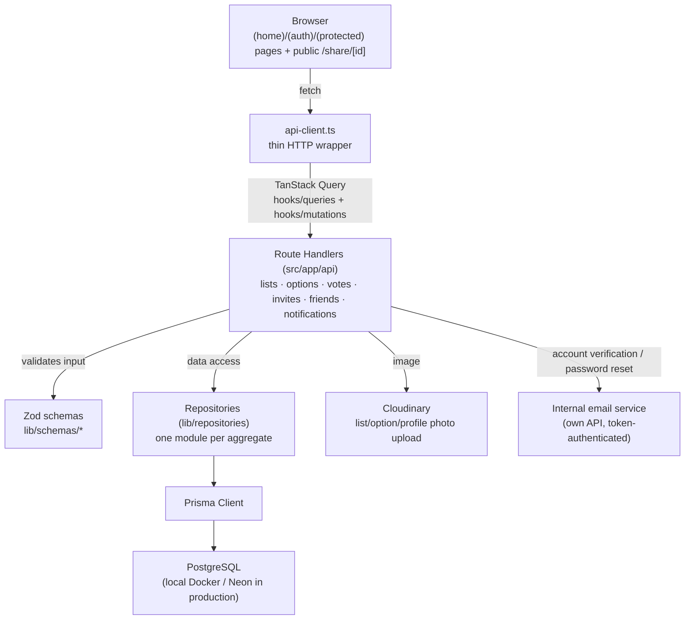

## About the Project

**Voting Lists** (internal product name: **Eleito**) is a platform for creating custom voting lists: any user builds a list, adds options (people, movies, objects — anything), invites participants by email, and tracks the outcome. Each list carries its own configurable rules — simple or ranked voting, results visible or hidden until the end, an expiration date, public or invite-only — that change the behavior of the entire voting experience.

## The Problem

Deciding something as a group through informal voting (a WhatsApp thread, a shared spreadsheet, a loose poll) quickly loses traceability: it's unclear who has already voted, the outcome gets mixed into the conversation, and rules like "everyone votes for up to 3" or "ranked preference" end up as a verbal agreement instead of an enforced constraint. The goal of the system is to formalize that flow — creation, invitation, voting, and tallying — with each list's rules applied consistently for every participant.

## Architecture

The project is a full-stack Next.js 15 (App Router) application, with clearly separated layers between client and database.

- **API Routes as thin controllers** — every route validates the session (`NextAuth`, JWT), validates the body with a Zod schema (`lib/schemas`), and delegates to the matching repository. No Prisma query runs outside the repository layer.
- **One repository per aggregate** — `list`, `option`, `vote`, `invite`, `participant`, `friend`, `notification`, `user`: each exposes specific functions (e.g. `getResultsByListId`, `findInvitesByEmail`) instead of a generic Prisma client scattered across the app.
- **Client state via TanStack Query** — `hooks/queries` (reads) and `hooks/mutations` (writes) wrap every call; there is no global application state outside the React Query cache.
- **Credentials-based auth** — NextAuth with a `Credentials` provider and JWT session: email + password (hashed with `bcryptjs`), requiring `emailVerified` before the first login. The user `id` and profile image are propagated into the token and the session via the `jwt`/`session` callbacks.

## Data Model and Voting Rules

The Prisma schema (`VotingList`, `Option`, `Vote`, `Participant`, `Invite`, `Friend`, `Notification`) encodes business rules as constraints, not just application-level validation:

- **Per-list configuration** — each `VotingList` carries its own flags: `isPublic`, `revealVotes` (show the count before the end), `allowMultipleVotes`, `rankedVoting`, `maxRank` (defaults to 5), and `allowParticipantsToAddOptions`. The Zod schema (`createListSchema`) enforces a cross-field rule: **ranked voting requires multiple votes to be enabled** — a list cannot be created with `rankedVoting: true` and `allowMultipleVotes: false`.
- **One vote per option, per person** — `@@unique([voterId, optionId])` on the `Vote` table prevents voting twice on the same option; in ranked lists, each vote carries a `rank` (preference position) instead of being a plain counter.
- **Ranked tally (Borda-style scoring)** — when `rankedVoting` is on, `getResultsByListId` computes each option's total by summing, for every vote it received, `maxRank + 1 - rank` (a 1st-place vote contributes more points than a last-place one). In simple voting, the total is just the vote count.
- **Restricted participation** — `@@unique([userId, listId])` on `Participant` guarantees a single entry per user in a list; only participants (or any visitor, if the list is public) can view/generate results, based on `isPublic`.
- **Email-addressed invites, resolved in-app** — an `Invite` is created with `listId` + `email` (idempotent `upsert`: resending an existing invite just resets its status to `PENDING`). The invite **does not trigger an email to the invitee** — it shows up on the `/invites` screen for any logged-in user with that email address, with the pending count refreshed by polling. Accepting the invite creates the `Participant`; a list's pending-invite listing already excludes emails that are already participants.
- **Unauthenticated public sharing** — `/share/[id]` exposes a list, its options, and its results **only if `isPublic` is true**, and **hides individual votes when `revealVotes` is false** (the route returns options with `votes: []`), with no login required.
- **Friendship system** — a `Friend` model (request/accept/reject, with a unique index per user pair) exists independently of the lists, laying groundwork for a future social layer (e.g. inviting friends directly instead of typing an email).

## Updates and Notifications

There is no WebSocket or Server-Sent Events: "real-time" updates are **TanStack Query polling** with a `refetchInterval` tuned per sensitivity — results for an ongoing vote every 10s (`useResults`, `usePublicResults`), notifications and their counter every 15s, and the pending-invites counter every 30s. It's a deliberately simple choice: no real-time infrastructure, trading a small delay window for zero persistent-connection complexity.

Every relevant event (vote received, option added/removed, invite accepted/rejected, list deleted, friend request) creates a `Notification` record, typed by an enum (`NotificationType`), read/marked-as-read by the user themself.

## Image Upload

List, option, and profile photos go through `/api/upload` straight to **Cloudinary**, with server-side MIME type (`jpeg/png/gif/webp/avif`) and size (max 5MB) validation before the upload. Every image replace/remove goes through an ownership check: the Cloudinary `publicId` embeds the type (`users`/`lists`/`options`) and the owner, and the route confirms the authenticated user actually owns the list/option/profile before accepting the change — preventing a user from swapping another person's list image by tampering with the call.

## Main Challenges

- **Not promising more real-time than what exists.** The temptation to call the polling "real-time notifications" was there from the start; keeping the intervals short (10–30s) and backed only by the React Query cache was the way to deliver a sense of constant freshness without the operational cost of persistent connections.
- **Cross-field rule between `rankedVoting` and `allowMultipleVotes`.** Ranking without multiple votes makes no semantic sense (you can't order a preference with a single vote per person). Enforcing that dependency in the Zod schema, via `.refine()`, keeps the invalid state from ever being created — before any tallying logic has to deal with it.
- **Hiding results without hiding participation.** When `revealVotes` is false, the public route still returns the list of options (so people can vote), but zeroes out the votes array — instead of denying the whole request, which would break the experience for someone who just wants to vote without seeing the scoreboard.
- **Email-addressed invites without an invite email.** Resolving the invite by the invitee's own account email (instead of a unique per-invite link) kept the flow simple, but ties the experience to "the invited person needs to have (or create) an account with that email" — a conscious limitation of the current model.

## Technologies Used

### Framework

- **Next.js 15/16** (App Router) + **React 19** + **TypeScript**
- **NextAuth.js** (Credentials + JWT) — authentication and session
- **bcryptjs** — password hashing

### Data

- **PostgreSQL** + **Prisma ORM** — local Docker in development, **Neon** in production
- **Zod** — schema validation across routes and forms

### Frontend

- **Tailwind CSS** + **shadcn/ui** (Radix UI)
- **TanStack Query** — cache, mutations, and polling
- **GSAP** — scroll/entrance animations
- **next-themes** — light/dark theme

### Infrastructure

- **Cloudinary** — image upload and hosting
- **Docker** — local database
- **Vercel** — application deploy; the production build runs `prisma db push` before `next build`

## Technical Notes

- **The repository layer is the only door into Prisma.** No route calls `prisma.*` directly; everything goes through `lib/repositories`, which keeps each aggregate testable and makes the tally query (`getResultsByListId`) reusable between the authenticated route and the public sharing route.
- **Ownership is verified on upload, not just in the UI.** The image ownership check happens in the upload route (server-side), not just by hiding the edit button on the client — the same "authorization at the edge of the action" pattern used in the other internal projects.
- **The friendship model already exists but isn't consumed yet by list creation/invites** — it's the most direct next extension of the product: inviting by friendship instead of typing an email every time.
