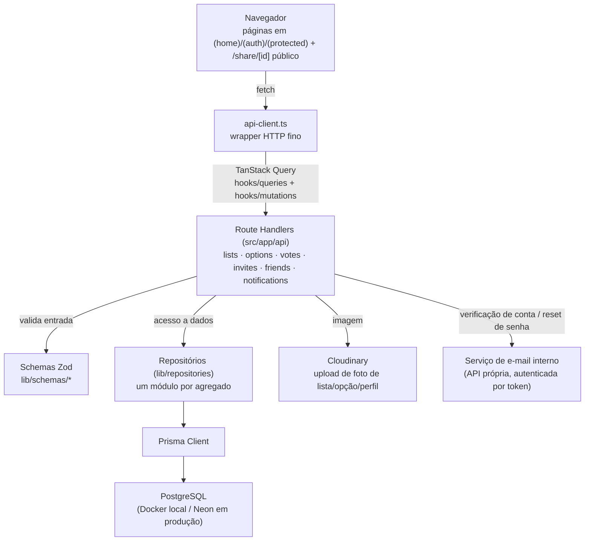

## Sobre o Projeto

**Voting Lists** (nome interno do produto: **Eleito**) é uma plataforma para criar listas de votação personalizadas: qualquer usuário monta uma lista, cadastra as opções (pessoas, filmes, objetos — qualquer coisa), convida participantes por e-mail e acompanha o resultado. Cada lista tem um conjunto de regras configuráveis — votação simples ou por ranking, resultado visível ou oculto até o fim, prazo de expiração, lista pública ou restrita a convidados — que mudam o comportamento de toda a experiência de votação.

## O Problema

Decidir algo em grupo por votação informal (papo de WhatsApp, planilha compartilhada, enquete solta) perde rápido a rastreabilidade: não fica claro quem já votou, o resultado se mistura com a conversa, e regras como "cada um vota em até 3" ou "ranking de preferência" viram combinado verbal em vez de restrição garantida. O objetivo do sistema é formalizar esse fluxo — criação, convite, votação e apuração — com as regras de cada lista aplicadas de forma consistente para todos os participantes.

## Arquitetura

O projeto é uma aplicação Next.js 15 (App Router) full-stack, com camadas bem isoladas entre o cliente e o banco.

- **API Routes como controllers finos** — cada rota valida a sessão (`NextAuth`, JWT), valida o corpo com um schema Zod (`lib/schemas`) e delega ao repositório correspondente. Nenhuma query Prisma é feita fora da camada de repositório.
- **Repositório por agregado** — `list`, `option`, `vote`, `invite`, `participant`, `friend`, `notification`, `user`: cada um expõe funções específicas (ex.: `getResultsByListId`, `findInvitesByEmail`) em vez de um cliente Prisma genérico espalhado pela aplicação.
- **Estado do cliente via TanStack Query** — `hooks/queries` (leitura) e `hooks/mutations` (escrita) encapsulam cada chamada; não há estado global de aplicação fora do cache do React Query.
- **Autenticação por credenciais** — NextAuth com `Credentials` provider e sessão JWT: e-mail + senha (hash com `bcryptjs`), exigindo `emailVerified` antes do primeiro login. O `id` do usuário e a imagem de perfil são propagados para o token e para a sessão nos callbacks `jwt`/`session`.

## Modelo de Dados e Regras da Votação

O schema Prisma (`VotingList`, `Option`, `Vote`, `Participant`, `Invite`, `Friend`, `Notification`) concentra as regras de negócio em constraints e não apenas em validação de aplicação:

- **Configuração por lista** — cada `VotingList` carrega suas próprias flags: `isPublic`, `revealVotes` (mostrar contagem antes do fim), `allowMultipleVotes`, `rankedVoting`, `maxRank` (padrão 5) e `allowParticipantsToAddOptions`. O schema Zod (`createListSchema`) aplica uma regra cruzada: **votação por ranking exige votos múltiplos ativados** — não é possível criar uma lista com `rankedVoting: true` e `allowMultipleVotes: false`.
- **Um voto por opção, por pessoa** — `@@unique([voterId, optionId])` na tabela `Vote` impede votar duas vezes na mesma opção; em listas de ranking, cada voto carrega um `rank` (posição de preferência) em vez de ser um simples contador.
- **Apuração por ranking (pontuação Borda)** — quando `rankedVoting` está ativo, `getResultsByListId` calcula o total de cada opção somando, para cada voto que ela recebeu, `maxRank + 1 - rank` (quem fica em 1º contribui mais pontos que quem fica em último). Em votação simples, o total é apenas a contagem de votos.
- **Participação restrita** — `@@unique([userId, listId])` em `Participant` garante uma única entrada por usuário na lista; só participantes (ou qualquer visitante, se a lista for pública) podem ver/gerar resultados, conforme `isPublic`.
- **Convite por e-mail, resolvido dentro do app** — um `Invite` é criado com `listId` + `email` (`upsert` idempotente: reenviar um convite existente apenas reseta o status para `PENDING`). O convite **não dispara um e-mail para o convidado** — ele aparece na tela `/invites` de qualquer usuário logado com aquele e-mail, e o contador de pendências é atualizado por polling. Aceitar o convite cria o `Participant`; a listagem de convites pendentes de uma lista já exclui e-mails que já são participantes.
- **Compartilhamento público sem autenticação** — `/share/[id]` expõe uma lista, suas opções e seus resultados **somente se `isPublic` for verdadeiro**, e **oculta os votos individuais quando `revealVotes` é falso** (a rota devolve as opções com `votes: []`), sem exigir login.
- **Sistema de amizades** — um modelo `Friend` (pedido/aceite/rejeição, com índice único por par de usuários) existe de forma independente das listas, para uma futura camada social (ex.: convidar amigos direto, sem digitar e-mail).

## Atualizações e Notificações

Não há WebSocket nem Server-Sent Events: a "atualização em tempo real" é **polling via TanStack Query** com `refetchInterval` diferenciado por sensibilidade — resultados de uma votação em andamento a cada 10s (`useResults`, `usePublicResults`), notificações e seu contador a cada 15s, e o contador de convites pendentes a cada 30s. É uma escolha deliberadamente simples: sem infraestrutura de tempo real, aceitando uma janela de atraso pequena em troca de nenhuma complexidade de conexões persistentes.

Cada evento relevante (voto recebido, opção adicionada/removida, convite aceito/recusado, lista excluída, pedido de amizade) gera um registro em `Notification`, tipado por um enum (`NotificationType`), lido/marcado como lido pelo próprio usuário.

## Upload de Imagens

Fotos de lista, de opção e de perfil sobem via `/api/upload` direto para o **Cloudinary**, com validação de tipo MIME (`jpeg/png/gif/webp/avif`) e tamanho (máx. 5MB) no servidor antes do envio. Toda substituição/remoção de imagem passa por uma checagem de posse: o `publicId` do Cloudinary embute o tipo (`users`/`lists`/`options`) e o dono, e a rota confirma que o usuário autenticado é realmente o dono da lista/opção/perfil antes de aceitar a alteração — impedindo que um usuário troque a imagem de uma lista de outra pessoa manipulando a chamada.

## Principais Dificuldades

- **Não prometer mais tempo-real do que existe.** A tentação de chamar o polling de "notificações em tempo real" existia desde a concepção do produto; manter os intervalos curtos (10-30s) e apoiados só em cache do React Query foi a forma de entregar uma sensação de atualização constante sem o custo operacional de conexões persistentes.
- **Regra cruzada entre `rankedVoting` e `allowMultipleVotes`.** Ranking sem múltiplos votos não faz sentido semântico (não dá para ordenar uma preferência com um único voto por pessoa). Fixar essa dependência no schema Zod, com `.refine()`, evita o estado inválido na origem — antes de qualquer lógica de apuração precisar lidar com ele.
- **Ocultar resultado sem esconder participação.** Quando `revealVotes` é falso, a rota pública ainda devolve a lista de opções (para votar), mas zera o array de votos — em vez de negar a requisição inteira, o que quebraria a experiência de quem só quer votar sem ver o placar.
- **Convite por e-mail sem serviço de e-mail para convites.** Resolver o convite pelo endereço de e-mail do próprio cadastro (em vez de um link único por convite) manteve o fluxo simples, mas amarra a experiência a "a pessoa convidada precisa ter (ou criar) conta com aquele e-mail" — uma limitação consciente do modelo atual.

## Tecnologias Utilizadas

### Framework

- **Next.js 15/16** (App Router) + **React 19** + **TypeScript**
- **NextAuth.js** (Credentials + JWT) — autenticação e sessão
- **bcryptjs** — hash de senha

### Dados

- **PostgreSQL** + **Prisma ORM** — Docker local em desenvolvimento, **Neon** em produção
- **Zod** — validação de schemas em rotas e formulários

### Frontend

- **Tailwind CSS** + **shadcn/ui** (Radix UI)
- **TanStack Query** — cache, mutações e polling
- **GSAP** — animações de scroll/entrada
- **next-themes** — tema claro/escuro

### Infraestrutura

- **Cloudinary** — upload e hospedagem de imagens
- **Docker** — banco local
- **Vercel** — deploy da aplicação; build de produção roda `prisma db push` antes do `next build`

## Notas Técnicas

- **Repositório como única porta de entrada ao Prisma.** Nenhuma rota chama `prisma.*` diretamente; tudo passa por `lib/repositories`, o que deixa cada agregado testável e a query de apuração (`getResultsByListId`) reutilizável entre a rota autenticada e a rota pública de compartilhamento.
- **Ownership verificado no upload, não só na UI.** A checagem de posse da imagem acontece na rota de upload (servidor), não apenas escondendo o botão de editar no cliente — o mesmo padrão de "autorização na borda da ação" usado nos demais projetos internos.
- **Modelo de amizade já existe, mas ainda não é consumido pela criação de lista/convite** — é a extensão mais direta do produto: convidar por amizade em vez de digitar um e-mail toda vez.
